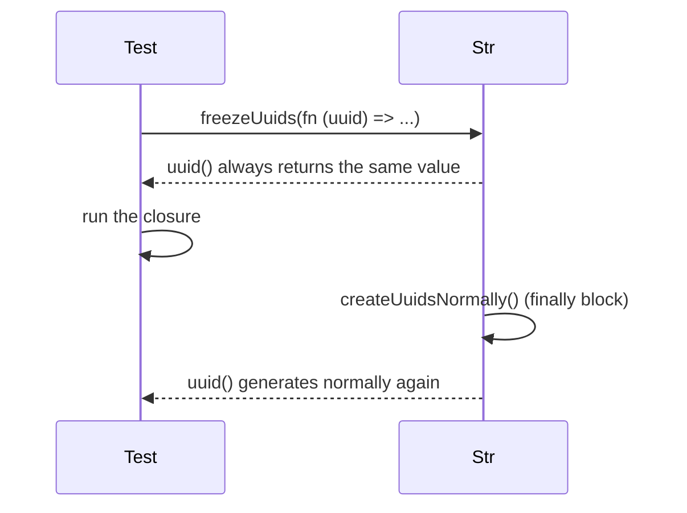

# Chapter 1 - Str beyond the better-known helpers

`Illuminate\Support\Str` is one of the first classes any Laravel developer meets, and one of
the last they expect to still hold surprises. Its documentation page is long, but it does not
cover every public method the class ships. This chapter walks through four such areas: two
little-known formatting aliases, a digit-extraction helper, a callback-reference parser, and a
family of methods that make UUID and ULID generation deterministic in tests. All four are
verified against `laravel/framework` `v13.22.0` and the `laravel/docs` `13.x` branch, and every
example below is extracted from the book's companion application (`code/`), where it runs as a
real, green Pest test.

The running scenario for this chapter is an order-processing API: webhooks that dispatch jobs
by event name, a phone number stored on an order, a per-order refund strategy, and an endpoint
that creates an order and returns its identifiers.

## `Str::pascal()` and `Str::pluralPascal()`

**Case type**: both are undocumented methods on an otherwise fully documented class - `Str` has
an official docs page, but neither `pascal()` nor `pluralPascal()` appears on it by name.

**Alias flag**: both are literal one-line aliases. `Str::pascal()` returns
`static::studly($value, $normalize)` and `Str::pluralPascal()` returns
`static::pluralStudly($value, $count)`. Neither adds behavior of its own; they exist so that
code reading "Pascal case" does not have to say "studly case" instead. Treat them as a naming
choice, not a new concept.

**Version note**: both were introduced in Laravel 11.x. `Str::pascal()`'s second argument,
`bool $normalize = false`, is new in Laravel 13.x itself: when true, an all-uppercase word
segment (an acronym such as `CBOR`) is lowercased before conversion, so it becomes `Cbor`
instead of being left untouched. If you are reading this chapter on an older Laravel version,
`pascal()`/`pluralPascal()` exist from 11.x onward, but the `normalize` parameter does not.

### Minimal snippet

```php
Str::pascal('order-refunded');
// 'OrderRefunded'
```

### Documented way vs. discovered way

Because `pascal()` is a pass-through to `studly()`, the two calls are interchangeable on the
same input:

```php
expect(Str::studly('order-refunded'))->toBe(Str::pascal('order-refunded'))
    ->and(Str::pascal('order-refunded'))->toBe('OrderRefunded');
```

The same holds for their plural counterparts, since `pluralPascal()` is a pass-through to
`pluralStudly()`:

```php
expect(Str::pluralStudly('OrderItem', 5))->toBe(Str::pluralPascal('OrderItem', 5))
    ->and(Str::pluralPascal(Str::pascal('order-item'), 5))->toBe('OrderItems');
```

The only reason to prefer the discovered names over the documented ones is readability:
`pascal()`/`pluralPascal()` name the casing convention they produce, `studly()`/`pluralStudly()`
name a Laravel-specific term for the same thing.

### Real scenario: resolving a job class from a webhook event

The companion app's webhook endpoint receives an event slug (`order-refunded`) and needs to
dispatch the job whose name matches it (`App\Jobs\OrderRefunded`). `Str::pluralPascal()`
handles the batch variant, where the event also carries a count and the target job's name is
plural (`order-item` with a count of five becomes `App\Jobs\OrderItems`). Note that
`pluralPascal()` expects an already Pascal-cased word, exactly like `pluralStudly()` does - so
the batch path converts the slug with `pascal()` first, then pluralizes the result:

```php
class WebhookEventDispatcher
{
    public function dispatch(string $event, array $payload = []): string
    {
        $jobClass = 'App\\Jobs\\'.Str::pascal($event);

        return $this->dispatchJob($jobClass, $payload, $event);
    }

    public function dispatchBatch(string $event, int $count, array $payload = []): string
    {
        $jobClass = 'App\\Jobs\\'.Str::pluralPascal(Str::pascal($event), $count);

        return $this->dispatchJob($jobClass, $payload, $event);
    }

    private function dispatchJob(string $jobClass, array $payload, string $event): string
    {
        if (! class_exists($jobClass)) {
            throw new InvalidArgumentException("No job registered for webhook event [{$event}].");
        }

        dispatch(new $jobClass($payload));

        return $jobClass;
    }
}
```

A thin controller exposes it over HTTP. Because the job class name is built by concatenating a
fixed `'App\\Jobs\\'` prefix with the converted event slug, an unrecognized event can only ever
miss the dispatcher's `class_exists()` check - it can never resolve to a class outside that
namespace. The dispatcher throws `InvalidArgumentException` in that case, which the controller
turns into a 422 rather than letting it surface as an uncaught error:

```php
class WebhookController extends Controller
{
    public function __invoke(Request $request, WebhookEventDispatcher $dispatcher)
    {
        $event = $request->string('event')->toString();
        $count = $request->integer('count');
        $payload = $request->array('payload');

        try {
            $jobClass = $count > 1
                ? $dispatcher->dispatchBatch($event, $count, $payload)
                : $dispatcher->dispatch($event, $payload);
        } catch (InvalidArgumentException $e) {
            return response()->json(['message' => $e->getMessage()], 422);
        }

        return response()->json(['dispatched' => $jobClass]);
    }
}
```

The feature test confirms both the singular and the batch path resolve to the right job and
that the job actually reaches the queue:

```php
it('dispatches the right job through the webhook API controller', function () {
    Queue::fake();

    postJson('/api/webhooks', ['event' => 'order-refunded', 'payload' => ['order_id' => 42]])
        ->assertOk()
        ->assertJson(['dispatched' => OrderRefunded::class]);

    Queue::assertPushed(OrderRefunded::class);
});

it('returns an unprocessable response for an unknown webhook event', function () {
    postJson('/api/webhooks', ['event' => 'totally-unknown-event'])
        ->assertUnprocessable()
        ->assertJson(['message' => 'No job registered for webhook event [totally-unknown-event].']);
});
```

## `Str::numbers()`

**Case type**: undocumented method on the documented `Str` class. 

**Alias flag**: none - it is
not a wrapper around another public method. 

**Version note**: introduced in Laravel 11.x
(absent from the `10.x` branch). It applies to any formatted identifier that needs to be
reduced to its digits, not only phone numbers - a dashed order reference code is just as valid
an input.

`Str::numbers()` strips every character that is not a digit:

```php
public static function numbers($value)
{
    return preg_replace('/[^0-9]/', '', $value);
}
```

### Minimal snippet

```php
Str::numbers('+1 (555) 123-4567');
// '15551234567'
```

### Manual way vs. discovered way

There is no documented Laravel helper for this specific job, only the manual regular
expression developers tend to reach for. `Str::numbers()` is that same expression, already
written and named:

```php
expect(preg_replace('/[^0-9]/', '', $phone))
    ->toBe(Str::numbers($phone))
    ->toBe('15551234567');
```

The value is not in new behavior - the regular expression is the same one either way - but in
not having to re-derive or remember it in every project that needs it.

### Real scenario: normalizing a phone number on write

The companion app's `Order` model uses `Str::numbers()` inside a mutator, so any phone number
assigned to an order - however it was formatted on input - is stored digits-only:

```php
protected function phoneNumber(): Attribute
{
    return Attribute::make(
        set: function (?string $value) {
            if ($value === null) {
                return null;
            }

            $digits = Str::numbers($value);

            return $digits !== '' ? $digits : null;
        },
    );
}
```

The extra check matters: `Str::numbers()` on a value with no digits at all (`'unknown'`, say)
returns an empty string, not `null`. Storing that empty string as-is would let a later lookup
with no `phone` parameter match it by coincidence, since an unnormalized empty string would
compare equal to another empty string - so the mutator folds that case back to `null`.

An `orders/lookup` endpoint queries by the same normalized form, so a support agent can search
using whatever punctuation the customer read the number with:

```php
public function lookup(Request $request)
{
    $order = Order::query()
        ->where('phone_number', Str::numbers($request->string('phone')->toString()))
        ->firstOrFail();

    return response()->json(['uuid' => $order->uuid, 'status' => $order->status]);
}
```

```php
it('finds an order by an unnormalized phone number through the lookup endpoint', function () {
    Order::factory()->create(['phone_number' => '+1 (555) 123-4567']);

    getJson('/api/orders/lookup?phone='.urlencode('1-555-123-4567'))
        ->assertOk()
        ->assertJsonPath('status', 'pending');
});
```

Because both write and read normalize through the same helper, the two never drift out of
sync: whatever punctuation a phone number arrives with, storing and searching agree on its
digits.

## `Str::parseCallback()`

**Case type**: undocumented method on the documented `Str` class. 

**Alias flag**: none.

**Version note**: long-standing, present since at least the `8.x` branch - there is no
recent-version caveat to add here.

`Str::parseCallback()` splits a `"Class@method"` reference into its two parts, falling back to
a default method when only a class name is given:

```php
public static function parseCallback($callback, $default = null)
{
    if (static::contains($callback, "@anonymous\0")) {
        if (static::substrCount($callback, '@') > 1) {
            return [
                static::beforeLast($callback, '@'),
                static::afterLast($callback, '@'),
            ];
        }

        return [$callback, $default];
    }

    return static::contains($callback, '@') ? explode('@', $callback, 2) : [$callback, $default];
}
```

### Minimal snippet

```php
Str::parseCallback('App\\Support\\RefundCalculators\\PercentageRefundCalculator@calculate');
// ['App\\Support\\RefundCalculators\\PercentageRefundCalculator', 'calculate']

Str::parseCallback('App\\Support\\RefundCalculators\\FlatRateRefundCalculator', 'calculate');
// ['App\\Support\\RefundCalculators\\FlatRateRefundCalculator', 'calculate']
```

### Manual way vs. discovered way

On a well-formed reference, a hand-written `explode('@', $reference, 2)` gives the same result:

```php
expect(explode('@', $reference, 2))
    ->toBe(Str::parseCallback($reference))
    ->toBe(['App\\Support\\RefundCalculators\\PercentageRefundCalculator', 'calculate']);
```

The manual version stops being equivalent the moment the class name is optional. On a
reference with no `@method` part at all, a bare `explode()` does not reach parity on its own:

```php
$reference = 'App\\Support\\RefundCalculators\\FlatRateRefundCalculator';

expect(explode('@', $reference, 2))->toBe([$reference]);

$manual = str_contains($reference, '@')
    ? explode('@', $reference, 2)
    : [$reference, 'calculate'];

expect($manual)
    ->toBe(Str::parseCallback($reference, 'calculate'))
    ->toBe(['App\\Support\\RefundCalculators\\FlatRateRefundCalculator', 'calculate']);
```

`explode()` alone returns a one-element array here, not the two-element `[$reference, $default]`
pair `Str::parseCallback()` produces - reaching parity manually needs an explicit
`str_contains()` check bolted on first. `Str::parseCallback()` also correctly special-cases PHP
anonymous class names, which already contain their own internal `@` markers
(`class@anonymous\0...`) that a naive `explode('@', $value, 2)` would cut in the wrong place.

### Real scenario: resolving a per-order refund calculator

Each order in the companion app carries a `refund_strategy` string - a class reference, with or
without an explicit method - and the refund endpoint resolves and calls it without knowing in
advance which calculator is configured. This is not a bespoke convention invented for this
example: Laravel itself uses the same textual "Class@method" style internally, for controller
action strings in routes and for custom validation rule callbacks, which is why a first-party
parser for it already exists:

```php
public function refund(Order $order)
{
    [$class, $method] = Str::parseCallback($order->refund_strategy, 'calculate');

    $refundCents = app($class)->{$method}($order);

    return response()->json(['refund_cents' => $refundCents]);
}
```

A parsed class name is only ever as safe as where it came from: `refund()` trusts
`$order->refund_strategy` because the companion app validates it against a fixed allow-list of
calculator classes when the order is created, not because `Str::parseCallback()` does any
validation of its own - it happily parses any string, including one an attacker fully controls.
Skipping that allow-list would turn this endpoint into an unrestricted "call any class and
method the container can resolve" primitive.

Two calculators back it: one referenced with an explicit `@calculate`, one relying on the
default:

```php
it('computes a refund through the configured calculator resolved from the order', function () {
    $order = Order::factory()->create([
        'refund_strategy' => 'App\\Support\\RefundCalculators\\PercentageRefundCalculator@calculate',
        'total_cents' => 10000,
    ]);

    getJson("/api/orders/{$order->id}/refund")
        ->assertOk()
        ->assertJson(['refund_cents' => 1000]);
});

it('computes a refund through the default calculator method when none is specified', function () {
    $order = Order::factory()->create([
        'refund_strategy' => 'App\\Support\\RefundCalculators\\FlatRateRefundCalculator',
        'total_cents' => 10000,
    ]);

    getJson("/api/orders/{$order->id}/refund")
        ->assertOk()
        ->assertJson(['refund_cents' => 500]);
});
```

## Deterministic UUID and ULID generation for tests

**Case type**: mixed. `Str::freezeUuids()`, `Str::freezeUlids()`, `Str::createUuidsUsingSequence()`,
and `Str::createUlidsUsingSequence()` are undocumented methods on the documented `Str` class.
`Str::createUuidsNormally()` and `Str::createUlidsNormally()`, by contrast, already have their
own entry in `laravel/docs` `13.x` (`strings.md`) - they are shown here only as the reset
counterpart to the freeze methods' callback form, not as discovered content in their own right.

**Alias flag**: none of the four undocumented methods wrap another public method. 

**Version note**: `freezeUuids()` and `createUuidsUsingSequence()` were introduced in Laravel 9.x;
`freezeUlids()` and `createUlidsUsingSequence()` followed in Laravel 10.x.

An order in the companion app is created with two identifiers: a `uuid` and a `tracking_code`
(a ULID), both generated through `Str::uuid()` and `Str::ulid()` when the model is created:

```php
protected static function booted(): void
{
    static::creating(function (Order $order) {
        $order->uuid ??= (string) Str::uuid();
        $order->tracking_code ??= (string) Str::ulid();
    });
}
```

### Minimal snippet

```php
$uuid = Str::freezeUuids();
// Str::uuid() now always returns $uuid, until generation is reset
```

### The loose-vs-exact assertion contrast

Without any help from `Str`, a feature test can only assert that the identifiers have the right
shape, not which values they hold:

```php
it('can only make a loose assertion about identifiers without freezing', function () {
    $response = postJson('/api/orders', ['total_cents' => 1500]);

    $response->assertCreated()->assertJsonStructure(['uuid', 'tracking_code', 'status']);
    expect(Str::isUuid($response->json('uuid')))->toBeTrue();
    expect(Str::isUlid($response->json('tracking_code')))->toBeTrue();
});
```

### Freezing a single value

`Str::freezeUuids()` and `Str::freezeUlids()` pin `Str::uuid()`/`Str::ulid()` to one value for
the rest of the test, turning that loose assertion into an exact one:

```php
it('asserts an exact uuid and tracking code once both generators are frozen', function () {
    $uuid = Str::freezeUuids();
    $ulid = Str::freezeUlids();

    postJson('/api/orders', ['total_cents' => 1500])
        ->assertCreated()
        ->assertJson([
            'uuid' => (string) $uuid,
            'tracking_code' => (string) $ulid,
        ]);

    Str::createUuidsNormally();
    Str::createUlidsNormally();
});
```

### Resetting generation back to normal

Calling `Str::createUuidsNormally()` / `Str::createUlidsNormally()` explicitly, as above, is one
option. It matters because a frozen generator stays frozen for the rest of the process: forget
to reset it, and every later test in the same suite run receives the same fixed identifier.
Passing a closure to `freezeUuids()` / `freezeUlids()` is the more idiomatic alternative, since
it cannot be forgotten: the closure runs with the frozen value, and generation resets
automatically, even if an assertion inside the closure fails.



```php
it('resets both generators automatically through the freeze callback form', function () {
    Str::freezeUuids(function ($uuid) {
        Str::freezeUlids(function ($ulid) use ($uuid) {
            postJson('/api/orders', ['total_cents' => 1500])
                ->assertJson(['uuid' => (string) $uuid, 'tracking_code' => (string) $ulid]);
        });

        expect((string) Str::ulid())->not->toBe((string) Str::ulid());
    });

    expect((string) Str::uuid())->not->toBe((string) Str::uuid());
});
```

Nesting the two calls exercises both freeze methods' callback form together: ULID generation
resets the moment the inner closure returns, and UUID generation resets the moment the outer one
does, each independently of the other.

### Replaying a sequence instead of a single value

`Str::createUuidsUsingSequence()` and `Str::createUlidsUsingSequence()` extend the same
underlying idea as freezing - pinning generation to a predetermined output - from a single value
to a list: the case a single frozen value cannot cover, where a test creates more than one
record and needs each one to receive a distinct, predetermined identifier, consumed in order.

```php
it('replays a predetermined sequence of identifiers across several orders', function () {
    $uuids = [Str::uuid(), Str::uuid()];
    $ulids = [Str::ulid(), Str::ulid()];

    Str::createUuidsUsingSequence($uuids);
    Str::createUlidsUsingSequence($ulids);

    postJson('/api/orders', ['total_cents' => 1000])
        ->assertJson(['uuid' => (string) $uuids[0], 'tracking_code' => (string) $ulids[0]]);

    postJson('/api/orders', ['total_cents' => 2000])
        ->assertJson(['uuid' => (string) $uuids[1], 'tracking_code' => (string) $ulids[1]]);

    Str::createUuidsNormally();
    Str::createUlidsNormally();
});
```

## Quick reference

| Method | Purpose | Documented alias |
|---|---|---|
| `Str::pascal($value, $normalize = false)` | Convert a string to PascalCase; `$normalize` (13.x) lowercases all-caps segments first | Alias of `Str::studly()` |
| `Str::pluralPascal($value, $count = 2)` | Pluralize the last word of an already Pascal-cased string | Alias of `Str::pluralStudly()` |
| `Str::numbers($value)` | Remove every non-digit character from a string | None |
| `Str::parseCallback($callback, $default = null)` | Split a `"Class@method"` reference into `[class, method]`, with a default method and anonymous-class handling | None |
| `Str::freezeUuids(?Closure $callback = null)` | Pin `Str::uuid()` to one value; auto-resets if a closure is given | None |
| `Str::freezeUlids(?Closure $callback = null)` | Pin `Str::ulid()` to one value; auto-resets if a closure is given | None |
| `Str::createUuidsUsingSequence(array $sequence, $whenMissing = null)` | Make `Str::uuid()` replay a fixed sequence of values | None |
| `Str::createUlidsUsingSequence(array $sequence, $whenMissing = null)` | Make `Str::ulid()` replay a fixed sequence of values | None |
| `Str::createUuidsNormally()` / `Str::createUlidsNormally()` | Reset `Str::uuid()` / `Str::ulid()` to normal, non-deterministic generation | Already documented - shown here only as the freeze methods' reset counterpart |
