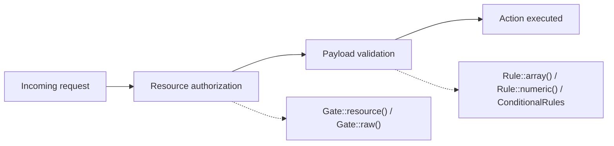

# Chapter 10 - Advanced authorization and validation

Chapter 9 closed Part IV by tracking a request through the `Router` facade: which route is
currently executing, and how a middleware group's own composition can shift underneath it.
Chapter 10 opens Part V - Authorization, Validation, and Asynchrony by picking up right where a
routed request lands next: deciding who may act on the resource it targets, and deciding what
data they may submit while doing so. Four undocumented entries cover this in two pairs.
`Gate::resource()` and `Gate::raw()` decide who may act: the first registers an entire resource's
standard permissions in one call, the second lets an authorization check return something richer
than a plain boolean. `Rule::array()`/`Rule::numeric()` and `ConditionalRules` decide what data is
acceptable: the first pair expresses two common rules as objects instead of strings, the second
applies a conditional rule as a reusable object instead of a closure copied into every form. The
running example is a project-management resource: a project has a budget and an assigned team,
guarded end to end by a full set of permissions and validated on creation and update. Every
example is verified against `laravel/framework` v13.22.0 and the `laravel/docs` `13.x` branch, and
is a real, green Pest test drawn from this book's companion application.



## `Gate::resource()`

**Case type**: an undocumented method on `Illuminate\Auth\Access\Gate` (proxied by the `Gate`
facade), sitting beside a class whose manual `Gate::define()` registration and Policy-based
authorization are both extensively documented. 

**Alias flag**: not an alias of anything documented
- it is a bulk-registration shortcut with no single-ability equivalent. 
 
**Audience**: ordinary
application developers wiring authorization for a resource, not package authors. 

**Stability**:
core authorization code, no minor-version churn found while verifying against v13.22.0.

`Gate::resource($name, $class, ?array $abilities = null)` registers a full set of abilities for a
resource in a single call. Reading `Illuminate\Auth\Access\Gate::resource()` at v13.22.0 shows
exactly what it does: unless a custom `$abilities` array is given, it walks the standard set
(`viewAny`, `view`, `create`, `update`, `delete`) and calls `Gate::define("{$name}.{$ability}",
"{$class}@{$method}")` for each one. Two details matter for how it is used. First, the registered
ability names carry the resource name as a prefix (`project.viewAny`, not `viewAny`), because that
is literally the string `define()` receives. Second, `Gate::define()`'s string-callback path
resolves the target class through `resolvePolicy()`, which is nothing more than
`$this->container->make($class)` - no interface, no base `Policy` class, no `Illuminate\Auth\Access\HandlesAuthorization`
trait required. Any plain class exposing methods named after the abilities works.

### Minimal snippet

```php
use Illuminate\Support\Facades\Gate;

Gate::resource('project', ProjectPermissions::class);

Gate::authorize('project.view', $project); // resolves to ProjectPermissions::view($user, $project)
```

### Documented way vs. discovered way

The documented way to reach the same five permissions is either a `Gate::define()` call per
ability, or a dedicated Policy class registered with `Gate::policy()`:

```php
Gate::define('project.viewAny', [ProjectPermissions::class, 'viewAny']);
Gate::define('project.view', [ProjectPermissions::class, 'view']);
Gate::define('project.create', [ProjectPermissions::class, 'create']);
Gate::define('project.update', [ProjectPermissions::class, 'update']);
Gate::define('project.delete', [ProjectPermissions::class, 'delete']);
```

Both documented paths work, but they repeat the same viewAny/view/create/update/delete wiring by
hand for every resource that needs the standard set, or require turning `ProjectPermissions` into
an actual Policy class tied to the `Project` model. `Gate::resource()` collapses the whole set into
one call, while still targeting the plain, model-agnostic `ProjectPermissions` class built for
this chapter's example:

```php
Gate::resource('project', ProjectPermissions::class);
```

This is a different problem from `Controller::authorizeResource()` (`Illuminate\Foundation\Auth\Access\AuthorizesRequests`).
That method attaches the `can` middleware to a resource controller's actions, but it requires an
actual Eloquent Policy registered for the model - it wires a controller to a Policy, it does not
register the abilities themselves. `Gate::resource()` solves the earlier problem: getting a full
permission set registered in the first place, from any class, whether or not it will ever become
a full Policy. `laravel/docs` `13.x` documents controller-level authorization only through the
`Authorize` attribute and the `can` middleware, both of which assume a Policy already exists; it
never mentions `Gate::resource()`, nor, as it turns out, `authorizeResource()` itself.

### Real scenario: registering the full project permission set

`ProjectPermissions` is a plain class, not a Policy, with the five standard ability methods:

```php
class ProjectPermissions
{
    public function viewAny(User $user): bool
    {
        return true;
    }

    public function view(User $user, Project $project): bool
    {
        return $user->is_admin
            || $project->owner_id === $user->id
            || in_array($user->id, $project->team_member_ids ?? [], true);
    }

    public function create(User $user): bool
    {
        return true;
    }

    public function update(User $user, Project $project): bool
    {
        return $project->status === 'draft'
            && ($user->is_admin || $project->owner_id === $user->id);
    }

    public function delete(User $user, Project $project): bool
    {
        return $user->is_admin;
    }
}
```

`AppServiceProvider::boot()` registers all five abilities in one line:

```php
public function boot(): void
{
    Gate::resource('project', ProjectPermissions::class);
}
```

`ProjectController` then authorizes each action by name, resolving through the same registration.
`index()` deliberately does more than call `Gate::authorize('project.viewAny')`: `viewAny` only
answers whether the endpoint itself is reachable at all, always `true` here, so the list must
still be narrowed down to what each caller may individually `view()` - otherwise a `viewAny` check
that merely gates the route would leak every project's budget and team to any authenticated user:

```php
public function index()
{
    Gate::authorize('project.viewAny');

    $projects = Project::all()
        ->filter(fn (Project $project) => Gate::allows('project.view', $project))
        ->values();

    return response()->json($projects->map(fn (Project $project) => $this->present($project)));
}

public function show(Project $project)
{
    Gate::authorize('project.view', $project);

    return response()->json($this->present($project));
}
```

And the test proving the list itself is scoped per caller, not just the single-project route:

```php
it('scopes the project list to only the projects each user is authorized to view', function () {
    $owner = User::factory()->create();
    $teamMember = User::factory()->create();
    $admin = User::factory()->admin()->create();
    $stranger = User::factory()->create();
    $ownedProject = Project::factory()->create([
        'owner_id' => $owner->id,
        'team_member_ids' => [$teamMember->id],
    ]);

    $ids = fn ($response) => collect($response->json())->pluck('id')->all();

    expect($ids($this->actingAs($owner)->get('/projects')))->toBe([$ownedProject->id])
        ->and($ids($this->actingAs($teamMember)->get('/projects')))->toBe([$ownedProject->id])
        ->and($ids($this->actingAs($admin)->get('/projects')))->toBe([$ownedProject->id])
        ->and($ids($this->actingAs($stranger)->get('/projects')))->toBe([]);
});
```

The same `project.view` ability also guards the single-project route directly, denying a stranger
with a 403 while the owner, an assigned team member, and an admin all get through:

```php
it('lets the owner, an assigned team member, or an admin view a project, but returns forbidden for a stranger', function () {
    $owner = User::factory()->create();
    $teamMember = User::factory()->create();
    $admin = User::factory()->admin()->create();
    $stranger = User::factory()->create();
    $project = Project::factory()->create([
        'owner_id' => $owner->id,
        'team_member_ids' => [$teamMember->id],
    ]);

    $this->actingAs($owner)->get("/projects/{$project->id}")->assertOk();
    $this->actingAs($teamMember)->get("/projects/{$project->id}")->assertOk();
    $this->actingAs($admin)->get("/projects/{$project->id}")->assertOk();
    $this->actingAs($stranger)->get("/projects/{$project->id}")->assertForbidden();
});
```

The same pattern covers `update` and `delete`: the update ability is denied once a project leaves
`draft` status even for its own owner, and delete stays admin-only regardless of ownership -
exactly the booleans `ProjectPermissions` already expressed, now reachable under names
`Gate::resource()` derived automatically from a single registration call.

## `Gate::raw()`

**Case type**: an undocumented method on the same `Illuminate\Auth\Access\Gate` class as
`Gate::resource()`, sitting beside `allows()`/`check()`/`denies()`/`inspect()`, all documented.

**Alias flag**: not an alias - it is the only one of the five that returns an ability callback's
result untouched. 

**Audience**: ordinary application developers who need more than a boolean from
an authorization check, not package authors. 

**Stability**: core authorization code, no
minor-version churn found while verifying against v13.22.0.

A resource permission is not always a plain yes or no. Approving a project pending review might
be allowed outright, refused outright, or allowed only once someone with more authority signs off
- a third outcome that does not fit into `true`/`false`. Reading `Illuminate\Auth\Access\Gate::raw()`
at v13.22.0 shows it returns the ability callback's result completely untouched, after any
`before`/`after` callbacks run, with no cast and no wrapping. Every other check on the same class -
`allows()`, `check()`, `denies()`, and even `authorize()` - goes through `inspect()` first, which
applies one rule: if the result is already an `Illuminate\Auth\Access\Response` instance, return it
as-is; otherwise, treat it as a plain PHP boolean and produce `Response::allow()` or
`Response::deny()` from it. A non-empty string is truthy in PHP, so an ability returning a string
for its third outcome is silently read as "allowed" the moment it passes through `inspect()`, its
actual content discarded.

### Minimal snippet

```php
use Illuminate\Support\Facades\Gate;

Gate::raw('approve-project', $project); // true, false, or 'requires-executive-signoff' - as returned
```

### Documented way vs. discovered way

`laravel/docs` `13.x` already documents a way to get more than a boolean out of a Gate check:
returning a `Response` object from the ability, then reading it back with `Gate::inspect()`:

```php
$response = Gate::inspect('approve-project', $project);

if ($response->allowed()) {
    // ...
} else {
    echo $response->message();
}
```

This works, but only for abilities deliberately built around `Response::allow()`/`Response::deny($message)`.
`ProjectPermissions::approve()` was not built that way: its third outcome is a plain string, not a
`Response`, because the caller needs to match on it directly rather than read it out of a message.
Passed through `Gate::inspect()` - or `Gate::allows()`, which is what a caller reaches for by
habit - that string is just as truthy as `true`, so both report the project as approved:

```php
Gate::allows('approve-project', $project); // true - even when the real result is the signoff string
```

A real test proves it, acting as an admin against a project over the budget threshold:

```php
it('reports the over-threshold signoff case as allowed through Gate::allows, unlike Gate::raw', function () {
    $admin = User::factory()->admin()->create();
    $project = Project::factory()->pendingApproval()->create(['budget_cents' => ProjectPermissions::EXECUTIVE_SIGNOFF_THRESHOLD_CENTS + 1]);

    $this->actingAs($admin);

    expect(Gate::allows('approve-project', $project))->toBeTrue()
        ->and(Gate::raw('approve-project', $project))->toBe('requires-executive-signoff');
});
```

`Gate::raw()` is the only one of the five that does not run the result through `inspect()`'s
truthiness check, so it is the only way to recover the string intact. This is not a matter of
convenience over `Gate::inspect()`: for an ability whose meaningful outcome is not itself a
`Response`, `inspect()` (and by extension `allows()`, `check()`, `denies()`, `authorize()`) simply
cannot tell that outcome apart from a plain `true`.

### Real scenario: approving a project pending budget signoff

`ProjectPermissions::approve()` returns one of three distinct values, not two, comparing against
a named `EXECUTIVE_SIGNOFF_THRESHOLD_CENTS` class constant rather than a bare number repeated
wherever the threshold matters:

```php
public function approve(User $user, Project $project): bool|string
{
    if (! $user->is_admin || $project->status !== 'pending_approval') {
        return false;
    }

    return $project->budget_cents <= self::EXECUTIVE_SIGNOFF_THRESHOLD_CENTS
        ? true
        : 'requires-executive-signoff';
}
```

Registered on its own, since it is not part of the standard resource set `Gate::resource()`
already covers:

```php
Gate::define('approve-project', [ProjectPermissions::class, 'approve']);
```

`ProjectController::approve()` inspects the raw result directly to decide what actually happened,
rather than treating the check as a single allowed/denied gate:

```php
public function approve(Project $project)
{
    $result = Gate::raw('approve-project', $project);

    if ($result === true) {
        $project->update(['status' => 'approved']);

        return response()->json($this->present($project->fresh()));
    }

    if ($result === 'requires-executive-signoff') {
        return response()->json(array_merge($this->present($project), ['reason' => $result]), 202);
    }

    abort(403);
}
```

And two of the tests proving all three outcomes are reachable through the actual route:

```php
it('lets an admin approve a pending project at or below the budget threshold', function () {
    $admin = User::factory()->admin()->create();
    $project = Project::factory()->pendingApproval()->create(['budget_cents' => ProjectPermissions::EXECUTIVE_SIGNOFF_THRESHOLD_CENTS]);

    $this->actingAs($admin)
        ->post("/projects/{$project->id}/approve")
        ->assertOk()
        ->assertJson(['status' => 'approved']);

    expect($project->fresh()->status)->toBe('approved');
});

it('leaves a pending project pending and surfaces the signoff reason above the budget threshold', function () {
    $admin = User::factory()->admin()->create();
    $project = Project::factory()->pendingApproval()->create(['budget_cents' => ProjectPermissions::EXECUTIVE_SIGNOFF_THRESHOLD_CENTS + 1]);

    $this->actingAs($admin)
        ->post("/projects/{$project->id}/approve")
        ->assertStatus(202)
        ->assertJson(['status' => 'pending_approval', 'reason' => 'requires-executive-signoff']);

    expect($project->fresh()->status)->toBe('pending_approval');
});
```

A project already outside `pending_approval`, or a non-admin caller, both collapse to the same
`false` and the same 403 - `approve()` only distinguishes its two positive outcomes from each
other, never from an outright denial.

## `Rule::array()` and `Rule::numeric()`

**Case type**: two undocumented, object-based equivalents of documented string rules on
`Illuminate\Validation\Rule` (both `'array'`/`'array:key1,key2'` and `'numeric'` are documented as
plain strings). 

**Alias flag**: this pair is not symmetric. `Rule::array($keys = null)` is a
close-to-trivial fluent alias: its `ArrayRule` class has no method beyond the constructor, and its
`__toString()` produces exactly the already-documented string, `'array'` with no keys or
`'array:key1,key2'` with them. `Rule::numeric()` is different: its `Numeric` class exposes real
chain methods (`between()`, `decimal()`, `digits()`, `max()`, `min()`, `multipleOf()`, and more),
each appending an already-documented rule fragment (`gt:`, `lte:`, `decimal:`, and so on) under one
discoverable, type-checked entry point. 

**Audience**: ordinary application developers, not package
authors. 

**Stability**: validation rule objects, no minor-version churn found while verifying
against v13.22.0.

### Minimal snippet

```php
use Illuminate\Validation\Rule;

Rule::array();              // same as the string 'array'
Rule::array(['name', 'id']); // same as the string 'array:name,id'
Rule::numeric()->min(0);    // same as the string 'numeric|min:0'
```

### Documented way vs. discovered way

For `team_member_ids`, an indexed list of user ids rather than an associative array with named
keys, `Rule::array()` buys nothing at all over the documented string: both produce the identical
`'array'` rule, and its one distinguishing feature, key restriction, does not apply to a plain list
of ids. This pair's honest story is not "the fluent form does more" - it is that `Rule::array()`
happens to be a bare restatement here, while `Rule::numeric()` genuinely is not:

```php
'budget' => ['required', 'numeric', 'min:0'],       // documented way
'budget' => ['required', Rule::numeric()->min(0)],  // discovered way
```

Both validate the same input identically. The difference is in composing more than one constraint:
`min:0` is easy enough to remember, but `Rule::numeric()->between(10, 500)->multipleOf(5)` reads as
one fluent, autocompletable chain, while its string equivalent requires recalling and correctly
ordering three separate rule names (`between:10,500`, `multiple_of:5`) by hand. Neither form
reaches behavior the other cannot express; the fluent form only lowers the chance of getting the
string syntax wrong as the number of constraints grows.

### Real scenario: project creation and update input

`ProjectController::validated()`, shared by `store()` and `update()`, uses both rules:

```php
private function validated(Request $request): array
{
    return $request->validate([
        'name' => ['required', 'string'],
        'budget' => ['required', Rule::numeric()->min(0)],
        'team_member_ids' => ['sometimes', Rule::array()],
        'team_member_ids.*' => ['integer', 'exists:users,id'],
        'type' => ['sometimes', 'string', 'in:internal,external'],
    ]);
}
```

`->min(0)` is a real constraint, not a demonstration prop: a project's budget cannot be negative.
The tests confirm both failure cases, reusing `assertOnlyJsonValidationErrors()` from Chapter 7
rather than a broader `assertInvalid()` check, and rely on it to prove no other field was flagged
alongside the one under test:

```php
it('rejects a non-array team_member_ids value, flagging only that field', function () {
    $user = User::factory()->create();

    $this->actingAs($user)
        ->postJson('/projects', [
            'name' => 'Broken team',
            'budget' => 500,
            'team_member_ids' => 'not-an-array',
        ])
        ->assertOnlyJsonValidationErrors(['team_member_ids']);
});

it('rejects a negative budget through the fluent Rule::numeric()->min(0) constraint', function () {
    $user = User::factory()->create();

    $this->actingAs($user)
        ->postJson('/projects', [
            'name' => 'Negative budget',
            'budget' => -50,
        ])
        ->assertOnlyJsonValidationErrors(['budget']);
});
```

## `ConditionalRules`

**Case type**: an entirely undocumented class, `Illuminate\Validation\ConditionalRules`, together
with its usual entry points `Rule::when()`/`Rule::unless()` - despite what an earlier working note
for this chapter assumed, `Rule::when()` itself does not appear anywhere in `laravel/docs` `13.x`
`validation.md` either. The conditional-validation mechanism that page actually documents is
`Validator::sometimes()`, a different tool entirely. 

**Alias flag**: not an alias of `sometimes()`
- the two solve the same problem with incompatible shapes, one imperative and instance-bound, the
other a declarative, shareable value.

**Audience**: ordinary application developers. 

**Stability**:
a small, stable class, no minor-version churn found while verifying against v13.22.0.

`Rule::when($condition, $rules, $defaultRules = [])` simply returns `new ConditionalRules($condition,
$rules, $defaultRules)`. Reading the class at v13.22.0 shows it holds those three values
untouched and only evaluates them lazily, against whatever data is passed to `passes()`/`rules()`/
`defaultRules()` - nothing is captured or fixed at construction time. `Illuminate\Validation\ValidationRuleParser::filterConditionalRules()`
confirms a `ConditionalRules` instance can stand as the entire value for a rules-array key
(`'field' => new ConditionalRules(...)`), not only wrapped inside an array alongside other rules.
That is what makes it a genuine standalone value: build one instance once, and pass the same
instance to as many `validate()` calls as needed.

### Minimal snippet

```php
use Illuminate\Support\Fluent;
use Illuminate\Validation\Rule;

$rule = Rule::when(
    fn (Fluent $input) => $input->type === 'external',
    ['required', 'string'],
);
```

### Documented way vs. discovered way

`laravel/docs` `13.x` documents a different conditional-validation tool, `Validator::sometimes()`,
which requires building a `Validator` instance by hand first, then attaching the condition to that
one instance:

```php
$validator = Validator::make($request->all(), [
    'name' => ['required', 'string'],
]);

$validator->sometimes('external_contract_reference', ['required', 'string'], function (Fluent $input) {
    return $input->type === 'external';
});
```

This works, but the condition and its rules live on that one `Validator` instance - reusing the
same logic from a second call site (this chapter's `store()` and `update()`, both still using the
plain `$request->validate()` shorthand) means calling `sometimes()` again there, rebuilding the
same closure. A `ConditionalRules` value has no such attachment: the same instance slots directly
into any rules array.

### Real scenario: requiring a contract reference for external projects

`App\Support\Authorization\ProjectValidationRules` builds the shared rule once:

```php
class ProjectValidationRules
{
    public static function externalContractReference(): ConditionalRules
    {
        return Rule::when(
            fn (Fluent $input) => $input->type === 'external',
            ['required', 'string'],
        );
    }
}
```

`ProjectController::validated()`, shared by `store()` and `update()`, references it as the entire
value for the field, alongside the plain rules from the rest of the chapter:

```php
private function validated(Request $request, ?Project $project = null): array
{
    if ($project && ! $request->has('type')) {
        $request->merge(['type' => $project->type]);
    }

    return $request->validate([
        'name' => ['required', 'string'],
        'budget' => ['required', Rule::numeric()->min(0)],
        'team_member_ids' => ['sometimes', Rule::array()],
        'team_member_ids.*' => ['integer', 'exists:users,id'],
        'type' => ['sometimes', 'string', 'in:internal,external'],
        'external_contract_reference' => ProjectValidationRules::externalContractReference(),
    ]);
}
```

The condition closure reads `$input->type` from the data being validated, not from the database,
so on `update()` that data has to be resolved first: `type` is `sometimes`, meaning a client is
free to omit it from a request that only changes, say, `budget`. Without the merge above, an
already-`external` project updated without resending `type` would see `$input->type` as `null`,
the condition would read as false, and `external_contract_reference` would stop being required for
that one request even though the project stays external. `update()` passes the route-bound
`$project` in precisely so the shared rule can fall back to its persisted `type` whenever the
request does not resend it; `store()` has no persisted project yet, so it calls `validated()` with
no second argument and the condition simply reads whatever `type` was submitted, defaulting to
`'internal'` downstream the same way it always has.

Neither action duplicates the condition. The tests confirm both directions on `store()`, plus the
update-time edge case above:

```php
it('requires external_contract_reference when creating an external project', function () {
    $user = User::factory()->create();

    $this->actingAs($user)
        ->postJson('/projects', [
            'name' => 'Vendor integration',
            'budget' => 500,
            'type' => 'external',
        ])
        ->assertOnlyJsonValidationErrors(['external_contract_reference']);
});

it('never requires external_contract_reference for an internal project', function () {
    $user = User::factory()->create();

    $this->actingAs($user)
        ->postJson('/projects', [
            'name' => 'Internal rollout',
            'budget' => 500,
            'type' => 'internal',
        ])
        ->assertCreated();
});
```

And the update-time case that motivated resolving the project's persisted `type` in the first
place, covering all three outcomes of a request that never resends `type`:

```php
it('still requires external_contract_reference when updating an external project without resending type', function () {
    $owner = User::factory()->create();
    $project = Project::factory()->external()->create([
        'owner_id' => $owner->id,
        'external_contract_reference' => 'CTR-2026-003',
    ]);

    $this->actingAs($owner)
        ->putJson("/projects/{$project->id}", ['name' => 'Budget-only update', 'budget' => 700])
        ->assertOnlyJsonValidationErrors(['external_contract_reference']);

    $this->actingAs($owner)
        ->putJson("/projects/{$project->id}", [
            'name' => 'Budget-only update',
            'budget' => 700,
            'external_contract_reference' => '',
        ])
        ->assertOnlyJsonValidationErrors(['external_contract_reference']);

    $this->actingAs($owner)
        ->putJson("/projects/{$project->id}", [
            'name' => 'Budget-only update',
            'budget' => 700,
            'external_contract_reference' => 'CTR-2026-003-R1',
        ])
        ->assertOk()
        ->assertJson(['external_contract_reference' => 'CTR-2026-003-R1']);

    expect($project->fresh()->external_contract_reference)->toBe('CTR-2026-003-R1');
});
```

The same `ProjectValidationRules::externalContractReference()` call also guards `update()`,
proving the shared instance behaves identically on a second, independent form - and, thanks to the
persisted-type fallback, regardless of whether that second form happens to resend `type`.

This closes the chapter's validation half. Together with `Rule::array()`/`Rule::numeric()`,
`ConditionalRules` completes a single story: declarative rule types for the shape of a value, and
a declarative, reusable way to decide when a rule applies at all - both undocumented alternatives
to writing the equivalent logic by hand, string by string or instance by instance.

## Summary

| Entry | Documented alternative | When to prefer it |
|---|---|---|
| `Gate::resource()` | `Gate::define()` once per ability, or a full Policy class registered via `Gate::policy()` | Registering a resource's standard five abilities (`viewAny`/`view`/`create`/`update`/`delete`) in one call, from any plain class, without turning it into a full Policy |
| `Gate::raw()` | `Gate::inspect()` (and, by extension, `Gate::allows()`/`check()`/`denies()`/`authorize()`) | The ability's meaningful outcome is not itself a `Response` - a plain string or other value that `inspect()`'s truthiness check cannot tell apart from `true` |
| `Rule::array()` / `Rule::numeric()` | The equivalent string rules (`'array'`, `'array:keys'`, `'numeric|min:0'`, ...) | `Rule::numeric()` composing more than one constraint as one fluent, autocompletable chain; `Rule::array()` is a near-trivial alias otherwise |
| `ConditionalRules` (`Rule::when()`) | `Validator::sometimes()` on a manually built `Validator` instance | The same conditional rule must be reused from more than one call site, as one shared, reusable object rather than a closure copied into each `sometimes()` call |

The documented alternative is not wrong, only narrower. `Gate::define()`/`Gate::policy()` are
fine for a resource with only one or two abilities, or one that already deserves a full Policy
class tied to an Eloquent model. `Gate::inspect()` covers every ability deliberately built around
`Response::allow()`/`Response::deny()`. `Rule::array()` buys nothing over the plain string the
moment key restriction is not in play, and `Rule::numeric()`'s advantage only grows with the
number of constraints chained onto it. `Validator::sometimes()` is fine for a condition used from
a single call site, with nowhere else that needs the same closure repeated.

Part V - Authorization, Validation, and Asynchrony continues in Chapter 11, which turns from who
may act and what they may submit to a different concern that appears once that data is real:
caching an expensive value instead of recomputing it on every request.
