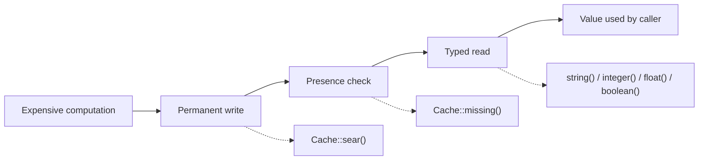

# Chapter 11 - Cache beyond `remember`

Chapter 10 closed the first half of Part V by tying a project resource's permissions and
validation rules together, declaratively and without repeating boilerplate for every ability or
every form. Chapter 11 continues Part V by turning to a different concern that appears once that
data is real: some of it is expensive to compute, and recomputing it on every request wastes work
for no benefit. Three undocumented cache methods cover the full lifecycle of a value like this.
`Cache::sear()` writes it permanently, under a name of its own; `Cache::missing()` answers,
directly, whether it has ever been written at all; and the typed getters (`string()`, `integer()`,
`float()`, `boolean()`) read it back already known to be of a given type. The running example is a
project report: four aggregate figures - a budget total, an average, an executive-review flag, and
a generation timestamp - computed once from the projects built in Chapter 10, then read back
through each of this chapter's three entries in turn. Every example is verified against
`laravel/framework` v13.22.0 and the `laravel/docs` `13.x` branch, and is a real, green Pest test
drawn from this book's companion application.



## `Cache::sear()`

**Case type**: an undocumented method on `Illuminate\Cache\Repository` (proxied by the `Cache`
facade), sitting beside a class whose `rememberForever()` is extensively documented. 

**Alias flag**: confirmed at the source, not only in effect - `sear()`'s entire body is a single
delegating call, nothing more. It is exactly the alias this chapter's own outline already flagged
it as; nothing below should be read as a new mechanism. 

**Audience**: ordinary application
developers, no shift toward package authors.

**Stability**: core cache code, no minor-version
churn found while verifying against v13.22.0.

Reading `Illuminate\Cache\Repository` at v13.22.0 settles the question directly:

```php
public function sear($key, Closure $callback)
{
    return $this->rememberForever($key, $callback);
}

public function rememberForever($key, Closure $callback)
{
    $value = $this->get($key);

    if (! is_null($value)) {
        return $value;
    }

    $this->forever($key, $value = $callback());

    return $value;
}
```

`sear()` is not a method that happens to behave like `rememberForever()`; it is `rememberForever()`,
reached through a different name. `laravel/docs` `13.x` `cache.md` documents `rememberForever()`
with a worked example; `sear(` does not appear anywhere in that document.

### Minimal snippet

```php
use Illuminate\Support\Facades\Cache;

$total = Cache::sear('projects.report.total_budget_cents', fn () => $this->compute()['total_budget_cents']);
```

### Documented way vs. discovered way

The two calls below do exactly the same thing, in the exact same order, because one is a
one-line wrapper around the other:

```php
Cache::rememberForever('projects.report.total_budget_cents', fn () => $this->compute()['total_budget_cents']);

Cache::sear('projects.report.total_budget_cents', fn () => $this->compute()['total_budget_cents']);
```

There is no behavioral reason to prefer either one. `sear()` exists purely as a shorter, more
evocative name for the same permanent-write-once operation `rememberForever()` already documents.

### Real scenario: caching the project report's four figures permanently

`ProjectReportService::compute()`, built in Chapter 11's first step, aggregates four figures over
every `Project` on each call, with no caching involved. `report()` wraps each figure in its own
`Cache::sear()` call:

```php
public function report(): array
{
    return [
        'total_budget_cents' => Cache::sear(
            'projects.report.total_budget_cents',
            fn () => $this->compute()['total_budget_cents'],
        ),
        'average_budget_cents' => Cache::sear(
            'projects.report.average_budget_cents',
            fn () => $this->compute()['average_budget_cents'],
        ),
        'requires_executive_review' => Cache::sear(
            'projects.report.requires_executive_review',
            fn () => $this->compute()['requires_executive_review'],
        ),
        'generated_at' => Cache::sear(
            'projects.report.generated_at',
            fn () => $this->compute()['generated_at'],
        ),
    ];
}
```

Four separate keys, not one array under a single key, because later in this chapter each figure
needs to be read back on its own, by a getter that expects one specific type. `GET /projects/report`
calls `report()` instead of `compute()`, so the aggregate now survives across requests instead of
being recalculated every time:

```php
$first = $this->actingAs($user)->get('/projects/report')->json();

Project::factory()->create(['budget_cents' => 6_000_000]);

$second = $this->actingAs($user)->get('/projects/report')->json();

expect($second)->toBe($first); // the new project does not change the cached report
```

A new project created after the first call has no effect on the second response: every figure was
already permanently stored under its own key by the first call, and `rememberForever()`'s own
logic - a plain `get()` check before ever invoking the callback - means `compute()` never runs
again until something clears those four keys explicitly. A second test proves the other side of
the same behavior: the report only changes once its cache keys are actually cleared, not on a
timer of its own:

```php
$first = $this->actingAs($user)->get('/projects/report')->json('generated_at');

Cache::flush();
sleep(1);

$second = $this->actingAs($user)->get('/projects/report')->json('generated_at');

expect($second)->not->toBe($first);
```

A practical note before relying on this pattern as-is: neither `sear()` nor `rememberForever()` is
atomic. If two requests reach `GET /projects/report` for the first time at nearly the same moment,
before any of the four keys exist, both can run `compute()` in parallel before either one writes
its result - each `Cache::sear()` call only checks `get()` for its own key, with no locking around
the gap between that check and the later `forever()` write. The duplicated work resolves itself
harmlessly once both calls finish (the last write simply wins), but it is still work done twice for
nothing. `Cache::lock()` - documented, and already used elsewhere in this book's companion
application to serialize a stock import - is the tool for closing that gap when duplicate work is
not acceptable; this chapter's report tolerates it, so it is left as `sear()` alone.

## `Cache::missing()`

**Case type**: an undocumented method on `Illuminate\Cache\Repository`, sitting beside `has()`,
which is documented. 

**Alias flag**: not a trivial alias the way `sear()` was - `missing()` is a
one-line negation of `has()`, but that negation is exactly the point: it lets a caller say "this
has not happened yet" as a single, positively named call, instead of reading a double negative
each time (`! $cache->has(...)`) wherever the question "is this still absent" comes up. 

**Audience**:
ordinary application developers. 

**Stability**: core cache code, no minor-version churn found
while verifying against v13.22.0.

Reading `Illuminate\Cache\Repository` at v13.22.0 confirms the whole method:

```php
public function has($key): bool
{
    return ! is_null($this->get($key));
}

public function missing($key)
{
    return ! $this->has($key);
}
```

`laravel/docs` `13.x` `cache.md` documents `has()`; `missing(` does not appear anywhere in that
file.

### Minimal snippet

```php
use Illuminate\Support\Facades\Cache;

if (Cache::missing('projects.report.generated_at')) {
    // the report has never been generated
}
```

### Documented way vs. discovered way

```php
! Cache::has('projects.report.generated_at');

Cache::missing('projects.report.generated_at');
```

Both lines evaluate to the same boolean, for the same key. The difference is entirely in how the
question reads at the call site: a caller asking "is this still missing" reads that intent
directly from `missing()`, rather than reconstructing it from a negated presence check.

### Real scenario: checking whether the report exists, without generating it

`ProjectReportService::isMissing()` exposes the check on the one cache key that `report()` always
writes last, since all four keys are always written together in the same call:

```php
public function isMissing(): bool
{
    return Cache::missing('projects.report.generated_at');
}
```

`ProjectReportController::status()` turns that into a small, read-only endpoint - the kind a
dashboard would poll before deciding whether to show a "generate report" prompt, without ever
paying for the aggregate itself:

```php
public function status(ProjectReportService $service)
{
    Gate::authorize('project.viewAny');

    return response()->json(['generated' => ! $service->isMissing()]);
}
```

A test confirms both the reported value and, just as importantly, the absence of any side effect:
calling `/projects/report/status` before the report has ever been requested still leaves the cache
key missing afterwards, proving the status check never ran `compute()` on the caller's behalf:

```php
$this->actingAs($user)->get('/projects/report/status')
    ->assertOk()
    ->assertJson(['generated' => false]);

expect(Cache::missing('projects.report.generated_at'))->toBeTrue();
```

Once `/projects/report` has been requested at least once, the same status endpoint reports
`generated: true` - it never recomputes anything, it only ever reads the one key `report()` already
wrote.

## `string()`, `integer()`, `float()`, `boolean()`

**Case type**: four undocumented methods on `Illuminate\Cache\Repository`. 

**Alias flag**: not
aliases of `get()` with a cast bolted on - each one throws rather than silently returning a
wrong-shaped value, which a manual cast never does. 

**Audience**: ordinary application developers.

**Stability**: core cache code, no minor-version churn found while verifying against v13.22.0.

All four follow the same shape: call `get($key, $default)`, then validate the type of whatever came
back - the cached value if the key exists, `$default` otherwise. Reading
`Illuminate\Cache\Repository` at v13.22.0 shows they are not all equally strict:

```php
public function integer($key, $default = null): int
{
    $value = $this->get($key, $default);

    if (is_int($value)) {
        return $value;
    }

    if (filter_var($value, FILTER_VALIDATE_INT) !== false) {
        return (int) $value;
    }

    throw new InvalidArgumentException(
        sprintf('Cache value for key [%s] must be an integer, %s given.', $key, gettype($value))
    );
}

public function boolean($key, $default = null): bool
{
    $value = $this->get($key, $default);

    if (! is_bool($value)) {
        throw new InvalidArgumentException(
            sprintf('Cache value for key [%s] must be a boolean, %s given.', $key, gettype($value))
        );
    }

    return $value;
}
```

`integer()` and `float()` grant one step of leniency beyond a strict type check - a numeric string
still passes, via `filter_var(..., FILTER_VALIDATE_INT|FLOAT)`. `boolean()` (and `string()`) grant
none: only an actual PHP `bool` (or `string`) passes, so a cached `1` or `'true'` throws exactly
like any other wrong type. A missing key with no `$default` argument fails the same check `$value`
is `null` in every one of them, so it throws too - the explicit defaults below are not a
convenience, they are what keeps a first-ever call from failing outright. `laravel/docs` `13.x`
`cache.md` documents none of these four methods by name.

### Minimal snippet

```php
use Illuminate\Support\Facades\Cache;

$total = Cache::integer('projects.report.total_budget_cents', 0);
```

### Documented way vs. discovered way

```php
(int) Cache::get('projects.report.total_budget_cents', 0);

Cache::integer('projects.report.total_budget_cents', 0);
```

A manual cast never throws - it silently coerces almost anything into some value of the target
type (`(int) 'not-a-number'` is `0`, `(bool) 'not-a-number'` is `true`). That is exactly the failure
mode the typed getters close off: a silently-wrong `0` or `true` sitting in a report is worse than
a loud exception during development, pointing straight at the cache key that no longer holds what
the code assumes it holds.

### Real scenario: a dashboard widget that never waits on the full report

`ProjectReportService::widget()` reads all four cached figures directly, with a default for each,
and never calls `report()` or `compute()`:

```php
public function widget(): array
{
    return [
        'total_budget_cents' => Cache::integer('projects.report.total_budget_cents', 0),
        'average_budget_cents' => Cache::float('projects.report.average_budget_cents', 0.0),
        'requires_executive_review' => Cache::boolean('projects.report.requires_executive_review', false),
        'generated_at' => Cache::string('projects.report.generated_at', 'never'),
    ];
}
```

`ProjectReportController::widget()` exposes it as `GET /projects/report/widget`, the kind of
lightweight card a dashboard renders immediately, even before anyone has ever requested the full
report:

```php
$this->actingAs($user)->get('/projects/report/widget')
    ->assertOk()
    ->assertJson([
        'total_budget_cents' => 0,
        'average_budget_cents' => 0.0,
        'requires_executive_review' => false,
        'generated_at' => 'never',
    ]);
```

Note the shape of that default: `generated_at` is an ISO 8601 string when the report exists, and
the plain string `'never'` when it does not - a caller that needs to parse it as a date has to
check for the sentinel first. `GET /projects/report/status` already exposes a clean boolean for
"has this ever run"; a real client is generally better off asking that endpoint before trying to
parse `generated_at` at all, rather than treating the sentinel as if it were a date.

Once `/projects/report` has been requested at least once, the widget reports back exactly what the
full report produced, read from the same four keys rather than recomputed:

```php
$report = $this->actingAs($user)->get('/projects/report')->json();
$widget = $this->actingAs($user)->get('/projects/report/widget')->json();

expect($widget)->toBe($report);
```

A last test demonstrates the strict, no-coercion side of `boolean()` directly: a cached `1` is
unambiguously "truthy" by ordinary PHP rules, yet `boolean()` still refuses it, exactly as the
verified source above predicts:

```php
Cache::put('projects.report.requires_executive_review', 1);

expect(fn () => Cache::boolean('projects.report.requires_executive_review'))
    ->toThrow(InvalidArgumentException::class);
```

## Summary

| Entry | Documented alternative | When to prefer it |
|---|---|---|
| `Cache::sear()` | `Cache::rememberForever()` | Never functionally - it is the same call under a shorter name; use whichever name reads better in context. |
| `Cache::missing()` | `! Cache::has($key)` | To state "this is still absent" directly, instead of a negated presence check at every call site. |
| `string()` / `integer()` / `float()` / `boolean()` | `Cache::get($key, $default)` + a manual cast | When a wrong-shaped cached value should fail loudly during development instead of silently coercing into a plausible-looking default. |

The documented approach is still the right one in some cases: a single, one-off cached value read
immediately after being written in the same request needs none of this chapter's three entries -
its type is already known with certainty, and a plain `Cache::remember()`/`get()`/`has()` says
exactly what is happening without reaching for a less familiar name. Neither `sear()` nor the typed
getters change how the `array` cache store behaves between tests: every test in this chapter opens
with `Cache::flush()`, since the store persists for the life of the test process and
`RefreshDatabase` only resets the database, never the cache.

This closes Part V - Authorization, Validation, and Asynchrony. Chapter 12 (Job chaining, queues,
and notifications outside the standard flow) closes the Part next, picking up a natural question
this chapter leaves open: a cached, expensive-to-compute report like this one is exactly the kind
of value a real application would refresh from a queued job on a schedule, rather than recomputing
it inline on whichever request happens to find it missing.
