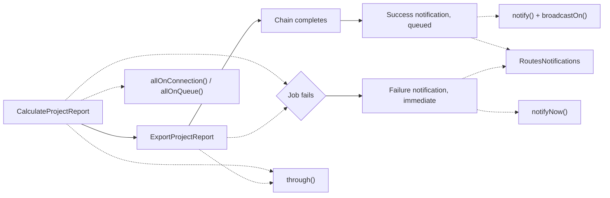

# Chapter 12 - Job chaining, queues, and notifications outside the standard flow

Chapter 11 closed by naming exactly the situation this chapter opens with: a cached,
expensive-to-compute report is exactly the kind of value a real application refreshes from a
queued job, rather than recomputing it inline on whichever request happens to find it missing.
Chapter 12 builds that job, and follows it all the way to the message that tells someone it is
done. Two clusters of undocumented mechanisms cover it end to end. Job chaining:
`allOnConnection()`/`allOnQueue()` route an entire chain onto a shared connection and queue
through a single pair of calls on its first job, and `through()` attaches queue middleware to a
job instance at dispatch time. Notifications: `notifyNow()` sends a notification
immediately, bypassing the queue entirely; `broadcastOn()` lets a notification choose its own
real-time broadcast channel instead of the one Laravel derives from its class name; and
`RoutesNotifications` is the trait that makes any class notifiable, not only a `User` model. The
running example is a background chain that regenerates the same project report Chapter 11
introduced - `CalculateProjectReport` recalculates and re-caches its four figures,
`ExportProjectReport` writes them out as a file - and, once the chain settles, notifies the
project's external stakeholder, a plain object built around its `external_contract_reference`
rather than a `User`, instead of leaving that report to be read back through a synchronous
request. Chapter 12 continues Part V - Authorization, Validation, and Asynchrony, and closes it.
Every example is verified against `laravel/framework` v13.22.0 and the `laravel/docs` `13.x`
branch, and is a real, green Pest test drawn from this book's companion application.



## `allOnConnection()` / `allOnQueue()`

**Case type**: two undocumented instance methods on `Illuminate\Bus\Queueable`, the trait every
queued job already uses, doing the same job as `PendingChain::onConnection()`/`onQueue()` -
documented, but on an entirely different class, not merely a sibling method sitting inside the
same otherwise-documented class. 

**Alias flag**: not an alias - the two reach the same end state
through a genuinely different mechanism: job-instance state cascaded chain-wide through
`dispatchNextJobInChain()`, versus `PendingChain`'s own chain-level properties copied onto the
first job at `dispatch()` time. 

**Audience**: ordinary application developers, no shift toward
package authors. 

**Stability**: core Bus/queue code, no minor-version churn found while verifying
against v13.22.0.

Reading `Illuminate\Bus\Queueable` at v13.22.0 settles what these two methods actually do,
together with the mechanism that carries their effect down the rest of the chain:

```php
public function allOnConnection($connection)
{
    $resolvedConnection = enum_value($connection);

    $this->chainConnection = $resolvedConnection;
    $this->connection = $resolvedConnection;

    return $this;
}

public function allOnQueue($queue)
{
    $resolvedQueue = enum_value($queue);

    $this->chainQueue = $resolvedQueue;
    $this->queue = $resolvedQueue;

    return $this;
}

public function dispatchNextJobInChain()
{
    if (is_array($this->chained) && ! empty($this->chained)) {
        dispatch(tap(unserialize(array_shift($this->chained)), function ($next) {
            $next->chained = $this->chained;

            $next->onConnection($next->connection ?: $this->chainConnection);
            $next->onQueue($next->queue ?: $this->chainQueue);

            $next->chainConnection = $this->chainConnection;
            $next->chainQueue = $this->chainQueue;
            $next->chainCatchCallbacks = $this->chainCatchCallbacks;
        }));
    }
}
```

`allOnConnection()`/`allOnQueue()` set both the immediate `connection`/`queue` properties on the
job they are called on and a second pair, `chainConnection`/`chainQueue`, meant to outlive that
one job. `dispatchNextJobInChain()`, invoked automatically once a queued job in a chain finishes,
reads exactly those two properties off the finishing job and copies them onto the next one, then
copies them forward again onto that same next job's own `chainConnection`/`chainQueue` - so a
third job, and a fourth, inherit the same routing without ever calling
`allOnConnection()`/`allOnQueue()` themselves. `Bus::chain([...])` itself returns
`Illuminate\Foundation\Bus\PendingChain`, an entirely different class with no
`allOnConnection()`/`allOnQueue()` of its own; the actually-reachable, documented way to route a
whole chain is `PendingChain`'s own `onConnection()`/`onQueue()`, called after `Bus::chain([...])`
and before `->dispatch()`.

### Minimal snippet

```php
(new CalculateProjectReport)->allOnConnection('reports')->allOnQueue('reports');
```

### Documented way vs. discovered way

```php
Bus::chain([
    new CalculateProjectReport,
    new ExportProjectReport,
])->onConnection('reports')->onQueue('reports')->dispatch();

Bus::chain([
    (new CalculateProjectReport)->allOnConnection('reports')->allOnQueue('reports'),
    new ExportProjectReport,
])->dispatch();
```

Both route the entire two-job chain onto the `reports` connection and queue identically at
runtime; `ExportProjectReport` never calls either method itself in either version. The difference
is which object carries the setting, and how forcefully it is applied. `PendingChain::dispatch()`
only assigns its chain-level connection/queue onto the first job if that job does not already
carry its own (`$firstJob->connection = $firstJob->connection ?: $this->connection;`, straight from
the framework source): the job's own setting wins. `allOnConnection()`/`allOnQueue()` assign
unconditionally, overriding whatever the job already had. The discovered pair is also the only
option when there is no `PendingChain` in scope at all - a job dispatched through its own
`chain([...])` call, or through `SomeJob::dispatch()->chain([...])`, never goes through
`Bus::chain([...])` and therefore never produces one.

### Real scenario: routing the report-regeneration chain onto its own connection

`ProjectReportController::regenerate()` dispatches the whole chain after confirming, through a
dedicated ability, that the requesting user owns or administers the project in the URL:

```php
public function regenerate(Project $project)
{
    Gate::authorize('regenerate-project-report', $project);

    Bus::chain([
        (new CalculateProjectReport)->allOnConnection('reports')->allOnQueue('reports'),
        new ExportProjectReport,
    ])->dispatch();

    return response()->json(['dispatched' => true], 202);
}
```

`config/queue.php` gains a `reports` connection alongside the existing ones:

```php
'reports' => [
    'driver' => 'sync',
],
```

The point of a dedicated connection and queue is isolation: recalculating four aggregate figures
over every `Project`, then writing an export file, is exactly the kind of work a real deployment
does not want competing with user-facing jobs on the default queue - a slow report run should never
be the reason a password-reset email or an order confirmation waits behind it. The `sync` driver
above provides no such isolation on its own; it is used here only because every example in this
book's companion application runs inline under `QUEUE_CONNECTION=sync` for testability, and a real
deployment would back the same `reports` connection with `redis`, `database`, or `sqs` to get actual
isolation.

Proving the routing actually reaches both jobs needs a real dispatch, not a fake: `Queue::fake()`
or `Bus::fake()` would intercept each job before `dispatchNextJobInChain()` ever runs, which is the
only place the `reports` connection and queue get copied onto the second job. A fake would also
wipe out the first job's own explicitly-set values, not just the second job's inherited ones:
`Illuminate\Support\Testing\Fakes\PendingChainFake::dispatch()` unconditionally calls
`$firstJob->allOnConnection($this->connection)`/`allOnQueue($this->queue)` with whatever the chain
itself was given, `null` included, so even `CalculateProjectReport`, which called
`allOnConnection()`/`allOnQueue()` itself, would read back unrouted under a fake. The test instead
listens with `Queue::before()`, which fires immediately before a job is processed, whether by a
real worker or, as here, inline by the `sync` driver, carrying the real job instance and the
connection it was pulled from, without preventing that processing:

```php
it('routes both chained jobs onto the reports connection and queue on a real end-to-end dispatch', function () {
    Storage::fake();

    $seen = [];

    Queue::before(function ($event) use (&$seen) {
        $command = unserialize($event->job->payload()['data']['command']);

        $seen[get_class($command)] = [
            'connection' => $command->connection,
            'queue' => $command->queue,
            'event_connection_name' => $event->connectionName,
        ];
    });

    $user = User::factory()->create();
    $project = Project::factory()->create(['owner_id' => $user->id]);

    $this->actingAs($user)
        ->post("/projects/{$project->id}/report/regenerate")
        ->assertStatus(202);

    expect($seen)->toHaveKeys([
        CalculateProjectReport::class,
        ExportProjectReport::class,
    ]);

    foreach ([CalculateProjectReport::class, ExportProjectReport::class] as $jobClass) {
        expect($seen[$jobClass]['connection'])->toBe('reports');
        expect($seen[$jobClass]['queue'])->toBe('reports');
        expect($seen[$jobClass]['event_connection_name'])->toBe('reports');
    }
});
```

Both jobs report `connection` and `queue` as `reports`, and the queue connection Laravel actually
used to run each one (`event_connection_name`) matches too - not just `CalculateProjectReport`,
which called `allOnConnection()`/`allOnQueue()` directly, but `ExportProjectReport`, which never
calls either method and only inherits the routing because `dispatchNextJobInChain()` propagated it
forward. The assertion checks only these two job classes by name, not everything `Queue::before()`
happens to observe: later entries in this chapter add more work to this same `regenerate()` call,
none of which has any reason to share the `reports` connection.

## `through()`

**Case type**: an undocumented method living alongside a widely documented *feature*, job
middleware, rather than an undocumented sibling sitting inside one specific documented class.
`laravel/docs` `13.x`'s `queues.md` documents job middleware at length, starting from its "Job
Middleware" section, entirely through a method named `middleware()` - `through(` never appears in
that file. 

**Alias flag**: not an alias, and the working assumption going into this chapter that it
was one does not survive reading the source. `through()` and `middleware()` are two distinct,
additive mechanisms whose results get merged, not one delegating to the other - the rest of this
section shows exactly how. 

**Audience**: ordinary application developers, no shift toward package
authors. 

**Stability**: core `Illuminate\Bus`/`Illuminate\Queue` code, no minor-version churn found
while verifying against v13.22.0.

`Illuminate\Bus\Queueable::through()` - the same trait behind `allOnConnection()`/`allOnQueue()`
above - is short enough to settle what it actually does on its own:

```php
public function through($middleware)
{
    $this->middleware = Arr::wrap($middleware);

    return $this;
}
```

It assigns a job's own public `$middleware` property, fluently, at the point where the job instance
is built and dispatched. `middleware(): array` is not a trait method at all: it does not exist
anywhere under `Illuminate\Queue\` or `Illuminate\Foundation\Bus\`. It is a plain user-land
convention, read off the job class through `method_exists()` - the docs say as much directly, noting
that this method "does not exist on jobs scaffolded by the `make:job` Artisan command, so you will
need to manually add it to your job class." `through()` needs no such addition: every job using the
`Queueable` trait already has it. The two are combined, not chosen between, exactly once, in
`Illuminate\Queue\CallQueuedHandler::dispatchThroughMiddleware()`:

```php
return (new Pipeline($this->container))->send($command)
    ->through(array_merge(method_exists($command, 'middleware') ? $command->middleware() : [], $command->middleware ?? []))
    ->finally(...)
    ->then(...);
```

Both feed the same `array_merge()`, so a job can use either, both, or neither - `through()` never
substitutes for `middleware()`.

### Minimal snippet

```php
(new CalculateProjectReport)->through([new WithoutOverlapping('project-report')]);
```

### Documented way vs. discovered way

```php
// Documented: defined once, on the job class itself.
class CalculateProjectReport implements ShouldQueue
{
    use Queueable;

    public function middleware(): array
    {
        return [new WithoutOverlapping('project-report')];
    }

    public function handle(ProjectReportService $service): void
    {
        $service->refresh();
    }
}

// Discovered: attached from the dispatching code, per call, with no changes to the job class.
(new CalculateProjectReport)->through([new WithoutOverlapping('project-report')]);
```

Both run the same middleware around the same `handle()` call, through the same `array_merge()` shown
above. The difference is where the decision lives. `middleware()` bakes a fixed policy into the job
class, evaluated fresh on every run - the natural choice when a job always needs the same guard no
matter who dispatches it. `through()` lets the call site decide instead, which matters here because
the guard protects the entire two-job pipeline, not either job in isolation: pairing
`CalculateProjectReport` and `ExportProjectReport` under one shared lock is a decision about how they
are dispatched together. Two separate `middleware()` methods would scatter that one policy across two
files instead of stating it once, where the chain itself is built.

### Real scenario: guarding the report chain against overlapping regenerations

`ProjectReportController::regenerate()` now attaches the same `WithoutOverlapping` instance,
configured with `->shared()`, to both jobs before they enter the chain:

```php
public function regenerate(Project $project)
{
    Gate::authorize('regenerate-project-report', $project);

    $overlapGuard = fn () => (new WithoutOverlapping('project-report'))->shared()->expireAfter(120);

    Bus::chain([
        (new CalculateProjectReport)
            ->allOnConnection('reports')->allOnQueue('reports')
            ->through([$overlapGuard()]),
        (new ExportProjectReport)->through([$overlapGuard()]),
    ])->dispatch();

    return response()->json(['dispatched' => true], 202);
}
```

`WithoutOverlapping`'s lock key is, by default, scoped to the dispatching job's own class name -
useless here, where `CalculateProjectReport` and `ExportProjectReport` are different classes
protecting one shared report. `->shared()` drops the class name from the key, so both jobs contend
for the exact same lock (`laravel-queue-overlap:project-report`); without it, a concurrent
regeneration could still start its own `CalculateProjectReport` while the first regeneration's
`ExportProjectReport` is still reading figures the first job just wrote - the two-step pipeline as a
whole is the critical section, not either step alone. `expireAfter(120)` bounds how long the lock can
survive a crashed job that never reaches its own `finally` release; a real regeneration finishes well
under that.

When the lock is already held, `WithoutOverlapping::handle()` never calls the job's own logic at all:

```php
public function handle($job, $next)
{
    $lock = Container::getInstance()->make(Cache::class)->lock(
        $this->getLockKey($job), $this->expiresAfter
    );

    if ($lock->get()) {
        try {
            $next($job);
        } finally {
            $lock->release();
        }
    } elseif (! is_null($this->releaseAfter)) {
        $job->release($this->releaseAfter);
    }
}
```

Leaving `releaseAfter` at its default of `0` means a blocked job is released immediately, with
`$next($job)` never called - `handle()` never runs at all. Proving this needs the second dispatch to
find the lock already taken, but this book's companion application runs its queue with
`QUEUE_CONNECTION=sync`, so two real dispatches never truly overlap: each runs to completion, lock
included, before the next request even arrives. The test instead acquires the same lock directly,
simulating a regeneration already in flight:

```php
it('skips both chained jobs when a regeneration is already holding the shared overlap lock, then resumes once it is released', function () {
    Storage::fake();

    $user = User::factory()->create();
    $project = Project::factory()->create(['owner_id' => $user->id, 'budget_cents' => 500_000]);

    $this->actingAs($user)
        ->post("/projects/{$project->id}/report/regenerate")
        ->assertStatus(202);

    $firstGeneratedAt = Cache::string('projects.report.generated_at');
    $firstCsv = Storage::get('reports/project-report.csv');

    $lock = Cache::lock('laravel-queue-overlap:project-report', 120);
    $lock->get();

    $processed = [];
    Queue::before(function ($event) use (&$processed) {
        $processed[] = get_class(unserialize($event->job->payload()['data']['command']));
    });

    sleep(1);

    $this->actingAs($user)
        ->post("/projects/{$project->id}/report/regenerate")
        ->assertStatus(202);

    expect($processed)->toBe([CalculateProjectReport::class]);
    expect(Cache::string('projects.report.generated_at'))->toBe($firstGeneratedAt);
    expect(Storage::get('reports/project-report.csv'))->toBe($firstCsv);

    $lock->release();

    $this->actingAs($user)
        ->post("/projects/{$project->id}/report/regenerate")
        ->assertStatus(202);

    expect(Cache::string('projects.report.generated_at'))->not->toBe($firstGeneratedAt);
    expect(Storage::get('reports/project-report.csv'))->not->toBe($firstCsv);
});
```

The dispatch itself still returns `202`: `WithoutOverlapping` only intervenes once a worker picks the
job up, not at enqueue time, so the endpoint has no way to report "skipped" back to the caller.
`$processed` shows only `CalculateProjectReport` was even attempted - `ExportProjectReport` never
runs, because a chain only moves to its next job once the current one finishes without being
released. Once the lock is released, the same endpoint recomputes the report and rewrites the export
normally, confirming the guard blocks genuine overlap without leaving the report permanently stuck.

## `notifyNow()`

**Case type**: an undocumented method sitting on the very trait this chapter's own fifth entry,
`RoutesNotifications`, is about - the two are treated as separate entries here purely for
expository clarity, not because they are unrelated. 

**Alias flag**: not a trivial alias of
`notify()` - it bypasses `ShouldQueue` entirely, a real behavioral difference, not a shortcut to
the same outcome. It is, however, functionally identical to a method already documented at the
facade level, `Notification::sendNow()`; what is missing from the docs is the instance-side
sibling of `notify()`, not the bypass behavior itself. 

**Audience**: ordinary application
developers, no shift. 

**Stability**: core `Illuminate\Notifications` code, no minor-version churn
found while verifying against v13.22.0.

`Illuminate\Notifications\RoutesNotifications::notifyNow($instance, ?array $channels = null)`
delegates to `app(Dispatcher::class)->sendNow($this, $instance, $channels)`, and `sendNow()` is not
a flag checked somewhere inside `notify()`'s own path - it is an entirely separate route through
the notification system. `NotificationSender::send()` (what `notify()` reaches) checks
`$notification instanceof ShouldQueue` and queues it if so; `NotificationSender::sendNow()` (what
`notifyNow()` reaches) contains no such check at all. A `ShouldQueue` notification sent through
`notifyNow()` still runs in the current process, synchronously, every time.

### Minimal snippet

```php
$stakeholder->notifyNow(new ProjectReportFailed($project, $e));
```

### Documented way vs. discovered way

```php
// Documented: queues ProjectReportReady, respecting its ShouldQueue interface.
$stakeholder->notify(new ProjectReportReady($project, $report));

// Discovered: always synchronous, ShouldQueue or not.
$stakeholder->notifyNow(new ProjectReportFailed($project, $e));
```

Both calls read almost identically - that similarity is the point, `notifyNow()` mirrors
`notify()`'s own ergonomics rather than asking for a different style of call. `laravel/docs`
already documents the facade equivalent, `Notification::sendNow($developers, ...)`, "even if the
notification implements the `ShouldQueue` interface" - the same guarantee `notifyNow()` gives an
instance, without importing a facade or building a notifiable collection first. A failure alert
cannot wait behind whatever else is sitting on the queue, so `ProjectReportFailed` (which does not
even implement `ShouldQueue`) is only ever sent this way. The queue's own automatic retries are a
casualty of the same bypass: if the mail transport itself throws, there is no second attempt,
unlike a queued notification a worker would retry.

### Real scenario: notifying the project's stakeholder on success or failure

`ProjectReportController::regenerate()` builds one `ProjectStakeholder` and reaches it two ways,
depending on how the chain ends - a job/closure appended as the chain's own last step for success
(this chapter has no `then()`, only reaching the end of the chain itself), `catch()` for failure:

```php
public function regenerate(Project $project)
{
    Gate::authorize('regenerate-project-report', $project);

    $overlapGuard = fn () => (new WithoutOverlapping('project-report'))->shared()->expireAfter(120);
    $stakeholder = new ProjectStakeholder($project);

    Bus::chain([
        (new CalculateProjectReport)
            ->allOnConnection('reports')->allOnQueue('reports')
            ->through([$overlapGuard()]),
        (new ExportProjectReport)->through([$overlapGuard()]),
        function () use ($project, $stakeholder) {
            $stakeholder->notify(new ProjectReportReady($project, app(ProjectReportService::class)->widget()));
        },
    ])->catch(function (Throwable $e) use ($project, $stakeholder) {
        report($e);
        $stakeholder->notifyNow(new ProjectReportFailed($project, $e));
    })->dispatch();

    return response()->json(['dispatched' => true], 202);
}
```

`ProjectStakeholder` routes mail through `external_contract_reference`, which Chapter 10 validates
only as a free-text string, never as an email address - the fixture used below sets it to a
plausible `'client@example.com'` to exercise real mail delivery, not proof that the field is
actually validated as one.

The `catch()` callback calls the global `report($e)` helper before `notifyNow()`, so the full
exception still reaches the application's own exception handler and logs. `ProjectReportFailed`
itself deliberately never puts `$e->getMessage()` in front of the recipient: unlike a queued
failure notification that would only ever reach an internal `User`, this one is addressed to
`external_contract_reference`, an outside party - surfacing a raw exception message there risks
leaking internal detail (a query fragment, a file path, a third-party error body) to someone
outside the organization. The notification still carries the `Throwable` as a constructor
property, available to any channel that legitimately needs it, but `toMail()` only ever describes
the failure in general terms.

Testing this pushed `Notification::fake()` out of the picture entirely, for a reason specific to
this chapter's own recipient: `NotificationFake` indexes every send by `$notifiable->getKey()`,
an Eloquent convention `ProjectStakeholder` deliberately does not have, being exactly the kind of
non-model notifiable `RoutesNotifications` exists to support. Sending to it under the fake fails
outright, before any assertion even runs. `Mail::fake()` fares no better here: the mail channel
sends through `Mailer::send($view, $data, $callback)` with a `MailMessage`, never a `Mailable`, and
`MailFake` silently drops anything that is not one. Both tests instead run for real. On success, a
`Queue::before()` listener - the same technique this chapter has used since its opening entry -
catches `Illuminate\Notifications\SendQueuedNotifications` among the jobs the `sync` driver
actually processes, proving `notify()` queued `ProjectReportReady` rather than sending it in place;
on failure, dispatching a dedicated always-throwing test job (a named class, not anonymous - PHP
refuses to serialize anonymous classes, and this one has to survive the same serialize/unserialize
round trip as any other queued job) inside its own chain confirms the exception still propagates
past `catch()` while `SendQueuedNotifications` never appears at all, and the test-configured
`array` mail transport shows `ProjectReportFailed` was delivered immediately all the same.

## `broadcastOn()`

**Case type**: an undocumented method inside an area that is only partially documented -
`via()` and `toBroadcast()` are, `broadcastOn()`'s role in choosing a channel is not. 

**Alias flag**: not an alias of anything documented, and specifically not of the mechanism it looks like
it replaces. 

**Audience**: ordinary application developers, no shift. 

**Stability**: core
`Illuminate\Notifications`/`Illuminate\Broadcasting` code, no minor-version churn found while
verifying against v13.22.0.

`Illuminate\Notifications\Channels\BroadcastChannel::send()` never reads `broadcastOn()` itself -
it wraps the notification in a `BroadcastNotificationCreated` event and dispatches that, and it is
*that event's own* `broadcastOn()` that picks the channel:

```php
public function broadcastOn()
{
    $channels = $this->notification->broadcastOn();

    if (! empty($channels)) {
        return $channels;
    }
    // ...falls back to $notifiable->receivesBroadcastNotificationsOn(), then
    // get_class($notifiable).'.'.$notifiable->getKey() if neither is defined.
}
```

The notification's own `broadcastOn()` is checked first; only an empty array falls through to a
channel derived from the *notifiable*, not the notification - `laravel/docs` documents that
fallback directly, as a method named `receivesBroadcastNotificationsOn()` defined on the
recipient itself. The two are not interchangeable spellings of the same idea: a
`receivesBroadcastNotificationsOn()` on `User` fixes one channel for every notification that user
ever receives, while `broadcastOn()` on a specific notification class routes only that
notification differently, regardless of who receives it. For `ProjectStakeholder`, this
difference is not cosmetic. The fallback's default path calls `$notifiable->getKey()` - the same
Eloquent convention this chapter already found missing on a plain, non-`User` recipient when
verifying `notifyNow()`. Without overriding `broadcastOn()`, adding the `broadcast` channel to
`ProjectReportReady::via()` would crash the first time a real chain completed.

### Minimal snippet

```php
public function broadcastOn(): array
{
    return [new PrivateChannel('projects.'.$this->project->id)];
}
```

### Documented way vs. discovered way

```php
// Documented: one fixed channel for every notification this recipient ever gets.
public function receivesBroadcastNotificationsOn(): string
{
    return 'users.'.$this->id;
}

// Discovered: this notification's own channel, independent of who receives it.
public function broadcastOn(): array
{
    return [new PrivateChannel('projects.'.$this->project->id)];
}
```

`ProjectStakeholder` defines neither method, so without `ProjectReportReady`'s own `broadcastOn()`
there would be no fallback left to reach for - `receivesBroadcastNotificationsOn()` would need to
be added to `ProjectStakeholder` itself, tying a notification-specific routing decision to a class
that otherwise only knows how to route mail.

### Real scenario: a private, per-project broadcast channel

```php
class ProjectReportReady extends Notification implements ShouldQueue
{
    use Queueable;

    public function __construct(public Project $project, public array $report) {}

    public function via($notifiable): array
    {
        return ['mail', 'broadcast'];
    }

    public function toBroadcast($notifiable): BroadcastMessage
    {
        return new BroadcastMessage($this->report);
    }

    public function broadcastOn(): array
    {
        return [new PrivateChannel('projects.'.$this->project->id)];
    }

    public function toMail($notifiable): MailMessage
    {
        // unchanged from notifyNow()'s entry
    }
}
```

```php
it('broadcasts ProjectReportReady on a private channel named after its own project', function () {
    $projectA = Project::factory()->create();
    $projectB = Project::factory()->create();

    $channelsA = (new ProjectReportReady($projectA, []))->broadcastOn();
    $channelsB = (new ProjectReportReady($projectB, []))->broadcastOn();

    expect($channelsA)->toHaveCount(1);
    expect($channelsA[0])->toBeInstanceOf(PrivateChannel::class);
    expect($channelsA[0]->name)->toBe('private-projects.'.$projectA->id);
    expect($channelsB[0]->name)->toBe('private-projects.'.$projectB->id);
    expect($channelsA[0]->name)->not->toBe($channelsB[0]->name);
});
```

`broadcastOn()` needs neither a recipient nor a real dispatch to verify, so the test calls it
directly on two notifications built for two different projects and checks the channel names differ
- proof this is a channel per project, not a fixed or class-derived one. `Notification::fake()`
plays no part here, for the same reason it played none in the previous entry: it would fail on
`ProjectStakeholder` before this method ever ran.

A private channel needs an authorization callback in `routes/channels.php` before any real
frontend could subscribe to it, and this chapter adds none: `ProjectStakeholder` is not a `User`,
so it would never pass through the standard HTTP-authenticated channel-authorization flow that
callback normally relies on in the first place. That is a stated limitation of this narrow
example, not an oversight quietly left for later - a real deployment broadcasting to a
non-`User` recipient needs its own authorization strategy for that channel, built deliberately,
not inherited from `Broadcast::channel()`'s usual `Auth`-based defaults.

## `RoutesNotifications`

**Case type**: an entire undocumented trait composing into an otherwise well-documented one.
`laravel/docs` covers `Notifiable` at length - the trait every notifiable model uses, always shown
on `App\Models\User` or another Eloquent model - but never mentions `RoutesNotifications` by name,
even though `Notifiable` is nothing more than `use HasDatabaseNotifications, RoutesNotifications;`.

**Alias flag**: not a trivial alias of `Notifiable` - it is deliberately less than `Notifiable`,
and that is the entire point. 

**Audience**: ordinary application developers; modeling a recipient
that is not a user is an ordinary application concern, not a package-authoring one. 

**Stability**:
core `Illuminate\Notifications` code, no minor-version churn found while verifying against
v13.22.0.

`RoutesNotifications` defines exactly three methods: `notify()`, `notifyNow()` (this chapter's
third entry), and `routeNotificationFor($driver, $notification)`, the generic router that calls a
`routeNotificationFor{Driver}` method when one exists - `routeNotificationForMail()` here - and
otherwise falls back to `$this->notifications()` for the `database` driver, `$this->email` for
`mail`, or `null`. None of that touches Eloquent unless the `database` fallback is actually
reached without an override. `Notifiable`'s other half, `HasDatabaseNotifications`, is where
Eloquent enters: `notifications()`, `readNotifications()`, and `unreadNotifications()` are all
`morphMany` relationships, unusable on a class with no database table behind it.
`ProjectStakeholder` never sends a `database` notification, so it never needed any of that -
only the routing and sending half of `Notifiable`, which is exactly what `RoutesNotifications`
is.

### Minimal snippet

```php
class ProjectStakeholder
{
    use RoutesNotifications;

    public function routeNotificationForMail($notification): ?string
    {
        return $this->project->external_contract_reference;
    }
}
```

### Documented way vs. discovered way

Every example in `laravel/docs`'s notifications page puts `Notifiable` on a model - the assumption
running underneath all of it is that receiving a notification means being a row in a database
table. `RoutesNotifications` alone contradicts that assumption directly: nothing about `notify()`,
`notifyNow()`, or `routeNotificationFor()` requires a primary key, a table, or a single line of
Eloquent. A plain constructor-only class satisfies all three.

### Real scenario: one plain class, the whole chapter's recipient

```php
class ProjectStakeholder
{
    use RoutesNotifications;

    public function __construct(public Project $project) {}

    public function routeNotificationForMail($notification): ?string
    {
        return $this->project->external_contract_reference;
    }
}
```

This is the same class that received `ProjectReportReady` (queued, `mail` and its private
per-project `broadcast` channel) and `ProjectReportFailed` (`notifyNow()`, immediate) throughout
this chapter - never a `User`, never a database row. The final test makes that explicit rather
than leaving it implied by the surrounding code's silence about `User`:

```php
it('notifies only the ProjectStakeholder, never a User or any Eloquent model, when the report chain completes', function () {
    Storage::fake();

    $processed = [];
    Queue::before(function ($event) use (&$processed) {
        $processed[] = unserialize($event->job->payload()['data']['command']);
    });

    $user = User::factory()->create();
    $project = Project::factory()->create([
        'owner_id' => $user->id,
        'external_contract_reference' => 'client@example.com',
    ]);

    $this->actingAs($user)
        ->post("/projects/{$project->id}/report/regenerate")
        ->assertStatus(202);

    $queuedNotification = collect($processed)->first(fn ($command) => $command instanceof SendQueuedNotifications);
    $notifiable = $queuedNotification->notifiables->first();

    expect($notifiable)->toBeInstanceOf(ProjectStakeholder::class);
    expect($notifiable)->not->toBeInstanceOf(Model::class);
    expect($notifiable->project->id)->toBe($project->id);
    expect($notifiable->routeNotificationForMail(null))->toBe('client@example.com');
});
```

A `User` exists in this test only to own the `Project` and authorize the request - the recipient
Laravel actually queued the notification for is asserted to not even be an instance of
`Illuminate\Database\Eloquent\Model`, `User` or otherwise. `Notification::fake()` is absent here
for the same reason it was absent from the previous two entries: it would fail on
`ProjectStakeholder` before the assertion ever ran.

## Summary

| Entry | Documented alternative | When to prefer the undocumented one |
|---|---|---|
| `allOnConnection()` / `allOnQueue()` | `Bus::chain([...])->onConnection()->onQueue()->dispatch()` | No `PendingChain` in scope at all (`SomeJob::dispatch()->chain([...])`), or the setting must apply unconditionally regardless of what a job already carries |
| `through()` | `middleware(): array` defined on the job class | The guard reflects a decision made by the dispatching code (pairing several job classes under one shared policy), not a fixed fact about one job class |
| `notifyNow()` | `notify()` (respects `ShouldQueue`) | The send genuinely cannot wait - never as a default, since it forfeits the queue's automatic retries |
| `broadcastOn()` | `receivesBroadcastNotificationsOn()` on the recipient | The channel must depend on which notification is being sent, not only on who receives it |
| `RoutesNotifications` | `Notifiable` (`RoutesNotifications` + `HasDatabaseNotifications`) | The recipient is not, and should not become, an Eloquent model |

The documented alternative already suffices in the ordinary case for each of these: a whole chain
sharing one connection and queue reads more clearly through `PendingChain::onConnection()`/
`onQueue()` than through a call on its first job; a guard a job always needs regardless of caller
belongs on the job class itself, as `middleware()`; a recipient that can wait a few seconds is
better served by `notify()` plus `ShouldQueue`, retries included; a notification with no reason to
scope its channel per entity is fine leaving `receivesBroadcastNotificationsOn()` (or, absent
that, the class-derived default it falls back to) in charge of the channel; and a recipient that
already is a `User` (or any Eloquent model) gains database
notifications for free by staying on the full `Notifiable` trait, with no reason to drop down to
`RoutesNotifications` alone. Two closing cautions worth repeating here rather than only where they
first appeared: a private broadcast channel still needs its own authorization callback in
`routes/channels.php`, which this chapter never added, because `ProjectStakeholder` would not go
through the standard HTTP-authenticated flow that callback normally assumes; and `notifyNow()`
buys immediacy at the cost of the queue's automatic retries, so a failed send there gets no second
attempt.

Part V - Authorization, Validation, and Asynchrony ends here, complete across Chapters 10-12: from
authorizing and validating a request, through caching its expensive results, to processing and
notifying about them outside the request/response cycle entirely. Part VI - Artisan Commands opens
next with Chapter 13, "Component-based output for Artisan commands", moving from background
processing to the console's own output layer.
