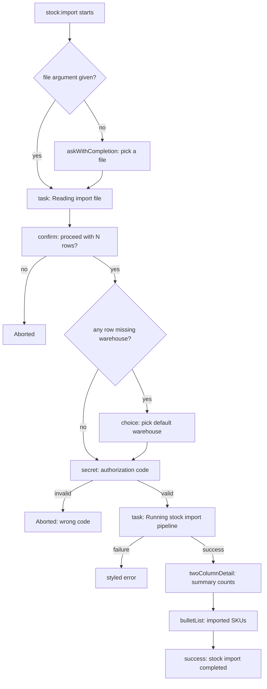

# Part VI - Artisan Commands

## Chapter 13: Component-based output for Artisan commands

Part VI - Artisan Commands opens here, directly after Part V - Authorization, Validation, and
Asynchrony closed with Chapter 12's job chains and notifications. This chapter stays inside a
single Artisan command, `stock:import`, which wraps the stock-movement import pipeline already
built in Chapter 3 (`StockImportPipeline`) behind a command-line entry point, alongside the
HTTP endpoint that already exposes the same pipeline. Every entry in this chapter styles or
extends that one command's output and interaction, one capability at a time.

Laravel ships this components-based output system for Artisan as part of pull request #43065,
"Introducing a fresh new look for Artisan," merged into the `9.x` branch in July 2022 alongside
a wholesale rewrite of the framework's own first-party commands (`migrate`, `queue:work`,
`db:seed`, and others). None of it replaces the classic `Command` methods described in the
official documentation: it sits beside them, reached through a single property,
`$this->components`, and it is exactly this property, not any of the classic methods, that this
chapter is about.



The command's own signature stays small through the whole chapter:

```php
protected $signature = 'stock:import {file} {--with-audit}';
```

Everything below styles or extends what happens inside a single `handle()` method.

### Styled status messages: `info()`, `error()`, `warn()`, `success()`, `alert()`, `line()`

A minimal, isolated look at all six, called directly on the property every `Command` already
carries:

```php
$this->components->alert('Starting stock import.');
$this->components->info('Importing 3 row(s) from stock.json.');
$this->components->warn('No audit snapshot was recorded; pass --with-audit to record one.');
$this->components->error('Stock import file not found: stock.json.');
$this->components->success('Stock import completed successfully.');
$this->components->line('info', 'A plain info-styled line, printed without calling info() itself.');
```

`alert()` renders as a full-width, uppercased banner. `info()`, `warn()`, `error()`, and
`success()` each render as a single line prefixed with a colored badge (a blue `INFO`, yellow
`WARN`, red `ERROR`, or green `SUCCESS` box) rather than the plain colored text the classic
methods produce. `line()` is the primitive the first four badges actually delegate to, and it
is the one method of the six whose signature differs from its classic counterpart: it takes the
badge style as a mandatory first argument (`info`, `success`, `warn`, or `error`), while the
classic `$this->line($string, $style = null, $verbosity = null)` takes an optional, trailing
style instead.

**Documented way vs. discovered way.** All of `line()`, `info()`, `warn()`, `alert()`, and
`error()` also exist as classic, individually documented methods directly on `Command`, and
they accept the same string:

```php
// Documented, classic Command methods
$this->alert('Starting stock import.');
$this->info('Importing 3 row(s) from stock.json.');
$this->warn('No audit snapshot was recorded; pass --with-audit to record one.');
$this->error('Stock import file not found: stock.json.');

// Discovered, component-based equivalents
$this->components->alert('Starting stock import.');
$this->components->info('Importing 3 row(s) from stock.json.');
$this->components->warn('No audit snapshot was recorded; pass --with-audit to record one.');
$this->components->error('Stock import file not found: stock.json.');
```

Same method names, same arguments, but not the same mechanism: the classic methods write
plainly colored text through Symfony Console's own tag formatting, while the
`$this->components->` versions route through a small, separate rendering pipeline
(`Illuminate\Console\View\Components\*`) that also applies three content mutators before
anything is printed - one that highlights backtick-wrapped text, one that appends closing
punctuation to a message that lacks it, and one that rewrites an absolute path under the
application's base path into a relative one. None of that happens with the classic methods.
`success()` has no classic counterpart to compare against at all: `Command` documents `line`,
`newLine`, `info`, `comment`, `question`, `warn`, `alert`, and `error`, but never a plain
`$this->success()` - the styled version is the only way to get that particular green badge.

**Real scenario.** `ImportStockMovementsCommand::handle()` uses all six, end to end:

```php
public function handle(StockImportPipeline $pipeline): int
{
    $this->components->alert('Starting stock import.');

    $path = $this->argument('file');

    if (! is_file($path) || ! is_readable($path)) {
        $this->components->error("Stock import file not found: {$path}");

        return self::FAILURE;
    }

    $decoded = json_decode(file_get_contents($path), true);

    if (json_last_error() !== JSON_ERROR_NONE || ! is_array($decoded)) {
        $this->components->error("Stock import file does not contain valid JSON: {$path}");

        return self::FAILURE;
    }

    $rows = $decoded['rows'] ?? [];

    $this->components->info('Importing '.count($rows).' row(s) from '.$path.'.');

    try {
        $result = $pipeline->run($rows, $this->option('with-audit'));
    } catch (InvalidArgumentException|RuntimeException $e) {
        $this->components->error($e->getMessage());

        return self::FAILURE;
    }

    if (array_key_exists('audit', $result)) {
        $this->components->info('Audit snapshot recorded for '.count($result['audit']['skus']).' SKU(s).');
    } else {
        $this->components->warn('No audit snapshot was recorded; pass --with-audit to record one.');
    }

    $this->components->success('Stock import completed successfully.');

    return self::SUCCESS;
}
```

`alert()` opens every run regardless of outcome; `error()` covers a missing file, invalid JSON,
and the two exceptions `StockImportPipeline` itself can throw (an invalid row, or the import
lock already being held); `info()` reports the row count up front and, on success, the audit
summary when `--with-audit` was passed; `warn()` covers the same branch when it was not; and
`success()` closes a run that reached the end without error.

Applying the mandatory flagging checklist to this entry: it does not shift the audience away
from application developers - anyone writing a custom Artisan command can reach
`$this->components` exactly the same way. None of the six methods is a trivial alias of
anything already documented: five of them share a name with a classic, documented method but
run through an entirely different rendering mechanism, and the sixth, `success()`, has no
documented counterpart whatsoever. This is core console infrastructure, used internally by
Laravel's own generator and maintenance commands since the `9.x` rewrite that introduced it, so
no particular production-stability warning applies here, beyond stating that explicitly rather
than assuming it silently. As for the shape of the case itself: `$this->components` is an
undocumented property on an otherwise thoroughly documented class, `Command`, and it resolves
to an entirely undocumented class family, `Illuminate\Console\View\Components\*`, dispatched
through a single `__call()` on a factory that has no hardcoded methods of its own.

### `task()`

A minimal, isolated look at the method:

```php
$this->components->task('Reading import file', function () {
    // ...
});
```

The line printed is the description, followed by a row of dots filling the rest of the
terminal width, an elapsed time, and one of three outcome words: `DONE` in green, `FAIL` in
red, or `SKIPPED` in yellow. Which of the three appears depends on how the callback ends, and
this is where `task()` hides two behaviors that are easy to miss:

The first is that an exception thrown inside the callback is not swallowed. `task()` prints
`FAIL` the moment the callback throws, but the same exception still propagates out of
`task()` afterward - the method only owns the visual indicator, not the surrounding control
flow. Calling code that wants to keep running, or return a specific exit code, still needs its
own `try`/`catch` around the call, exactly as it would without `task()` at all.

The second is narrower but easy to trip over: returning a plain boolean `false` from the
callback does not render as `FAIL`. The outcome is decided by comparing the callback's return
value against two specific integers (the ones behind `Illuminate\Console\View\TaskResult::
Failure` and `::Skipped`); anything else, `false` included, is treated as success. Laravel's
own `optimize`/`optimize:clear` commands write `fn () => $this->callSilently($command) == 0`
as a task callback - a boolean expression - so even a failing sub-command there would still
print `DONE`. The safe way to signal failure from inside a task is to throw, not to return
`false`.

**Documented way vs. discovered way.** `task()` has no classic counterpart to fall back on:
`Command` never defines a `task()` method of its own, styled or otherwise. The comparison here
is against the manual pattern the previous section's messages would otherwise require - an
`if`/`else` block that decides for itself what to print, with no dots, no timing, and no
single word summarizing the outcome:

```php
// Manual pattern, no task()
$this->components->info('Reading import file...');

try {
    $rows = readImportFile($path);
    $this->components->info('Reading import file: done.');
} catch (RuntimeException $e) {
    $this->components->error('Reading import file: failed.');

    throw $e;
}

// Discovered: task() does the printing for you
$this->components->task('Reading import file', function () use ($path, &$rows) {
    $rows = readImportFile($path);
});
```

**Real scenario.** `ImportStockMovementsCommand::handle()` wraps both of its steps this way,
letting one shared `catch` handle whichever step fails:

```php
public function handle(StockImportPipeline $pipeline): int
{
    $this->components->alert('Starting stock import.');

    $path = $this->argument('file');

    $rows = [];
    $result = [];

    try {
        $this->components->task('Reading import file', function () use ($path, &$rows) {
            if (! is_file($path) || ! is_readable($path)) {
                throw new RuntimeException("Stock import file not found: {$path}");
            }

            $decoded = json_decode(file_get_contents($path), true);

            if (json_last_error() !== JSON_ERROR_NONE || ! is_array($decoded)) {
                throw new RuntimeException("Stock import file does not contain valid JSON: {$path}");
            }

            $rows = $decoded['rows'] ?? [];
        });

        $this->components->info('Importing '.count($rows).' row(s) from '.$path.'.');

        $this->components->task('Running stock import pipeline', function () use ($pipeline, $rows, &$result) {
            $result = $pipeline->run($rows, $this->option('with-audit'));
        });
    } catch (InvalidArgumentException|RuntimeException $e) {
        $this->components->error($e->getMessage());

        return self::FAILURE;
    }

    if (array_key_exists('audit', $result)) {
        $this->components->info('Audit snapshot recorded for '.count($result['audit']['skus']).' SKU(s).');
    } else {
        $this->components->warn('No audit snapshot was recorded; pass --with-audit to record one.');
    }

    $this->components->success('Stock import completed successfully.');

    return self::SUCCESS;
}
```

Neither closure returns anything: both simply fill a variable captured by reference
(`&$rows`, `&$result`) for use once the `try` block ends, since `task()` itself always
returns `void` regardless of what the callback returns. If reading the file fails, the second
task is never even attempted - the exception raised inside the first one propagates straight
to the shared `catch`, which prints one styled error and returns `self::FAILURE`, the same
outcome the command already produced before this section wrapped its two steps in `task()`.

Applying the mandatory flagging checklist: no audience shift, this remains for application
developers writing their own commands. It is not an alias of anything: unlike the previous
entry, there is no classic method sharing its name to confuse it with, only the manual
pattern shown above. The same stability note applies as for the six status messages: this is
core console infrastructure, stable, but stated rather than assumed. And the case type is the
same one established already - another undocumented method reached through
`Illuminate\Console\View\Components\Factory`, not a new shape of undocumented API.

### `twoColumnDetail()`

A minimal, isolated look at the method:

```php
$this->components->twoColumnDetail('Imported rows', '3');
```

The first argument sits on the left, the second on the right, with a gray dot-fill spacer
stretched between them to the width of the terminal:

```
  Imported rows ............................................................ 3
```

That width comes from the terminal Laravel is actually running in, so it is not fixed and not
something a test - or this book - can pin to an exact rendered line; only the label and the
value on either side of it are worth asserting on or relying on.

**Documented way vs. discovered way.** Like `task()`, `twoColumnDetail()` has no classic
`Command` counterpart at all. The comparison here is against the plain pair of lines it would
otherwise take to show the same two pieces of information, with no alignment between the
label and the value:

```php
// Manual pattern, no twoColumnDetail()
$this->components->line('info', 'Imported rows: 3');
$this->components->line('info', 'Distinct SKUs: 2');

// Discovered: two aligned columns instead of two ad hoc sentences
$this->components->twoColumnDetail('Imported rows', '3');
$this->components->twoColumnDetail('Distinct SKUs', '2');
```

**Real scenario.** The audit branch of `ImportStockMovementsCommand::handle()` uses exactly
this pair, reading both numbers straight off the pipeline's own audit snapshot without any
additional computation:

```php
if (array_key_exists('audit', $result)) {
    $this->components->twoColumnDetail('Imported rows', (string) $result['audit']['imported']);
    $this->components->twoColumnDetail('Distinct SKUs', (string) count($result['audit']['skus']));
} else {
    $this->components->warn('No audit snapshot was recorded; pass --with-audit to record one.');
}
```

This replaces the single sentence the audit branch printed before this section - "Audit
snapshot recorded for N SKU(s)." - with two rows that separate the two numbers the sentence
was cramming together, at no extra cost: `$result['audit']` already carries both `imported`
and `skus` by the time this branch runs, from the same pipeline call the previous section's
`task()` already wraps.

Applying the mandatory flagging checklist: no audience shift. Not an alias, for the same
reason as `task()` - nothing classic to compare it to, only the manual two-line pattern above.
Same stability note as the rest of the chapter: core, stable, stated rather than assumed. Same
case type as every entry so far: another method on
`Illuminate\Console\View\Components\Factory`.

### `bulletList()`

A minimal, isolated look at the method:

```php
$this->components->bulletList(['SKU-1', 'SKU-2']);
```

Each element in the array becomes its own line, prefixed with a gray arrow, one bullet per
entry:

```
  ⇂ SKU-1
  ⇂ SKU-2
```

Each element also goes through the same "no trailing punctuation" rule already seen on
`task()`'s description: a string ending in a period has it stripped before printing, not just
left alone if it happens to already lack one.

**Documented way vs. discovered way.** No classic `Command` method produces this shape either
- the comparison is against a manual loop printing one plain line per element:

```php
// Manual pattern, no bulletList()
foreach ($skus as $sku) {
    $this->components->line('info', $sku);
}

// Discovered: one call for the whole list
$this->components->bulletList($skus);
```

**Real scenario.** The audit branch of `ImportStockMovementsCommand::handle()` passes the same
`skus` array straight through, right after the two `twoColumnDetail()` rows:

```php
if (array_key_exists('audit', $result)) {
    $this->components->twoColumnDetail('Imported rows', (string) $result['audit']['imported']);
    $this->components->twoColumnDetail('Distinct SKUs', (string) count($result['audit']['skus']));
    $this->components->bulletList($result['audit']['skus']);
} else {
    $this->components->warn('No audit snapshot was recorded; pass --with-audit to record one.');
}
```

There is no matching failure-case list anywhere in this command: `ValidateStockImportRows`
(Chapter 3) stops at the first invalid row instead of collecting every problem it finds, so
there is never a list of per-row errors to hand to `bulletList()` here - it only ever appears
alongside the two `twoColumnDetail()` rows, on the path that already succeeded.

One practical note for anyone testing a command that uses `bulletList()`: it renders its whole
array as a single write to the output, not one write per element. A test that checks for two
different elements by calling an output-substring assertion twice may find that only the first
one is recognized, even though both are genuinely printed - the safest way to check for more
than one element is to capture the command's full output once and search it directly, rather
than asserting on individual elements one call at a time.

Applying the mandatory flagging checklist: no audience shift. Not an alias, same reasoning as
`task()` and `twoColumnDetail()`. Stability stated explicitly, same core infrastructure. Case
type unchanged: another method on `Illuminate\Console\View\Components\Factory`.

### Styled interactive prompts: `askWithCompletion()`, `confirm()`, `choice()`, `secret()`

A minimal, isolated look at all four:

```php
$this->components->askWithCompletion('Which file do you want to import?', ['batch.json']);
$this->components->confirm('Proceed importing 3 row(s)?', true);
$this->components->choice('Which warehouse should rows without one be assigned to?', ['north', 'south', 'unassigned'], 'unassigned');
$this->components->secret('Enter the stock import authorization code');
```

Unlike the entries earlier in this chapter, three of these four are not new capabilities so
much as the same capability rendered differently. `confirm()`, `secret()`, and
`askWithCompletion()` each call the exact same underlying construction their classic
counterparts already build - the same `Question`/`ConfirmationQuestion` object, the same call
to `$this->output->confirm()`/`askQuestion()` - wrapped in a call that temporarily swaps which
question-rendering helper is in use. The swapped-in helper is what actually changes: it bolds
the question, adds a closing `?`/`:` if the text is missing one, shows `(yes/no) [default]` for
a confirmation, and prints the default value in its own color. None of that is a different
mechanism or a different return type - it is the same question, rendered more consistently
with the rest of a styled command's output.

`choice()` is the one exception with a genuine behavioral difference underneath the styling:
its `ChoiceQuestion` is a subclass that treats an associative array of choices the way an
array with meaningful keys is meant to be treated, something the classic `choice()` does not
do on its own.

**Documented way vs. discovered way.** `confirm()`, `choice()`, and `secret()` all have
individually documented classic counterparts with the exact names `confirm()`, `choice()`, and
`secret()`. `askWithCompletion()` is a slightly longer chain: the documentation only ever
mentions `anticipate()`, and `anticipate()` turns out to be nothing more than a one-line
wrapper around `$this->askWithCompletion()` - a classic method that is itself never mentioned
by that exact name anywhere in the documentation. So there are three things here, not two: the
documented `anticipate()`, the undocumented classic `askWithCompletion()` it quietly delegates
to, and the undocumented styled `$this->components->askWithCompletion()` this chapter covers,
which differs from the classic one only by the same rendering swap as `confirm()`/`secret()`.

```php
// Documented way
if ($this->confirm('Proceed importing 3 row(s)?', true)) { /* ... */ }
$warehouse = $this->choice('Which warehouse?', ['north', 'south', 'unassigned'], 'unassigned');
$code = $this->secret('Enter the stock import authorization code');
$file = $this->anticipate('Which file do you want to import?', ['batch.json']);

// Discovered way
if ($this->components->confirm('Proceed importing 3 row(s)?', true)) { /* ... */ }
$warehouse = $this->components->choice('Which warehouse?', ['north', 'south', 'unassigned'], 'unassigned');
$code = $this->components->secret('Enter the stock import authorization code');
$file = $this->components->askWithCompletion('Which file do you want to import?', ['batch.json']);
```

**Real scenario.** `ImportStockMovementsCommand::handle()` uses all four together, gating the
whole command:

```php
public function handle(StockImportPipeline $pipeline): int
{
    $this->components->alert('Starting stock import.');

    $rows = [];
    $result = [];

    try {
        $path = $this->argument('file');

        if ($path === null) {
            $suggestions = Storage::disk('stock_imports')->files();
            $answer = $this->components->askWithCompletion('Which file do you want to import?', $suggestions);

            if ($answer === null) {
                $this->components->error('No import file was selected.');

                return self::FAILURE;
            }

            $path = Storage::disk('stock_imports')->path($answer);
        }

        $this->components->task('Reading import file', function () use ($path, &$rows) {
            if (! is_file($path) || ! is_readable($path)) {
                throw new RuntimeException("Stock import file not found: {$path}");
            }

            $decoded = json_decode(file_get_contents($path), true);

            if (json_last_error() !== JSON_ERROR_NONE || ! is_array($decoded)) {
                throw new RuntimeException("Stock import file does not contain valid JSON: {$path}");
            }

            $rows = $decoded['rows'] ?? [];
        });

        $this->components->info('Importing '.count($rows).' row(s) from '.$path.'.');

        if (! $this->components->confirm('Proceed importing '.count($rows).' row(s)?', true)) {
            $this->components->warn('Import cancelled.');

            return self::FAILURE;
        }

        if (collect($rows)->contains(fn ($row) => empty($row['warehouse'] ?? null))) {
            $defaultWarehouse = $this->components->choice(
                'Which warehouse should rows without one be assigned to?',
                ['north', 'south', 'unassigned'],
                'unassigned'
            );

            $rows = collect($rows)->map(function ($row) use ($defaultWarehouse) {
                $row['warehouse'] = $row['warehouse'] ?? $defaultWarehouse;

                return $row;
            })->all();
        }

        $expectedCode = config('services.stock_import.code');
        $code = $this->components->secret('Enter the stock import authorization code');

        if ($expectedCode === null || $code !== $expectedCode) {
            $this->components->error('Invalid stock import authorization code.');

            return self::FAILURE;
        }

        $this->components->task('Running stock import pipeline', function () use ($pipeline, $rows, &$result) {
            $result = $pipeline->run($rows, $this->option('with-audit'));
        });
    } catch (InvalidArgumentException|RuntimeException $e) {
        $this->components->error($e->getMessage());

        return self::FAILURE;
    }

    // ...
}
```

`askWithCompletion()` only runs when the `file` argument is omitted, offering the files already
sitting on the `stock_imports` disk as completions. `confirm()` defaults to proceeding: declining
it is the only way to cancel an import that already has a valid file. `choice()` fires at most
once, only if at least one row is missing a warehouse, and the answer is applied to every row
that needs it before anything is imported. `secret()` gates the mutating step itself, checked
against a configured authorization code rather than anything the file supplies.

That last check is deliberately stricter than a plain equality would be:
`$expectedCode === null || $code !== $expectedCode` treats an unconfigured authorization code as
an unconditional failure, never a match. Without the `=== null` guard, an environment that never
set `STOCK_IMPORT_CODE` would compare `null` (nothing configured) against `null` (nothing typed,
which is exactly what `secret()` returns when there is nothing to prompt for - see below) and let
the import through unauthorized.

**A note on `--no-interaction`.** Every one of these four calls degrades differently when a
command runs without a terminal to prompt against. Symfony's question helper responds to
`--no-interaction` by returning each question's own default immediately, without asking anything
- so `confirm()`'s `true` default lets a non-interactive run proceed silently, and `choice()`'s
`'unassigned'` default is applied the same way if a row needs one. `secret()` has no default at
all, and neither does `askWithCompletion()` as this command calls it: both simply return `null`
without prompting or throwing. That is exactly what the `$expectedCode === null ||` guard and the
`$answer === null` check above exist to catch - a non-interactive run either has nothing to
authorize with or nothing to import, and both fail with a plain, styled message instead of
hanging or crashing.

Applying the mandatory flagging checklist, one entry at a time rather than as a group: no
audience shift for any of the four. `confirm()`, `secret()`, and `askWithCompletion()` are not
trivial aliases of their classic counterparts, but they come close - same question, same return
value, only the rendering helper behind it differs, and that is worth saying plainly rather than
presenting each as an unrelated new mechanism. `choice()` is not an alias either, and unlike the
other three it also behaves differently, not just differently styled. Stability: same core
console infrastructure as the rest of the chapter, stated rather than assumed. Case type: the
same undocumented method family established since the six status messages, reached through
`$this->components` - except for `askWithCompletion()`, which sits on a class already partly
documented at one remove, through `anticipate()`'s own undocumented delegate.

## Closing

A note on how `ImportStockMovementsCommand` was built across this chapter: each entry's real
scenario above shows the command as it stood when that entry was introduced, not a repeat of
its final form - the styled status messages section shows it before `task()` existed, `task()`'s
section shows it before the interactive prompts existed, and so on. The complete command,
every entry working together, is the one shown whole in the styled-prompts section above, and
it is what ships in `code/` at this chapter's own tag.

| Entry | Documented alternative | When to prefer the undocumented one |
|---|---|---|
| Styled status messages (`info()`/`error()`/`warn()`/`success()`/`alert()`/`line()`) | Classic `$this->info()`/`error()`/`warn()`/`alert()`/`line()` (`success()` has no classic form at all) | Console output that reads consistently with Laravel's own first-party commands, or whenever `success()`'s green badge is wanted |
| `task()` | A manual `if`/`else` block printing its own outcome | An action with one clear success/failure outcome, when automatic timing and a DONE/FAIL indicator are wanted |
| `twoColumnDetail()` | Two ad hoc lines, or one sentence cramming both values together | Paired label/value data that benefits from column alignment |
| `bulletList()` | A manual `foreach` printing one line per item | A list of discrete items, not a single sentence |
| Styled prompts (`askWithCompletion()`/`confirm()`/`choice()`/`secret()`) | Classic `anticipate()`/`confirm()`/`choice()`/`secret()` | Prompts rendered consistently with the rest of a styled command; `choice()` specifically also when the choices are an associative array |

The documented approach still suffices in the mirror image of each of those cases: a command
with little enough output that plain, classic methods already read clearly does not need
styling at all; an action with no single success/failure outcome does not fit `task()`; two
unrelated values do not benefit from `twoColumnDetail()`'s alignment; a short list may read
just as well as one sentence; and a prompt that never needs to visually match the rest of a
styled command has no reason to leave the classic method behind.

One last practical note: every one of these methods accepts the same `$verbosity` parameter its
classic counterpart does, defaulting to `OutputInterface::VERBOSITY_NORMAL`. Passing
`VERBOSITY_VERBOSE` makes a line show only under `-v`, and running a command with `-q` (quiet)
suppresses component output exactly the way it suppresses classic output - both still pass
through Symfony Console's own verbosity filtering underneath the styling.

Part VI - Artisan Commands continues in Chapter 14, which turns from output to behavior:
forbidding a command in a given environment, requiring confirmation in production, loading
commands lazily through the container, and preventing overlapping runs of the same command.
