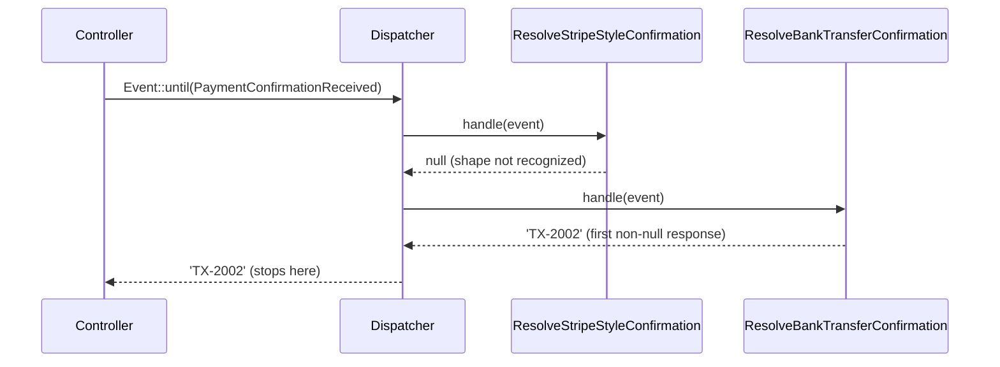

# Chapter 15 - Events and logs beyond the standard flow

Chapter 14 closed Part VI (Artisan Commands) by covering safeguards a custom command can adopt
around its own execution. Chapter 15 turns from the command line back to the event and log layers
that already run underneath every request, job, and command in this book: not just dispatching an
event or writing a log line, but controlling how far an event's response chain runs, deferring and
cancelling groups of dispatches, and reaching into the log pipeline itself. This opens Part VII
(Observing and Communicating), which spans this chapter and Chapter 16.

The running scenario is a webhook that reconciles incoming payment confirmations against
`Transaction` records the application already knows about. Incoming providers do not agree on a
payload shape, so the controller never parses the payload itself: it dispatches an event and lets
whichever listener recognizes the shape resolve it. This is a different concern from Chapter 8's
`PaymentGatewayWebhookController`, which intercepts one fixed webhook handler's method call via
`bindMethod()` regardless of payload shape; here, several candidate listeners compete to recognize
an unknown shape, and only one of them ever needs to run.



## `Event::until()`

**Case type**: an undocumented method on `Illuminate\Events\Dispatcher` (and its `Event` facade),
sitting beside the documented `dispatch()`, `listen()`, and `subscribe()` on the same class.

**Alias flag**: not an alias - `until()` changes what the dispatch itself returns and how far it
travels, not just how it is called. 

**Audience**: application developers, no shift toward package
authors. 

**Stability**: core event dispatcher, no minor-version churn found while verifying
against v13.22.0.

### Minimal snippet

```php
Event::listen('confirmation.received', fn () => null);
Event::listen('confirmation.received', fn () => 'resolved');

Event::until('confirmation.received'); // 'resolved' - stops at the first non-null response
Event::dispatch('confirmation.received'); // [null, 'resolved'] - every response, none skipped
```

### Documented way vs. discovered way

The documented `Event::dispatch()` calls every listener registered for an event and collects every
response into an array, in registration order, regardless of what any of them returned:

```php
$responses = Event::dispatch(new PaymentConfirmationReceived($payload));
// [null, 'TX-2002'] when only the second listener recognizes the payload
```

Nothing in the documented API stops that loop early. Picking "the first listener that actually
recognized this payload" out of that array still requires writing the search yourself, and every
listener still runs even after one of them has already answered.

`Event::until()` dispatches the exact same event but halts at the first non-null response and
returns it directly, skipping every listener registered after it:

```php
$reference = Event::until(new PaymentConfirmationReceived($payload));
// 'TX-2002' - the search Event::dispatch() left to the caller is now free
```

### Real scenario: resolving an unrecognized payment confirmation

`PaymentConfirmationReceived` carries the raw, provider-specific payload as-is:

```php
class PaymentConfirmationReceived
{
    public function __construct(
        public readonly array $payload,
    ) {}
}
```

Two listeners are registered for it, each recognizing one provider's shape and returning the
transaction reference it finds, or `null` if the payload does not match:

```php
class ResolveStripeStyleConfirmation
{
    public function handle(PaymentConfirmationReceived $event): ?string
    {
        if (! str_starts_with((string) Arr::get($event->payload, 'type'), 'payment_intent.')) {
            return null;
        }

        $reference = Arr::get($event->payload, 'data.object.metadata.transaction_reference');

        return is_string($reference) ? $reference : null;
    }
}

class ResolveBankTransferConfirmation
{
    public function handle(PaymentConfirmationReceived $event): ?string
    {
        if (($event->payload['status'] ?? null) !== 'confirmed') {
            return null;
        }

        $reference = $event->payload['reference_code'] ?? null;

        return is_string($reference) ? $reference : null;
    }
}
```

Both declare `: ?string`, and PHP enforces that at runtime - a listener that tried to return
something else would fail loudly with a `TypeError`, not silently corrupt the result. That
`is_string()` check is what keeps that `TypeError` from ever happening in the first place: a
malformed payload where the nested reference is itself an array (`metadata.transaction_reference`
holding an object instead of a string, say) now resolves to `null`, treated the same as any other
unrecognized shape, instead of crashing the request with an uncaught exception - a gap a post-close
review caught before it shipped.

Both are registered explicitly, in this exact order, in `AppServiceProvider::boot()` rather than
left to listener auto-discovery:

```php
Event::listen(PaymentConfirmationReceived::class, [ResolveStripeStyleConfirmation::class, 'handle']);
Event::listen(PaymentConfirmationReceived::class, [ResolveBankTransferConfirmation::class, 'handle']);
```

Once `Event::until()` decides the outcome, `PaymentWebhookController` never has to know which
listener actually answered:

```php
public function __invoke(Request $request)
{
    // ... diagnostics collector and log context, both covered later in this chapter ...

    $expectedKey = config('services.payment_confirmation.key');
    $signature = hash_hmac('sha256', $request->getContent(), (string) $expectedKey);

    if ($expectedKey === null || ! hash_equals($signature, (string) $request->header('X-Webhook-Signature'))) {
        // ... rejects with 401, covered below ...
    }

    $reference = Event::until(new PaymentConfirmationReceived($request->all()));

    if ($reference === null) {
        return response()->json(['message' => 'Unrecognized payment confirmation format.'], 422);
    }

    $transaction = Transaction::where('reference', $reference)->where('status', 'pending')->first();

    if (! $transaction) {
        return response()->json(['message' => 'No pending transaction found for this reference.'], 422);
    }

    $transaction->update(['status' => 'reconciled']);

    return response()->json(['reference' => $transaction->reference, 'status' => $transaction->status]);
}
```

A signature check gates the whole method, added after a post-close review found the route had no
authentication at all - unlike Chapter 8's `PaymentGatewayWebhookController`, which validates an
HMAC signature before trusting anything, this webhook originally accepted any request and would
reconcile whichever transaction a crafted payload named. `hash_equals()` compares the computed
HMAC-SHA256 of the raw request body (`services.payment_confirmation.key`, unset by default - a
missing key fails the request rather than accepting it, the same fail-closed shape as Chapter 13's
stock-import authorization code) against an `X-Webhook-Signature` header; anything that does not
match, including a request with no key configured at all, gets a 401 before `Event::until()` ever
runs. Every test in this chapter that exercises the webhook now sends a correctly computed
signature alongside its payload.

A payload shaped like a Stripe-style confirmation resolves through the first listener, and the
second is never invoked at all - not just unnecessary, genuinely never called, which the test
proves directly:

```php
$this->mock(ResolveBankTransferConfirmation::class)->shouldNotReceive('handle');
```

A bank-transfer-style payload, unrecognized by the first listener, resolves through the second
instead, with the same successful outcome. A payload neither listener recognizes, or a reference
that resolves but matches no pending transaction, is a controlled 422 rather than an uncaught
exception.

The order the two listeners are registered in is not cosmetic. If a listener meant to run only
after another one has already answered were registered before it instead, `until()` would still
halt at the first non-null response, just from the wrong listener, and any side effect the later
listener would have produced - a notification, an audit entry, anything - simply never happens.
Nothing raises an error when that occurs; the chain just ends earlier than expected.

## `Event::push()` and `Event::flush()`

**Case type**: an undocumented pair on `Illuminate\Events\Dispatcher` (and its `Event` facade)
sitting beside the documented `Event::defer()`, which covers a related but distinct need.

**Alias flag**: not an alias of `defer()` - the two hand control of cancellation to different
places, as the comparison below shows. 

**Audience**: application developers. 

**Stability**: core
event dispatcher, no minor-version churn found while verifying against v13.22.0.

### Minimal snippet

```php
Event::listen('batch.step', fn () => Log::info('step recorded'));

Event::push('batch.step', ['first']); // nothing runs yet
Event::push('batch.step', ['second']); // still nothing - a second, independent registration
Event::flush('batch.step'); // both registered closures run now, in the order they were pushed
```

### Documented way vs. discovered way

The documented way to group several dispatches so they only fire once a whole block of work
succeeds is `Event::defer()`:

```php
Event::defer(function () {
    // every event dispatched in here is buffered...
    Event::dispatch(new SomethingHappened());
}); // ...and only fired here, once this closure returns without throwing
```

`defer()` decides everything on its own: every event dispatched inside its closure is buffered
automatically, fired the moment the closure returns, and silently discarded if the closure throws
- verified directly against `Illuminate\Events\Dispatcher::defer()`, which restores its previous
buffering state in a `finally` block regardless of outcome. There is no way to fire only some of
what was buffered, or to decide later, outside the closure, whether to fire or discard.

`Event::push()` buffers one event registration at a time, under whatever name is passed to it, and
`Event::flush()` fires everything buffered under that name whenever it is called - not tied to any
closure boundary:

```php
Event::push(TransactionReconciled::class, [new TransactionReconciled($transaction)]);
// ... arbitrarily more code, more push() calls, even a different method entirely ...
Event::flush(TransactionReconciled::class); // fires now, on command, not on scope exit
```

The trade-off is that cancellation is no longer automatic either: nothing discards a pushed event
on its own. That is `Event::forgetPushed()`, covered next.

### Real scenario: batch-reconciling pending transactions

`reconcile:transactions` reconciles every pending `Transaction` in one pass. Each row is marked
`reconciled` immediately, but the events announcing it - an audit entry and a customer notice -
are only pushed, not dispatched, while the loop is still running:

```php
public function handle(): int
{
    $transactions = Transaction::where('status', 'pending')->get();

    $this->components->task("Reconciling {$transactions->count()} pending transaction(s)", function () use ($transactions) {
        foreach ($transactions as $transaction) {
            $transaction->update(['status' => 'reconciled']);

            Event::push(TransactionReconciled::class, [new TransactionReconciled($transaction)]);
            Event::push(CustomerNoticeDue::class, [new CustomerNoticeDue($transaction)]);
        }
    });

    Event::flush(TransactionReconciled::class);
    Event::flush(CustomerNoticeDue::class);

    $this->components->success("Reconciled {$transactions->count()} transaction(s).");

    return self::SUCCESS;
}
```

Only once every row in the batch has been marked `reconciled` does the command call `flush()` -
once per event class - firing every pushed registration from the whole loop in one go:

```php
Event::listen(TransactionReconciled::class, [RecordReconciliationAuditLog::class, 'handle']);
Event::listen(CustomerNoticeDue::class, [SendCustomerReconciliationNotice::class, 'handle']);
```

A test proves both listeners fire exactly once per transaction, only after the batch finishes:

```php
$auditSpy = $this->spy(RecordReconciliationAuditLog::class);
$noticeSpy = $this->spy(SendCustomerReconciliationNotice::class);

$this->artisan('reconcile:transactions')
    ->assertExitCode(0)
    ->expectsOutputToContain('Reconciled 3 transaction(s).');

$auditSpy->shouldHaveReceived('handle')->times(3);
$noticeSpy->shouldHaveReceived('handle')->times(3);
```

This is a second, batch path to the same `'reconciled'` status the webhook in the previous section
sets in real time. The two do not conflict - a webhook confirmation reconciles one transaction as
its confirmation arrives, while this command sweeps every transaction still pending, deferring the
audit and notice events until it knows the whole sweep succeeded - but a reader skimming both is
right to notice they touch the same field, which is worth saying outright rather than leaving
implicit.

One gotcha surfaced while building this scenario, worth stating plainly: `Event::push()` does not
do `Event::dispatch()`'s usual trick of turning a plain event object into both the event name and
its own payload. `dispatch(new TransactionReconciled($transaction))` would infer the event name
from the object automatically; `push()` always takes the event name as an explicit string, so the
payload passed to it must already be exactly what the listener expects to receive - here, the
constructed `TransactionReconciled` instance itself, not the bare `Transaction`. Passing the wrong
shape does not fail silently: the listener's own type hint rejects it immediately with a `TypeError`.

A second, unrelated discovery from the same work: this application's `bootstrap/app.php` now
disables Laravel's default event-listener auto-discovery (`->withEvents(discover: false)`), which
is otherwise on by default in every Laravel 11+ application - even one, like this one, with no
`app/Providers/EventServiceProvider.php` of its own - and would otherwise register every class
under `app/Listeners` a second time, on top of the explicit `Event::listen()` calls this chapter
relies on for a deterministic listener order.

## `Event::forget()` and `Event::forgetPushed()`

**Case type**: an undocumented pair on `Illuminate\Events\Dispatcher` (and its `Event` facade)
with no documented sibling at all for actually removing a bound listener - a different case from
`push()`/`flush()`, which at least has `Event::defer()` covering a related need. 

**Alias flag**:
not an alias. 

**Audience**: application developers. 

**Stability**: core event dispatcher, no
minor-version churn found while verifying against v13.22.0.

### Minimal snippet

```php
Event::listen('probe.forget', fn () => Log::info('handled'));

Event::dispatch('probe.forget'); // logs once
Event::forget('probe.forget');
Event::dispatch('probe.forget'); // nothing - the listener is gone

Event::forgetPushed(); // safe even if nothing was ever pushed
```

### Documented way vs. discovered way

Nothing in the documented event API removes a listener once it is bound. The closest documented
workaround is a boolean flag the listener itself checks before doing anything:

```php
class SendCustomerReconciliationNotice
{
    public static bool $suppressed = false;

    public function handle(CustomerNoticeDue $event): void
    {
        if (static::$suppressed) {
            return;
        }

        Log::info("Customer notice due for transaction {$event->transaction->reference}.");
    }
}
```

The listener still runs on every dispatch; it just chooses to do nothing. `Event::forget()`
removes the registration itself, so the listener is never invoked at all - not invoked-and-a-no-op,
genuinely not called:

```php
Event::forget(CustomerNoticeDue::class); // no flag anywhere, no listener left to run
```

### Real scenario: suppressing a notice and cancelling a failed batch

`reconcile:transactions` gains a `--suppress-notice` option for historical backfills, where
customers should not be re-notified about transactions reconciled long ago:

```php
protected $signature = 'reconcile:transactions {--suppress-notice}';
```

```php
$suppressNotice = $this->option('suppress-notice');

if ($suppressNotice) {
    Event::forget(CustomerNoticeDue::class);
}
```

Removing the listener bound to `CustomerNoticeDue` leaves `TransactionReconciled`'s audit listener
completely unaffected - `forget()` only ever touches the exact event name it is given, and the two
concerns were deliberately given separate events in Step 2 for exactly this reason. A test proves
it: with `--suppress-notice`, the audit spy still receives one call per transaction, and the
notice spy receives none.

`forget()` removing the *only* registration for `CustomerNoticeDue` has a consequence worth being
explicit about: nothing puts it back. Under a stateless deployment the whole process ends right
after, so it does not matter; under a long-running worker (Octane), the very first
`--suppress-notice` run would otherwise disable customer notices forever, for every later run in
that same worker, suppressed or not - a post-close review caught this before it shipped. The fix
re-registers the listener in a `finally` block, so the removal never outlives the run that asked
for it:

```php
try {
    // ... the whole batch, described below ...

    return self::SUCCESS;
} finally {
    if ($suppressNotice) {
        Event::listen(CustomerNoticeDue::class, [SendCustomerReconciliationNotice::class, 'handle']);
    }
}
```

A test proves the scoping directly: a `--suppress-notice` run followed by a second, ordinary run
of the same command, in the same process, still notifies for the second run's own transaction.

The same command also uses `forgetPushed()` to keep a mid-batch failure from announcing a partial
result. Each row is validated before being reconciled:

```php
try {
    $this->components->task("Reconciling {$transactions->count()} pending transaction(s)", function () use ($transactions) {
        foreach ($transactions as $transaction) {
            if ($transaction->amount_cents <= 0) {
                throw new RuntimeException("Transaction {$transaction->reference} has a non-positive amount and cannot be reconciled.");
            }

            $transaction->update(['status' => 'reconciled']);

            Event::push(TransactionReconciled::class, [new TransactionReconciled($transaction)]);
            Event::push(CustomerNoticeDue::class, [new CustomerNoticeDue($transaction)]);
        }
    });
} catch (RuntimeException $e) {
    Event::forgetPushed();
    $this->components->error($e->getMessage());

    return self::FAILURE;
}

Event::flush(TransactionReconciled::class);
Event::flush(CustomerNoticeDue::class);
Event::forgetPushed();
```

If the second of three transactions has a non-positive amount, the exception propagates out of
`task()` (which still shows its `FAIL` indicator, as Chapter 13 already established), is caught
here, and `forgetPushed()` discards every event pushed so far for the whole batch - both listeners
end up receiving zero calls, proven by a spy on each. What `forgetPushed()` cannot do is undo the
`update()` already applied to the first transaction before the second one failed: the test for
this confirms the first row is left `reconciled`, while the second and third stay `pending`.
`forgetPushed()` cancels pending *announcements*, not already-committed database state - a batch
built this way gets atomic notifications, not an atomic outcome.

That last `Event::forgetPushed()`, right after the two successful `flush()` calls, is not
defensive dead code - it is the fix for the sharpest gotcha found while building this scenario.
`flush()` dispatches whatever was pushed; it does not remove the registration `push()` created.
Left in place, those same closures are still sitting on the dispatcher the next time anything
pushes and flushes `TransactionReconciled` or `CustomerNoticeDue` in the same process - which, for
an Artisan command, means the next time `reconcile:transactions` itself runs, under a long-running
worker. Without cleaning up, a second run would re-announce every transaction the *first* run
already flushed, on top of its own new batch, silently doubling the audit trail and the customer
notices for old transactions every time the command runs again. A test proves it directly: two
ordinary runs of the command in the same process, one after the other, each invoke both listeners
exactly once - for their own batch only.

One more caveat worth stating plainly: `forgetPushed()` is not scoped to any one caller's batch. It
removes every currently pending pushed listener across the whole application, for any event, not
just the ones this command happens to have pushed. That is not a problem here, since
`reconcile:transactions` is the only place in this codebase that uses `push()`/`flush()` at all,
but it would be worth remembering in an application where more than one piece of code defers
events this way at the same time.

## `Log::withoutContext()`

**Case type**: an undocumented method beside the documented `Log::withContext()` on the same `Log`
facade - but not simply its mirror image. `LogManager` never defines its own `withContext()`;
calling it through the facade goes through `LogManager::__call()` to the default channel alone.
`withoutContext()` is different: it is defined directly on `LogManager`, and clears context from
every channel already resolved, not only the default one. 

**Alias flag**: not an alias - it also
supports removing only specific keys, which simply not calling `withContext()` again cannot do.

**Audience**: application developers. 

**Stability**: core logging, no minor-version churn found
while verifying against v13.22.0.

### Minimal snippet

```php
Log::withContext(['request_id' => 'abc-123', 'user_id' => 42]);

Log::withoutContext(['user_id']); // only user_id is gone
Log::info('still tagged'); // carries request_id, not user_id

Log::withoutContext(); // clears everything left
```

### Documented way vs. discovered way

The documented `Log::withContext()` adds context to every subsequent log call, for as long as the
process keeps running:

```php
Log::withContext(['webhook_request_id' => $id]);
Log::info('first line'); // tagged
Log::info('second line'); // still tagged - nothing in the documented API removes it
```

There is nothing else to call. Once set, the context stays until either the value is overwritten
or the process itself ends. `Log::withoutContext()` is what actually clears it back out, whole or
key by key:

```php
Log::withoutContext(); // now neither of the two lines above's tags carry forward
```

### Real scenario: tagging and untagging a webhook request

`PaymentWebhookController` opens a context at the very start of the request and closes it again
before every response it can return:

```php
Log::withContext(['webhook_request_id' => (string) Str::uuid()]);

// ... webhook signature verification, covered in the Event::until() section above ...

$reference = Event::until(new PaymentConfirmationReceived($request->all()));

if ($reference === null) {
    Log::info('Unrecognized payment confirmation format received.');
    Log::channel('null')->warning('Unrecognized payment confirmation format flagged for review.');
    Log::withoutContext();
    Event::forget(MessageLogged::class); // Log::listen()'s own cleanup, covered later in this chapter

    return response()->json([
        'message' => 'Unrecognized payment confirmation format.',
        'diagnostics' => $diagnostics->summary(), // also Log::listen()'s, covered later
    ], 422);
}
```

The same pair brackets the other two exit points - the "no pending transaction" failure and the
successful reconciliation - so every path out of the controller leaves logging exactly as it found
it:

```php
Log::info("Transaction {$transaction->reference} reconciled via webhook.");
Log::withoutContext();
Event::forget(MessageLogged::class);

return response()->json([
    'reference' => $transaction->reference,
    'status' => $transaction->status,
    'diagnostics' => $diagnostics->summary(),
]);
```

A test proves the id does not survive past its own request: it points the `single` channel at a
temporary file, hits the webhook once, extracts the `webhook_request_id` value the log file
actually recorded, then hits it again with a different payload and asserts that value does not
appear anywhere in what the second request added to the same file.

Clearing the context here is not a cosmetic habit. `PaymentWebhookController`, like every
controller, is only ever resolved fresh per request under a standard stateless deployment
(PHP-FPM, CLI) - but Chapter 9 already showed that `Router` is a container singleton that persists
for as long as the application instance lives, and the only environment where that persistence
becomes observable is a long-running worker model such as Laravel Octane. The same is true of a
channel's `Logger` instance and the `$context` array it holds: under Octane, one worker process
keeps handling request after request against the same booted application, so a `webhook_request_id`
left in place by `withContext()` would keep tagging every log line of every later request that
worker happens to serve, not just the one that set it, until something explicitly clears it. Under
a standard deployment this would never surface at all, since the whole process - and its
`Logger` along with it - is discarded the moment the request ends; it is precisely the environment
where it would matter that makes clearing it worth doing unconditionally, not only when it is
observable.

## `Log::listen()`

**Case type**: an undocumented method beside the documented `Log::withContext()`/
`Log::withoutContext()` on the same `Log` facade, with one added nuance: the event it registers
against, `Illuminate\Log\Events\MessageLogged`, is itself unmentioned anywhere in `logging.md` -
not just the method that listens for it. 

**Alias flag**: not an alias. 

**Audience**: application developers. 

**Stability**: core logging, no minor-version churn found while verifying against
v13.22.0.

### Minimal snippet

```php
Log::listen(function (MessageLogged $event) {
    Log::channel('single')->debug("saw a {$event->level} line: {$event->message}");
});

Log::info('hello'); // triggers the callback above, in addition to the normal log line
```

### Documented way vs. discovered way

Nothing in the documented logging API reacts to a message after it has been logged - the closest
realistic workaround is attaching a custom Monolog handler or processor to a channel by hand, which
means knowing which channel to attach it to and repeating the wiring for every channel that matters:

```php
Log::channel('single')->getLogger()->pushHandler(new MyDiagnosticsHandler());
// and again for every other channel this needs to observe
```

`Log::listen()` is a single call, registered once, that observes every channel already:

```php
Log::listen(function (MessageLogged $event) {
    // one registration, every channel
});
```

### Real scenario: collecting diagnostics for a webhook request

`App\Support\LogDiagnosticsCollector` wraps the registration and keeps only an aggregate summary,
deliberately never the raw message or context of each entry:

```php
class LogDiagnosticsCollector
{
    protected array $entries = [];

    public function listen(): void
    {
        Log::listen(function (MessageLogged $event) {
            $this->entries[] = [
                'level' => $event->level,
                'message' => $event->message,
            ];
        });
    }

    public function summary(): array
    {
        return [
            'count' => count($this->entries),
            'levels' => collect($this->entries)->pluck('level')->unique()->values()->all(),
        ];
    }
}
```

That restraint is the point, not an afterthought: `Log::listen()` captures every message logged
anywhere during the request, not only the lines this endpoint writes itself. Whatever else happens
to log something while the request is being handled - a query log, a warning from unrelated code,
an exception with a stack trace - passes through the same callback. Returning that raw content in a
public JSON response would risk leaking exactly the kind of detail logging exists to capture
internally; a count and the distinct levels seen is enough to prove something happened, without
repeating what was said.

`PaymentWebhookController` registers the collector as the very first thing it does, so nothing
logged afterward is missed:

```php
$diagnostics = new LogDiagnosticsCollector;
$diagnostics->listen();
```

On the unrecognized-format path, two channels are used on purpose - the default one, and `null`
(configured with Monolog's `NullHandler`, standing in here for a dedicated alerting channel a real
deployment might route this to, which is out of this book's scope) - specifically to prove the
collector's reach is not limited to whichever channel happens to be the default:

```php
Log::info('Unrecognized payment confirmation format received.');
Log::channel('null')->warning('Unrecognized payment confirmation format flagged for review.');
```

A test proves both arrive at the same collector: an isolated call to `Log::channel('single')` and
one to `Log::channel('null')` each add exactly one entry, and the levels of both show up in the
same `summary()`. A second test drives the whole controller and confirms the response's
`diagnostics` key reflects both lines from that one real request.

Every exit point also calls `Event::forget(MessageLogged::class)` right next to the existing
`Log::withoutContext()` call:

```php
Log::withoutContext();
Event::forget(MessageLogged::class);
```

This is not optional bookkeeping. `Log::listen()` registers on the dispatcher shared by every
channel, with no lifetime of its own - nothing removes it when the request ends. Under a standard
stateless deployment this is invisible, since the whole process is discarded anyway, but under the
same long-running worker model already flagged for `withoutContext()`, every request would add one
more permanently-registered closure to the same listener array, forever, since nothing would ever
call `forget()` on its behalf. A test confirms the mechanism directly: after
`Event::forget(MessageLogged::class)` runs, a further log call no longer reaches the collector at
all.

## Summary

| Entry | Documented alternative | Prefer the undocumented one when |
|---|---|---|
| `Event::until()` | `Event::dispatch()` | Only the first non-null response matters, and every listener after it should not even run |
| `Event::push()` / `Event::flush()` | `Event::defer(closure)` | The dispatch needs to happen on command, outside any single closure's scope, not automatically the moment a block of code finishes |
| `Event::forget()` / `Event::forgetPushed()` | A hand-written flag the listener itself checks | The listener must not run at all, not run-and-do-nothing, and any pending pushed events must be cancelled outright rather than fired |
| `Log::withoutContext()` | `Log::withContext()` alone | The process reuses state across requests or jobs (a long-running worker such as Octane) and context set for one must not tag the next |
| `Log::listen()` | A hand-attached Monolog handler or processor per channel | Every channel needs the same observer with a single registration, not one wired by hand per channel |

Each documented alternative is not wrong, only narrower. Plain `dispatch()` is fine whenever every
listener's response is wanted, not just the first. `Event::defer()` is fine whenever its
automatic fire-on-success, discard-on-exception behavior is exactly what is needed, with no
reason to cancel or postpone outside its own closure. A hand-written flag is fine for a listener
that only ever needs to skip its own body, never to be removed from the dispatcher entirely.
`Log::withContext()` alone is fine in any short-lived process that never reuses state across
requests, which is most PHP-FPM or CLI deployments. A hand-attached Monolog handler is fine for
observing one specific channel, not every channel a request might touch. Each entry in this
chapter earns its place only once one of those narrower conditions stops holding.

Part VII - Observing and Communicating is half complete: this chapter moved from a command's own
behavior (Chapters 13-14) to how the application's internal events and logs can be observed and
controlled, all layered onto one webhook and one batch command reconciling payment confirmations.
Chapter 16, "Mail and localization", closes the Part next, turning from observing what already
happened to sending mail and handling translations outside the documented flow.
