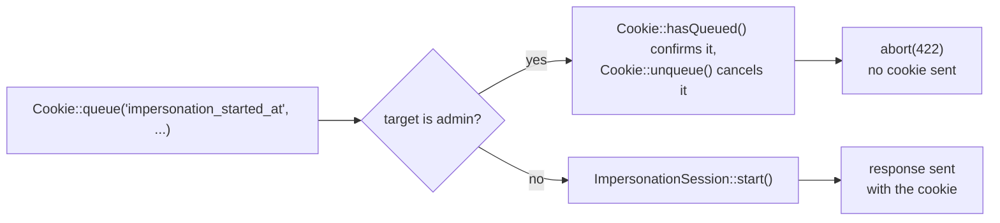

# Chapter 17 - Configuration and cookies at runtime

Chapter 16 closed Part VII (Observing and Communicating) with two facades that reach past their
better-known surface: `Mail`, sending outside the Mailable-based flow, and `Lang`, resolving
locales beyond the standard fallback chain. Chapter 17 opens Part VIII (Application
Infrastructure) with the same idea applied to two more facades every Laravel application already
depends on: `Config`, read and written far more often than its full public surface suggests, and
`Cookie`, whose queue of outgoing values turns out to be inspectable and reversible, not just
write-only. The chapter starts with `Config`.

## `Config::getMany()`

**Case type**: an undocumented method on `Illuminate\Config\Repository` (and the `Config`
facade), sitting beside the documented single-key `config()`/`Config::get()`/`Config::set()` that
`configuration.md` covers. **Alias flag**: not a new, competing method - it is the actual
mechanism the documented `Config::get()` already delegates to whenever it receives an array of
keys; calling `getMany()` directly is about explicitness of intent at the call site, not new
capability. **Audience**: application developers, no shift toward package authors. **Stability**:
core `Config` component, no churn found verifying against v13.22.0.

### Minimal snippet

```php
Config::getMany([
    'shipping.default' => null,
    'shipping.accounts.default' => null,
]);
// ['shipping.default' => 'flat', 'shipping.accounts.default' => 'ups']
```

`Illuminate\Config\Repository::getMany()` accepts either form for each entry: a bare,
integer-indexed key with no default, or a `key => default` pair -

```php
public function getMany($keys)
{
    $config = [];

    foreach ($keys as $key => $default) {
        if (is_numeric($key)) {
            [$key, $default] = [$default, null];
        }

        $config[$key] = Arr::get($this->items, $key, $default);
    }

    return $config;
}
```

- and every lookup goes through `Arr::get()`, so a missing key never throws, it just falls back
to whatever default that key was given.

### Documented way vs. discovered way

`Config::get()` (the same class, and what `config()` calls internally for a single key) already
handles an array argument by delegating straight to `getMany()`:

```php
public function get($key, $default = null)
{
    if (is_array($key)) {
        return $this->getMany($key);
    }

    return Arr::get($this->items, $key, $default);
}
```

So `Config::get(['shipping.default' => null, 'shipping.accounts.default' => null])` is a
genuinely documented way to reach the same result - the honest comparison here is not "no
equivalent exists", it is "the same call, made explicitly instead of through an overload nobody
reads the source to discover." Next to it, the ordinary approach most code actually reaches for
is three separate single-key calls:

```php
config('shipping.default');
config('shipping.accounts.default');
config('shipping.accounts.instances.ups.driver');
```

One thing this comparison has to rule out explicitly: the global `config()` helper's own array
form is not a shorthand for either of the above. Passing an array to `config()` does not read
anything at all -

```php
function config($key = null, $default = null)
{
    if (is_null($key)) {
        return app('config');
    }

    if (is_array($key)) {
        return app('config')->set($key);
    }

    return app('config')->get($key, $default);
}
```

- it sets every key in the array to the paired value. This is not a hypothetical trap: this same
codebase already relies on exactly that behavior in a Chapter 16 test
(`config(['services.fulfillment.alert_address' => 'ops@example.test'])`, to seed a value before
asserting on it), and reaching for the same syntax expecting it to *read* several keys at once
would silently overwrite them instead.

### Real scenario: a shipping-configuration diagnostics summary

`config/shipping.php` already holds several related settings read individually across the
codebase - the active rate driver, the default carrier account, and each account's own driver.
`App\Support\ShippingDiagnostics` gathers three of them in one call:

```php
class ShippingDiagnostics
{
    public function summary(): array
    {
        $defaultAccount = config('shipping.accounts.default');

        return Config::getMany([
            'shipping.default' => null,
            'shipping.accounts.default' => null,
            "shipping.accounts.instances.{$defaultAccount}.driver" => null,
        ]);
    }
}
```

The third key cannot be a static literal: its dotted path embeds the second key's own resolved
value, so `$defaultAccount` is read first, with a plain single-key `config()` call, before the one
`getMany()` call that produces the actual summary. Two tests confirm the behavior from both
sides. The first proves the call does real multi-key work against the account currently
configured as default:

```php
$summary = (new ShippingDiagnostics)->summary();

expect($summary)->toBe([
    'shipping.default' => 'flat',
    'shipping.accounts.default' => 'ups',
    'shipping.accounts.instances.ups.driver' => 'ups',
]);
```

The second isolates `getMany()`'s per-key default against `dhl`, a carrier that does not exist
anywhere under `shipping.accounts.instances` - not a missing leaf, a missing branch entirely -
confirming the fallback holds even then:

```php
$values = Config::getMany([
    'shipping.default' => null,
    'shipping.accounts.default' => null,
    'shipping.accounts.instances.ups.driver' => null,
    'shipping.accounts.instances.dhl.driver' => null,
]);

expect($values)->toBe([
    'shipping.default' => 'flat',
    'shipping.accounts.default' => 'ups',
    'shipping.accounts.instances.ups.driver' => 'ups',
    'shipping.accounts.instances.dhl.driver' => null,
]);
```

## `Config::prepend()` / `Config::push()`

**Case type**: two undocumented methods on `Illuminate\Config\Repository` (and the `Config`
facade), sitting beside the documented single-key `get()`/`set()` that `configuration.md`
covers. **Alias flag**: not aliases - each does a real array mutation, not something achievable
with `set()` alone. **Audience**: application developers; the scenario below has a
self-registering-module shape that echoes Chapter 3's `Manager`/`MultipleInstanceManager`
package-author pattern, worth noting, though nothing here actually shifts the target reader away
from an application developer. **Stability**: core `Config` component, no churn found verifying
against v13.22.0.

### Minimal snippet

```php
Config::push('shipping.incident_notification_channels', 'dhl-ops@example.test');
Config::prepend('shipping.incident_notification_channels', 'oncall-escalation@example.test');
// ['oncall-escalation@example.test', 'ops@example.test', 'dhl-ops@example.test']
```

Neither method guards against adding a value that is already present - both simply read the
current array, mutate a local copy, and write it back:

```php
public function prepend($key, $value)
{
    $array = $this->get($key, []);

    array_unshift($array, $value);

    $this->set($key, $array);
}

public function push($key, $value)
{
    $array = $this->get($key, []);

    $array[] = $value;

    $this->set($key, $array);
}
```

### Documented way vs. discovered way

Without either method, the same result needs a manual read, mutation, and write-back through the
documented `get()`/`set()` pair:

```php
$channels = config('shipping.incident_notification_channels');
array_unshift($channels, 'oncall-escalation@example.test');
$channels[] = 'dhl-ops@example.test';
Config::set('shipping.incident_notification_channels', $channels);
```

`prepend()`/`push()` collapse that into two calls that say directly what they do, at the cost of
one call each instead of a single combined write.

### Real scenario: a self-registering carrier module

`config/shipping.php` gained a new key for this entry, deliberately a flat, ordered list rather
than the keyed `accounts.instances` map above it - `push()`ing onto a keyed map would append at
a numeric index and break every lookup that reads it by carrier code:

```php
'incident_notification_channels' => [
    'ops@example.test',
],
```

`App\Providers\CarrierNotificationServiceProvider` extends that list at boot, as a hypothetical
carrier module would register its own incident contact alongside the app's own:

```php
class CarrierNotificationServiceProvider extends ServiceProvider
{
    public function boot(): void
    {
        if (! in_array('dhl-ops@example.test', config('shipping.incident_notification_channels'), true)) {
            Config::push('shipping.incident_notification_channels', 'dhl-ops@example.test');
        }

        if (! in_array('oncall-escalation@example.test', config('shipping.incident_notification_channels'), true)) {
            Config::prepend('shipping.incident_notification_channels', 'oncall-escalation@example.test');
        }
    }
}
```

Both mutations are guarded by an `in_array()` check read fresh from `config()` immediately before
each call, not cached in a local variable - `prepend()`/`push()` themselves have no notion of
"already present," per the source above. This matters more than it looks: under a stateless
deployment `boot()` runs once per request and the guard is merely tidy, but under a long-running
worker such as Octane the configuration array survives across requests in the same process, so an
unguarded version would append the same two channels again on every request that followed the
first. A test proves the guard holds even under direct, repeated invocation:

```php
$provider = new CarrierNotificationServiceProvider($this->app);

$provider->boot();
$provider->boot();
$provider->boot();

expect(config('shipping.incident_notification_channels'))->toBe([
    'oncall-escalation@example.test',
    'ops@example.test',
    'dhl-ops@example.test',
]);
```

This is worth contrasting with `Env::writeVariable()` (Chapter 3), used elsewhere in this same
codebase by `App\Support\ShippingProviderConfigurator`:

```php
public function rotateApiKey(string $key): void
{
    Env::writeVariable('SHIPPING_API_KEY', $key, $this->environmentFilePath, overwrite: true);
}
```

`Env::writeVariable()` persists to the actual `.env` file on disk - the change survives a process
restart. `Config::prepend()`/`Config::push()` mutate only the in-memory runtime array: the moment
the process ends, the addition is gone, unless something re-applies it at every boot, exactly as
`CarrierNotificationServiceProvider` does here.

## `Cookie::forever()`

**Case type**: an undocumented method on `Illuminate\Cookie\CookieJar` (and the `Cookie` facade),
sitting beside the documented `make()` that `responses.md`'s cookie section covers.
**Alias flag**: yes - a one-line wrapper over `make()` with a fixed duration, the same case-type
already covered for `Cache::sear()` (Chapter 11). **Audience**: application developers.
**Stability**: core `Cookie`/`CookieJar` component, no churn found verifying against v13.22.0.

### Minimal snippet

```php
Cookie::forever('remembered_setting', 'value');
```

`CookieJar::forever()` is exactly a call to `make()` with a fixed 400-day duration baked in:

```php
public function forever($name, $value, $path = null, $domain = null, $secure = null, $httpOnly = true, $raw = false, $sameSite = null)
{
    return $this->make($name, $value, 576000, $path, $domain, $secure, $httpOnly, $raw, $sameSite);
}
```

The 576000-minute figure is not an arbitrary Laravel constant - it works out to exactly 400 days,
which is also the maximum lifetime modern browsers (Chrome, Firefox) will honor on any cookie
regardless of what a server requests. `forever()` is aligned with that external ceiling, not
inventing one of its own.

### Documented way vs. discovered way

Without it, the same 400-day duration has to be computed by hand and passed to `make()`:

```php
Cookie::make('remembered_setting', 'value', 60 * 24 * 400);
```

`forever()` collapses that arithmetic into a name that says what it means, at the cost of a fixed
duration - there is no parameter for "as long as possible but not quite forever."

### Real scenario: remembering an explicitly audited order locale

Chapter 16's `OrderController::lookup()` already treats an explicitly requested `?locale=`
differently from an absent one: a named locale is checked against that locale alone, missing keys
and all, while an absent one falls through the ordinary locale-resolution chain. This entry adds a
third path: a caller who named a locale once has that choice remembered in a cookie, so a later
request naming none can still get the strict, drift-detecting treatment instead of silently
falling back through `Lang::determineLocalesUsing()`.

```php
public function lookup(Request $request, PreferredLocaleContext $context)
{
    $order = Order::query()
        ->where('phone_number', Str::numbers($request->string('phone')->toString()))
        ->firstOrFail();

    $context->set($order->preferred_locale);

    $key = "orders.status.{$order->status}";
    $requested = $request->string('locale')->toString();
    $remembered = $request->cookie('preferred_locale_audit');

    $statusLabel = match (true) {
        $requested !== '' => Lang::get($key, [], $requested, false),
        $remembered !== null => Lang::get($key, [], $remembered, false),
        default => Lang::get($key),
    };

    $response = response()->json([
        'uuid' => $order->uuid,
        'status' => $order->status,
        'status_label' => $statusLabel,
    ]);

    if ($requested !== '') {
        $response->withCookie(Cookie::forever('preferred_locale_audit', $requested));
    }

    return $response;
}
```

One detail here is not cosmetic: `Cookie::forever()` only builds a
`Symfony\Component\HttpFoundation\Cookie` instance, it does not send it anywhere on its own. The
natural-looking `Cookie::queue(Cookie::forever(...))` would have compiled, run, and done nothing -
`Illuminate\Cookie\Middleware\AddQueuedCookiesToResponse` is the piece that actually flushes a
queued cookie onto the response, and it is only present in the `web` middleware group by default.
`OrderController` is routed through `routes/api.php`, served by the `api` group, which does not
include it (nor `EncryptCookies`, the group's other cookie-related middleware) unless the
application opts in. Attaching the cookie directly to this response with `withCookie()` sidesteps
the queue entirely, so it works regardless of which middleware group the route happens to run
under - and because `EncryptCookies` never touches this route either, the cookie travels and is
read back as a plain, unencrypted string, which is also why the test below asserts on it with
`encrypted: false`.

```php
$response = $this->getJson('/api/orders/lookup?phone='.$order->phone_number.'&locale=es')
    ->assertOk()
    ->assertJsonPath('status_label', 'Pendiente')
    ->assertCookie('preferred_locale_audit', 'es', encrypted: false);
```

A separate test confirms a later request with no `?locale=` but carrying that same cookie resolves
through the strict path rather than the ordinary fallback chain - reusing `'refunded'`, already
known from Chapter 16's own tests to be missing from `lang/es/orders.php` but present in
`lang/en/orders.php`:

```php
$this->withCredentials()
    ->withUnencryptedCookie('preferred_locale_audit', 'es')
    ->getJson('/api/orders/lookup?phone='.$order->phone_number)
    ->assertOk()
    ->assertJsonPath('status_label', 'orders.status.refunded');
```

If the ordinary chain had resolved this instead, the English fallback would have silently supplied
`'Refunded'` - the literal key coming back is the proof the cookie drove the strict path.

Worth being explicit about what this cookie is not: it only ever carries a locale preference,
never anything resembling session or authorization state. A 400-day lifetime is a poor fit for
data like that, which is exactly why the impersonation-adjacent cookie later in this chapter
deliberately does not reach for `forever()`.

## `Cookie::hasQueued()` / `Cookie::getQueuedCookies()` / `Cookie::unqueue()`

**Case type**: a facade with a docs page covering only some of its methods - `responses.md`'s
cookie section documents `Cookie::queue()` (accompanying a response) and `Cookie::forget()`
(expiring one on the *next* response); it says nothing about inspecting or cancelling a cookie
already sitting in the queue. **Alias flag**: not aliases. **Audience**: application developers.
**Stability**: core `Cookie`/`CookieJar` component, no churn found verifying against v13.22.0.

### Minimal snippet

```php
Cookie::queue('remembered_setting', 'value');

Cookie::hasQueued('remembered_setting'); // true

Cookie::unqueue('remembered_setting');

Cookie::hasQueued('remembered_setting'); // false
```

All three read or mutate the same internal queue, never the response itself:

```php
public function hasQueued($key, $path = null)
{
    return ! is_null($this->queued($key, null, $path));
}

public function unqueue($name, $path = null)
{
    if ($path === null) {
        unset($this->queued[$name]);

        return;
    }

    unset($this->queued[$name][$path]);

    if (empty($this->queued[$name])) {
        unset($this->queued[$name]);
    }
}

public function getQueuedCookies()
{
    return Arr::flatten($this->queued);
}
```

`unqueue()` without a `$path` drops every path registered for that name; given one, it drops only
that path's entry, leaving any other path's cookie of the same name queued.

### Documented way vs. discovered way

There is no documented way to ask "is this cookie already queued" or "cancel a cookie I queued
earlier in this same request" - `queue()` adds to the queue, `forget()` schedules an already-sent
cookie's expiry on the *next* response, and neither looks at what is currently waiting to be sent.
Once a value has been queued, the documented API offers no way back; these three are the only way
to inspect or reverse that decision before the response goes out.

### Real scenario: cancelling an impersonation cookie for a rejected target

`ImpersonationController::start()` queues a cookie optimistically, then applies a business rule
that decides whether to keep it - an admin cannot impersonate another admin:

```php
public function start(User $user)
{
    abort_unless(Auth::check() && Auth::user()->is_admin, 403);

    Cookie::queue('impersonation_started_at', now()->toIso8601String());

    if ($user->is_admin) {
        if (Cookie::hasQueued('impersonation_started_at')) {
            Cookie::unqueue('impersonation_started_at');
        }

        abort(422, 'An admin cannot impersonate another admin.');
    }

    ImpersonationSession::start(Auth::user(), $user);

    Route::prependMiddlewareToGroup('web', ImpersonationAuditMiddleware::class);

    return back();
}
```

Unlike the locale-preference cookie above, `impersonation_started_at` is queued with plain
`Cookie::queue()`, not `forever()` - it is exactly the kind of session-adjacent signal that entry's
security note warned against giving a 400-day lifetime. This route also runs under the `web`
middleware group (unlike `OrderController::lookup()`'s `api` group in the previous entry), which
keeps Laravel's default `EncryptCookies` and `AddQueuedCookiesToResponse` - so `Cookie::queue()`
here needs no extra wiring, and the cookie is encrypted like any ordinary `web`-route cookie.



A second mechanism reads the queue rather than mutating it. `ImpersonationAuditMiddleware` records,
for every audited request, the names of whatever cookies happen to be queued at that moment:

```php
public function handle(Request $request, Closure $next): Response
{
    if (ImpersonationSession::isActive()) {
        ImpersonationAuditLog::create([
            'admin_id' => ImpersonationSession::adminId(),
            'target_user_id' => ImpersonationSession::targetId(),
            'route_name' => optional($request->route())->getName(),
            'queued_cookie_names' => collect(Cookie::getQueuedCookies())->map->getName()->implode(','),
        ]);
    }

    return $next($request);
}
```

A test starts impersonation, then visits an unrelated ticket page, and finds
`impersonation_started_at` already sitting in that later request's audit row:

```php
$this->actingAs($admin)->post("/admin/impersonate/{$target->id}")->assertRedirect();

$this->get("/tickets/{$ticket->id}")->assertOk();

$log = ImpersonationAuditLog::sole();
expect($log->queued_cookie_names)->toBe('impersonation_started_at');
```

That is not a coincidence worth glossing over. `Illuminate\Cookie\Middleware\
AddQueuedCookiesToResponse` attaches every queued cookie to the response but never calls
`CookieJar::flushQueuedCookies()` afterward - the queue is never emptied on its own. Since
`CookieJar` is a singleton, a cookie queued during `start()` stays queued for every later request
in the same process until something explicitly `unqueue()`s it, which is exactly why the ticket
request above still sees it. Left unmanaged under a long-running worker, the same cookie would
keep re-attaching itself to every response for the rest of that worker's life.

`CookieJar::queued()` - singular, the method `hasQueued()` itself delegates to - resolves one
cookie by name and path directly rather than answering yes/no; it stays out of scope here, a
candidate for a future edition.

## Summary

| Entry | Documented alternative | Prefer the undocumented one when |
|---|---|---|
| `Config::getMany()` | Repeated single-key `config()` calls, or `Config::get([...])` (which already delegates to it) | Reading several related keys at one call site, each with its own default |
| `Config::prepend()` / `Config::push()` | Manual read, `array_merge()`/`array_unshift()`, and `Config::set()` | A component must extend an array-shaped config value at runtime, with its own duplicate guard |
| `Cookie::forever()` | `Cookie::make()` with a manually computed 400-day minute count | A value should persist as close to indefinitely as browsers allow, and is not session/authorization data |
| `Cookie::hasQueued()` / `Cookie::getQueuedCookies()` / `Cookie::unqueue()` | None - `queue()`/`forget()` only add to the queue or expire on the *next* response | A decision to send a cookie needs to be inspected or reversed before the current response leaves |

None of these four documented alternatives are wrong, only narrower. `config()`'s single-key form
is still the right tool for a single value; `Config::get([...])` already reaches `getMany()`
internally the moment more than one key is worth naming together. A config array set once at
deploy time never needs `prepend()`/`push()` at all - they exist for the value a component must
extend after the fact, at boot, guarding against its own duplication. `Cookie::make()` with a
hand-computed duration is correct right up until "as long as the browser will allow" becomes the
actual requirement, which is what `forever()` exists to skip recomputing every time. And
`queue()`/`forget()` cover every cookie whose fate is decided once and never reconsidered within
the same request - the moment a later condition in that same request can change the decision, as
it does for `ImpersonationController::start()`'s admin-target guard, only `hasQueued()`/
`getQueuedCookies()`/`unqueue()` can act on it before the response goes out.

Chapter 17 leaves Part VIII - Application Infrastructure open, not closed: Chapter 18, "Filesystem
and reflection", follows next and closes it, moving from the configuration and cookie state an
application carries to the files it reads and writes, and the class attributes that can drive its
own behavior.
