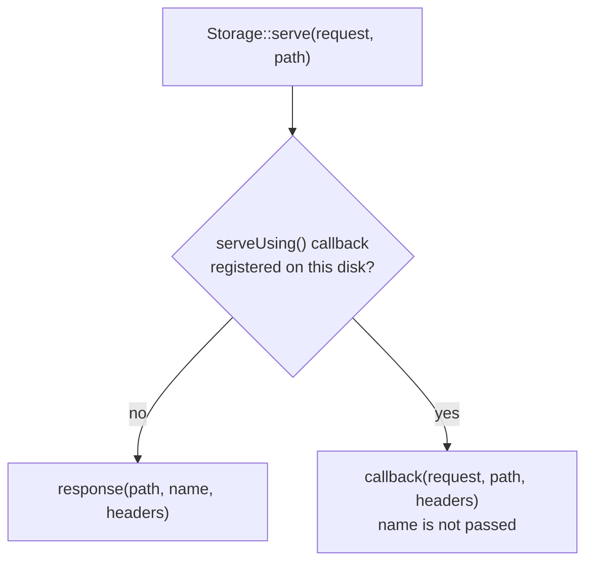

# Chapter 18 - Filesystem and reflection

Chapter 17 opened Part VIII (Application Infrastructure) with two facades already familiar from
daily use, `Config` and `Cookie`, each read past its better-known surface. Chapter 18 closes the
Part with two areas that sit even further from the documentation: the abstract filesystem behind
`Storage`, whose docs page covers only part of its public surface, and `Reflector`, an entire
class with no documentation page at all, used to read PHP attributes declared on a class. The
chapter starts with `Storage`'s own quietest pair of pairs: two precise existence checks sitting
right beside the single, ambiguous one everybody already knows.

## `Storage::fileExists()` / `Storage::fileMissing()` / `Storage::directoryExists()` / `Storage::directoryMissing()`

**Case type**: two undocumented method pairs on `Illuminate\Filesystem\FilesystemAdapter` (and
the `Storage` facade), sitting beside the documented `exists()`/`missing()` that `filesystem.md`
covers - `Storage`'s own docs page, like `Config`'s in Chapter 17, covers only part of its public
surface. **Alias flag**: not aliases - `exists()`/`missing()` delegate to Flysystem's `has()`,
which answers true for a file or a directory alike; `fileExists()`/`fileMissing()` and
`directoryExists()`/`directoryMissing()` each ask a strictly narrower question the documented pair
cannot. **Audience**: application developers, no shift toward package authors. **Stability**: core
`Filesystem` component, no churn found verifying against v13.22.0.

### Minimal snippet

```php
Storage::exists('suppliers/acme'); // true - a directory counts as "existing" too
Storage::fileExists('suppliers/acme'); // false - it is not a file
Storage::directoryExists('suppliers/acme'); // true
```

### Documented way vs. discovered way

`exists()` and `missing()` are the documented pair, and both go through Flysystem's own
ambiguous `has()`:

```php
public function exists($path)
{
    return $this->driver->has($path);
}

public function missing($path)
{
    return ! $this->exists($path);
}
```

Right beside them, `fileExists()`/`fileMissing()` and `directoryExists()`/`directoryMissing()`
each delegate to a type-specific Flysystem method instead:

```php
public function fileExists($path)
{
    return $this->driver->fileExists($path);
}

public function fileMissing($path)
{
    return ! $this->fileExists($path);
}

public function directoryExists($path)
{
    return $this->driver->directoryExists($path);
}

public function directoryMissing($path)
{
    return ! $this->directoryExists($path);
}
```

The difference is not cosmetic. A path that happens to be a directory reads as "existing" under
the documented `exists()` even when the caller meant "is this a readable file" - the two
undocumented pairs are how `Storage` actually answers that narrower question.

### Real scenario: precise existence checks in a supplier document archive

`App\Support\StockImport\SupplierDocumentArchive` keeps scanned supplier documents (delivery
notes, invoices) on a dedicated `supplier_documents` disk, organized as `suppliers/{supplier}/
{document}`. It needs to answer two genuinely different questions - does a supplier have a folder
at all, and does a specific document exist inside it - and answering either with the ambiguous
`exists()` would silently accept the wrong kind of path:

```php
class SupplierDocumentArchive
{
    public function hasFolderFor(string $supplier): bool
    {
        $this->assertSafeSegment($supplier);

        return Storage::disk('supplier_documents')->directoryExists("suppliers/{$supplier}");
    }

    public function hasDocument(string $supplier, string $document): bool
    {
        $this->assertSafeSegment($supplier);
        $this->assertSafeSegment($document);

        return Storage::disk('supplier_documents')->fileExists("suppliers/{$supplier}/{$document}");
    }

    // missingFolderFor() and missingDocument() follow the same shape.

    protected function assertSafeSegment(string $value): void
    {
        abort_if(
            $value === '' || $value !== basename($value) || str_contains($value, '..'),
            422,
            'Invalid path segment.'
        );
    }
}
```

`assertSafeSegment()` is the one addition every method in this class shares, and it earns a
word of explanation on its own. `fileExists("suppliers/{$supplier}/{$document}")` builds its
path by string interpolation - nothing stops `$document` from being `../../secret.txt`, and
Flysystem's local adapter only throws once a path resolves outside the disk's own root: a
single or double `..` still resolves silently *inside* it, far enough to reach another
supplier's folder or any other file the disk happens to hold. `basename($value) !== $value`
catches exactly that: a value containing a directory separator is, by definition, not equal to
its own basename. Every method below reuses this same guard before ever touching a path.

`App\Http\Controllers\Api\SupplierDocumentController` exposes both checks over HTTP, each a thin,
validated delegation, deliberately open to any caller - later entries in this chapter gate
`serve()` and a checksum lookup behind a supplier-specific token, but a plain existence check
answers only "does this exist", nothing about the document's own content:

```php
public function checkFolder(Request $request, SupplierDocumentArchive $archive)
{
    $validated = $request->validate([
        'supplier' => ['required', 'string'],
    ]);

    return response()->json([
        'exists' => $archive->hasFolderFor($validated['supplier']),
    ]);
}
```

A test proves both pairs answer their own question and no other:

```php
Storage::fake('supplier_documents');
Storage::disk('supplier_documents')->makeDirectory('suppliers/acme');

$archive = new SupplierDocumentArchive;

expect($archive->hasFolderFor('acme'))->toBeTrue();
expect($archive->missingFolderFor('acme'))->toBeFalse();
expect($archive->hasFolderFor('globex'))->toBeFalse();
expect($archive->missingFolderFor('globex'))->toBeTrue();
```

Had `SupplierDocumentArchive` reached for `exists()` instead, a supplier's empty folder and a
supplier's first uploaded document would have been indistinguishable from each other - exactly
the ambiguity these four undocumented methods exist to remove.

## `Storage::checksum()`

**Case type**: an undocumented method on `Illuminate\Filesystem\FilesystemAdapter` (and
`Storage`), another gap in the same partially-documented `filesystem.md` page. **Alias flag**: not
an alias - no documented mechanism computes a checksum on the disk side at all; the closest
documented alternative is downloading the file and hashing it in the application, which is exactly
what this method avoids. **Audience**: application developers. **Stability**: core `Filesystem`
component, stable, but the checksum's algorithm and format are driver-dependent - the default is
`md5`, and it is only as trustworthy as whatever the underlying adapter actually computes it from.

### Minimal snippet

```php
Storage::checksum('suppliers/acme/invoice-1.pdf');
// '9a0364b9e99bb480dd25e1f0284c8555' - an md5 hash, computed on the disk side
```

### Documented way vs. discovered way

Without `checksum()`, confirming a remote file's integrity means downloading it first and hashing
it locally:

```php
$contents = Storage::get('suppliers/acme/invoice-1.pdf');
$matches = hash_equals($expectedChecksum, hash('md5', $contents));
```

`Storage::checksum()` skips the download entirely - the hash is computed on the disk side and only
the resulting string crosses back to the application:

```php
public function checksum(string $path, array $options = [])
{
    try {
        return $this->driver->checksum($path, $options);
    } catch (UnableToProvideChecksum $e) {
        throw_if($this->throwsExceptions(), $e);

        $this->report($e);

        return false;
    }
}
```

Two things worth stating plainly rather than leaving implicit. First, when the driver cannot
produce a checksum - most commonly because the path does not exist - `checksum()` does not throw
by default: it reports the exception and returns `false`, unless the disk's own `throw` config key
is `true`. A caller that treats `false` as "just another checksum string" instead of "the check
failed" will misread a missing file as a mismatch, not as an error. Second, `Storage::fake()`
always backs a disk with Flysystem's local adapter, regardless of what driver that disk is
actually configured with in `config/filesystems.php` - so a test built against a faked disk, this
one included, never exercises whatever a real non-local disk's own driver does for `checksum()`;
it only proves the application's own logic around the method, not the adapter behind it.

### Real scenario: verifying a supplier document without downloading it

`SupplierDocumentArchive::verifyIntegrity()` compares a checksum a supplier already provided (in a
manifest, say) against the one `Storage::checksum()` computes on the stored copy, never reading
the document's own contents into the application:

```php
public function verifyIntegrity(string $supplier, string $document, string $expectedChecksum): bool
{
    $this->assertSafeSegment($supplier);
    $this->assertSafeSegment($document);

    $checksum = Storage::disk('supplier_documents')->checksum("suppliers/{$supplier}/{$document}");

    return hash_equals($expectedChecksum, (string) $checksum);
}
```

The cast to a string matters: `checksum()` returns `false`, not a string, when it fails, and
`hash_equals()` requires two strings - casting first keeps a failed checksum from ever being
compared as anything other than the literal string `"0"` or `""`, neither of which a real checksum
can ever equal. A test proves the failure path explicitly, not just the success path:

```php
Storage::fake('supplier_documents');

expect(Storage::disk('supplier_documents')->checksum('suppliers/acme/missing.pdf'))->toBeFalse();

$archive = new SupplierDocumentArchive;

expect($archive->verifyIntegrity('acme', 'missing.pdf', 'anything'))->toBeFalse();
```

A missing document fails integrity verification the same way a genuinely corrupted one would -
`verifyIntegrity()` itself never needs to special-case "the file was not even there". The
`Api\SupplierDocumentController` endpoint that exposes it over HTTP does have to, though: both
cases make `verifyIntegrity()` return `false`, and reporting them under the same
`{"matches": false}` would leave an API caller unable to tell a real mismatch apart from a typo
in the document name. `verifyDocument()` checks existence first, so the two surface as distinct
responses. It also requires a supplier-specific token before either check runs -
`assertAuthorizedFor()`, which the next entry introduces alongside `serve()`. The reason it
belongs here too, unlike the plain existence checks earlier in this chapter
(`checkFolder()`/`checkDocument()`, which stay open to any caller): confirming a checksum match
is still a way to confirm knowledge of a document's content, not merely of its existence, and
is worth gating the same way a download is:

```php
public function verifyDocument(Request $request, SupplierDocumentArchive $archive)
{
    $validated = $request->validate([
        'supplier' => ['required', 'string'],
        'document' => ['required', 'string'],
        'expected_checksum' => ['required', 'string'],
    ]);

    $archive->assertAuthorizedFor($request, $validated['supplier']);
    abort_unless($archive->hasDocument($validated['supplier'], $validated['document']), 404);

    return response()->json([
        'matches' => $archive->verifyIntegrity(
            $validated['supplier'],
            $validated['document'],
            $validated['expected_checksum'],
        ),
    ]);
}
```

## `Storage::serve()` / `Storage::serveUsing()`

**Case type**: two undocumented methods on `Illuminate\Filesystem\FilesystemAdapter` (and
`Storage`), yet another gap in `filesystem.md`'s partial coverage. **Alias flag**: not an alias -
`serveUsing()` is a global override of every future `serve()` call on that disk, not a per-call
parameter `Storage::response()`/`Storage::download()` already accept. **Audience**: application
developers. **Stability**: core `Filesystem` component, stable.

### Minimal snippet

```php
Storage::serve($request, 'suppliers/acme/invoice-1.pdf');
// a streamed, inline HTTP response - no callback registered, so it is response() underneath
```

### Documented way vs. discovered way

`Storage::response()` and `Storage::download()` (both documented) are how a stored file usually
becomes an HTTP response - `download()` is `response()` with `attachment` disposition instead of
`inline`. `serve()` sits right beside them, but takes a `Request` as its first argument:

```php
public function serve(Request $request, $path, $name = null, array $headers = [])
{
    return isset($this->serveCallback)
        ? call_user_func($this->serveCallback, $request, $path, $headers)
        : $this->response($path, $name, $headers);
}
```

With no callback registered, `$request` is not actually used at all - the method degrades to a
plain `response()` call. `serveUsing()` is what gives `$request` a reason to exist:

```php
public function serveUsing(Closure $callback)
{
    $this->serveCallback = $callback;
}
```

Once registered, every `serve()` call on that disk runs the callback instead - and only three
arguments reach it, `$request`, `$path`, and `$headers`. `$name`, the download filename, is not
one of them: a callback that wants the same automatic filename `response()` derives from the path
has to recompute it itself, or it is silently lost.

### `serve()` authorizes nothing on its own

The framework's own only internal caller of `serve()`, `Illuminate\Filesystem\ServeFile` (behind
the signed route local disks use for `temporaryUrl()`), makes this explicit by example - it checks
the request's signature itself, strictly before ever calling `serve()`:

```php
public function __invoke(Request $request, string $path)
{
    abort_unless(
        $this->hasValidSignature($request),
        $this->isProduction ? 404 : 403
    );
    try {
        abort_unless(Storage::disk($this->disk)->exists($path), 404);

        $headers = [
            'Cache-Control' => 'no-store, no-cache, must-revalidate, max-age=0',
            'Content-Security-Policy' => "default-src 'none'; style-src 'unsafe-inline'; sandbox",
        ];

        return tap(
            Storage::disk($this->disk)->serve($request, $path, headers: $headers),
            function ($response) use ($headers) {
                if (! $response->headers->has('Content-Security-Policy')) {
                    $response->headers->replace($headers);
                }
            }
        );
    } catch (PathTraversalDetected) {
        abort(404);
    }
}
```

`serve()` itself never asks whether the caller is entitled to that specific path - `ServeFile`
asks first, then delegates. Application code calling `serve()` directly has to do the same asking
itself; nothing further down the call ever will.



### Real scenario: authorizing and serving a supplier document

`SupplierDocumentArchive::serve()` checks authorization first, existence second, and only then
serves the file - in that order, so an unauthorized caller learns nothing about whether the
document even exists:

```php
public function serve(Request $request, string $supplier, string $document): Response
{
    $this->assertSafeSegment($supplier);
    $this->assertSafeSegment($document);

    $this->assertAuthorizedFor($request, $supplier);
    abort_unless($this->hasDocument($supplier, $document), 404);

    return Storage::disk('supplier_documents')->serve($request, "suppliers/{$supplier}/{$document}");
}

public function assertAuthorizedFor(Request $request, string $supplier): void
{
    abort_unless($this->isAuthorizedFor($request, $supplier), 403);
}

protected function isAuthorizedFor(Request $request, string $supplier): bool
{
    // Always compare against something, even for a supplier with no configured
    // credential at all - a null config lookup short-circuiting before hash_equals()
    // would let an unconfigured supplier name be told apart from a configured one
    // by response timing alone.
    $expected = config("suppliers.credentials.{$supplier}.token") ?? Str::random(64);

    return hash_equals((string) $expected, (string) $request->header('X-Supplier-Token'));
}
```

`assertAuthorizedFor()` is public and kept separate from `serve()` on purpose: the checksum
entry earlier in this chapter reuses it directly from `verifyDocument()`, without needing a
full read or write action just to ask the same question.

`config/suppliers.php` holds one token per named supplier - the first credential of its kind in
this application, checked against an `X-Supplier-Token` header rather than a session, since these
are stateless API requests with no logged-in user at all. `App\Providers\AppServiceProvider`
registers a `serveUsing()` callback once, adding the same `Content-Security-Policy` header
`ServeFile` uses internally to every response `SupplierDocumentArchive::serve()` produces, and
recomputing the filename `serve()` itself would otherwise drop:

```php
public function registerSupplierDocumentServing(): void
{
    Storage::disk('supplier_documents')->serveUsing(function ($request, $path, $headers) {
        return Storage::disk('supplier_documents')->response($path, basename($path), [
            ...$headers,
            'Content-Security-Policy' => "default-src 'none'; style-src 'unsafe-inline'; sandbox",
        ]);
    });
}
```

This registration is pulled out of `boot()` into its own method for a reason a test surfaces
directly: `Storage::fake()` replaces a disk's entire underlying instance, which drops any
`serveUsing()` callback already registered on it - unlike `buildTemporaryUrlsUsing()` and
`buildTemporaryUploadUrlsUsing()`, which `fake()` explicitly reinstates with its own default. A
test against a faked `supplier_documents` disk has to call `registerSupplierDocumentServing()`
again to actually exercise the customization, not assume `boot()`'s registration survived:

```php
Storage::fake('supplier_documents');
(new AppServiceProvider(app()))->registerSupplierDocumentServing();

Storage::disk('supplier_documents')->put('suppliers/acme/invoice-1.pdf', 'contents-1');
```

## `Storage::buildTemporaryUploadUrlsUsing()`

**Case type**: an undocumented method on `Illuminate\Filesystem\FilesystemAdapter` (and
`Storage`), sitting one word away from a documented sibling that customizes a different method.
**Alias flag**: not an alias - `buildTemporaryUrlsUsing()` customizes `temporaryUrl()` (reading a
file); this hook customizes `temporaryUploadUrl()` (uploading one), a distinct capability, not a
renamed duplicate of the same thing. **Audience**: application developers, though this specific
hook - like `serveUsing()` - starts to resemble the kind of customization a storage-integration
package author would reach for. **Stability**: core `Filesystem` component, stable.

### Minimal snippet

```php
Storage::buildTemporaryUploadUrlsUsing(function ($path, $expiration, $options) {
    return ['url' => "https://example.test/{$path}", 'headers' => []];
});

Storage::temporaryUploadUrl('suppliers/acme/invoice-1.pdf', now()->addMinutes(5));
```

### Documented way vs. discovered way

Right beside this undocumented hook sits a documented one that looks almost identical:

```php
public function buildTemporaryUrlsUsing(Closure $callback)
{
    $this->temporaryUrlCallback = $callback;
}

public function buildTemporaryUploadUrlsUsing(Closure $callback)
{
    $this->temporaryUploadUrlCallback = $callback;
}
```

`buildTemporaryUrlsUsing()` - documented in `filesystem.md`'s "Enabling Local Temporary URLs"
section - customizes `temporaryUrl()`, the read-side method behind a downloadable link. The two
names differ by one word, and only the read-side one has a docs page: a reader searching for
"temporary upload url" customization will likely find `buildTemporaryUrlsUsing()` first and
reasonably assume it covers uploads too. It does not. The method this entry's hook actually
replaces, `temporaryUploadUrl()`, is itself documented and already delegates to the callback once
one is registered:

```php
public function temporaryUploadUrl($path, $expiration, array $options = [])
{
    if (method_exists($this->adapter, 'temporaryUploadUrl')) {
        return $this->adapter->temporaryUploadUrl($path, $expiration, $options);
    }

    if ($this->temporaryUploadUrlCallback) {
        return $this->temporaryUploadUrlCallback->bindTo($this, static::class)(
            $path, $expiration, $options
        );
    }

    throw new RuntimeException('This driver does not support creating temporary upload URLs.');
}
```

Nothing here enforces an expiration once the default is replaced - the callback receives
`$expiration` as a plain argument and is free to ignore it entirely, producing a link that never
expires. `Storage::fake()` reinstates its own default callback for this hook on every call,
returning an unsigned URL with the expiration only sitting in the query string, unchecked by
anything - a real illustration of exactly this risk, not a hypothetical one.

### Real scenario: a genuinely expiring, verifiable upload link

`SupplierDocumentArchive::issueUploadUrl()` wraps `temporaryUploadUrl()` directly, and checks
the same supplier token `serve()` does before ever issuing a link. Handing out a signed upload
URL is a write capability, not a read one: nothing about `temporaryUploadUrl()` itself asks
whether the caller is entitled to write into that supplier's folder at all, so
`issueUploadUrl()` has to ask, through the same `assertAuthorizedFor()` `serve()` already uses
for downloads:

```php
public function issueUploadUrl(Request $request, string $supplier, string $document, DateTimeInterface $expiration): array
{
    $this->assertSafeSegment($supplier);
    $this->assertSafeSegment($document);

    $this->assertAuthorizedFor($request, $supplier);

    return Storage::disk('supplier_documents')->temporaryUploadUrl(
        "suppliers/{$supplier}/{$document}",
        $expiration,
    );
}
```

The customization registered for it builds on `URL::temporarySignedRoute()` - the same primitive
`LocalFilesystemAdapter`'s own default upload mechanism and `ServeFile`'s `hasValidSignature()`
check are built on - rather than a hand-rolled signature, so the expiration this method receives
is enforced structurally, not just asserted in a comment:

```php
public function registerSupplierDocumentUploadUrls(): void
{
    Storage::disk('supplier_documents')->buildTemporaryUploadUrlsUsing(function ($path, $expiration, $options) {
        [, $supplier, $document] = explode('/', $path, 3);

        return [
            'url' => URL::temporarySignedRoute('stock.supplier-documents.upload', $expiration, [
                'supplier' => $supplier,
                'document' => $document,
            ]),
            'headers' => [],
        ];
    });
}
```

The receiving end verifies that same signature before ever touching the disk:

```php
public function receiveUpload(Request $request)
{
    abort_unless($request->hasValidSignature(), 403);

    $validated = $request->validate([
        'supplier' => ['required', 'string'],
        'document' => ['required', 'string'],
    ]);

    Storage::disk('supplier_documents')->put(
        "suppliers/{$validated['supplier']}/{$validated['document']}",
        $request->getContent(),
    );

    return response()->json(['stored' => true]);
}
```

A test proves the whole path end to end, not just that a URL comes back: it issues one with an
authorized request, `PUT`s real content through it, and confirms both that the document lands
on disk and that a tampered or expired version of the same URL is rejected before anything is
written:

```php
Storage::fake('supplier_documents');
(new AppServiceProvider(app()))->registerSupplierDocumentUploadUrls();

$archive = new SupplierDocumentArchive;
$issued = $archive->issueUploadUrl(authorizedUploadRequest(), 'acme', 'invoice-1.pdf', now()->addMinutes(5));

$this->call('PUT', $issued['url'], [], [], [], [], 'contents')
    ->assertOk()
    ->assertExactJson(['stored' => true]);

expect(Storage::disk('supplier_documents')->get('suppliers/acme/invoice-1.pdf'))->toBe('contents');
```

A separate test proves the authorization check itself: an upload URL request with a missing or
wrong `X-Supplier-Token` never reaches `temporaryUploadUrl()` at all, over HTTP, the same way an
unauthorized download never reaches `Storage::serve()`.

This closes the filesystem block of the chapter. The last entry moves to a different area
entirely: reading PHP attributes declared on a class.

## `Reflector::getClassAttribute()` / `Reflector::getClassAttributes()`

**Case type**: `Illuminate\Support\Reflector` is not a partially-documented class like
`Storage` above - it has no documentation page at all, undocumented from top to bottom.
**Alias flag**: not an alias - no equivalent convenience exists anywhere in documented Laravel
code; the only native alternative is PHP's own reflection API, used directly. **Audience**:
this specific technique - discovering classes by a repeatable metadata attribute - leans toward
the kind of plugin/registry mechanism a package or subsystem author would build, more than
day-to-day application code, the same audience shift `Manager`/`MultipleInstanceManager` got in
Chapter 3. **Stability**: core framework, no churn found verifying against v13.22.0.

### Minimal snippet

```php
#[Reportable(name: 'inventory-monthly')]
class InventoryReportGenerator {}

Reflector::getClassAttribute(InventoryReportGenerator::class, Reportable::class)->name;
// 'inventory-monthly'
```

### Documented way vs. discovered way

Nothing in documented Laravel reads a class's own attributes for you - the closest built-in
alternative is PHP's native `ReflectionClass::getAttributes()`, used directly:

```php
$reflection = new ReflectionClass(InventoryReportGenerator::class);
$attributes = $reflection->getAttributes(Reportable::class);
$reportable = $attributes === [] ? null : $attributes[0]->newInstance();
```

`Reflector::getClassAttribute()` and `getClassAttributes()` wrap exactly this, minus the
boilerplate:

```php
public static function getClassAttribute($objectOrClass, $attribute, $ascend = false)
{
    return static::getClassAttributes($objectOrClass, $attribute, $ascend)->flatten()->first();
}

public static function getClassAttributes($objectOrClass, $attribute, $includeParents = false)
{
    $reflectionClass = new ReflectionClass($objectOrClass);

    $attributes = [];

    do {
        $attributes[$reflectionClass->name] = new Collection(array_map(
            fn (ReflectionAttribute $reflectionAttribute) => $reflectionAttribute->newInstance(),
            $reflectionClass->getAttributes($attribute)
        ));
    } while ($includeParents && false !== $reflectionClass = $reflectionClass->getParentClass());

    return $includeParents ? new Collection($attributes) : array_first($attributes);
}
```

Without `$includeParents`, `getClassAttributes()` returns a plain `Collection` of every
instance of `$attribute` found on that one class - `Reflector` does not ascend the inheritance
chain by default, since PHP's own attribute reflection never does either. With
`$includeParents`, it returns a `Collection` keyed by class name, one entry per class walked
from the target upward, each already instantiated rather than left as raw
`ReflectionAttribute` objects the caller would otherwise have to call `newInstance()` on
themselves.

`getClassAttribute()` delegates to exactly that, then `flatten()->first()`. With
`$ascend = false` (the default), it returns the first attribute found on the target class
alone. With `$ascend = true`, `flatten()` walks the keyed collection in the same order
`getClassAttributes()` built it - target class first, then each parent in turn - so the first
non-empty match encountered is the nearest declaration to the target class, not necessarily
the topmost one.

That "first" is exactly where the silent data loss lives: if `$attribute` is repeatable and
applied more than once on the resolved class, `getClassAttribute()` returns only the first
instance it finds, with no exception and no way to tell from its return value alone that a
second one exists.

### Real scenario: a repeatable report attribute and the primary-report gotcha

`App\Support\ReportCatalog\Reportable` is a repeatable class attribute declaring a named
report and its schedule:

```php
#[Attribute(Attribute::TARGET_CLASS | Attribute::IS_REPEATABLE)]
class Reportable
{
    public function __construct(
        public string $name,
        public string $schedule = 'monthly',
    ) {}
}
```

Most report generators declare it once. `FinanceReportGenerator` declares it twice, on
purpose - the same underlying figures, published on two different cadences:

```php
#[Reportable(name: 'finance-monthly')]
#[Reportable(name: 'finance-quarterly', schedule: 'quarterly')]
class FinanceReportGenerator
{
    public function generate(): array
    {
        return ['report' => 'finance'];
    }
}
```

`App\Support\ReportCatalog\ReportCatalog` reads that metadata without instantiating any
generator, using each `Reflector` method for what it is actually good at:

```php
class ReportCatalog
{
    public function discover(array $classes): Collection
    {
        return collect($classes)->mapWithKeys(fn (string $class) => [
            $class => Reflector::getClassAttributes($class, Reportable::class),
        ]);
    }

    public function primaryReportNameFor(string $class): ?string
    {
        return Reflector::getClassAttribute($class, Reportable::class)?->name;
    }
}
```

A test proves the gotcha directly, rather than only describing it: `discover()` sees both of
`FinanceReportGenerator`'s declarations, but `primaryReportNameFor()` on that very same class
returns only the first one, with nothing in its return value hinting that a second, distinct
report was silently dropped:

```php
expect($catalog->primaryReportNameFor(FinanceReportGenerator::class))->toBe('finance-monthly');
expect($catalog->discover([FinanceReportGenerator::class])[FinanceReportGenerator::class])
    ->toHaveCount(2);
```

Anything built on `primaryReportNameFor()` alone - a scheduler deciding which report to run
today, say - would run `finance-monthly` forever and never learn `finance-quarterly` exists,
unless it also calls `discover()` and checks the count itself.

This is the same technique the reader already saw Laravel use internally in Chapter 14:
`#[AsCommand(name: '...')]` on a command class is a PHP attribute the framework reads via
reflection to decide whether that command can be loaded lazily, before ever instantiating it.
`ReportCatalog` applies the identical idea directly, from application code, to a metadata
attribute of its own design rather than one the framework defines.

## Summary

| Entry | Documented alternative | Prefer the undocumented one when |
|---|---|---|
| `Storage::fileExists()` / `fileMissing()` / `directoryExists()` / `directoryMissing()` | `Storage::exists()` / `missing()` | The question is specifically "is this a file" or "is this a directory", not the ambiguous "is there something at this path" |
| `Storage::checksum()` | `Storage::get()` followed by hashing the contents locally | The file only needs verifying, not reading, especially against a remote disk |
| `Storage::serve()` / `serveUsing()` | `Storage::response()` / `Storage::download()` | The response must be built from the incoming `Request`, or every future `serve()` call on a disk needs the same custom behavior |
| `Storage::buildTemporaryUploadUrlsUsing()` | `Storage::temporaryUploadUrl()`'s own driver default | The default upload-link mechanism does not fit (no adapter support, or the expiration and target must be enforced differently) |
| `Reflector::getClassAttribute()` / `getClassAttributes()` | `ReflectionClass::getAttributes()` used directly | A class's own declared attributes must be read as instantiated objects, optionally across its inheritance chain, without native reflection's boilerplate |

Each documented alternative is not wrong, only narrower. `exists()`/`missing()` are fine
wherever a path's exact kind never matters; `Storage::get()` plus a local hash is fine for a
file small and local enough that downloading it costs nothing; `response()`/`download()` cover
every case that does not need the request itself or a disk-wide default; and the driver's own
default upload mechanism is fine until it either does not exist or is not trustworthy enough on
its own. Native `ReflectionClass::getAttributes()` is fine for a one-off read; `Reflector`
earns its place the moment more than one caller needs the same attribute read the same way, or
needs it read while walking a class hierarchy.

Part VIII - Application Infrastructure ends here, complete across Chapters 17-18: from
configuration and cookies read past their documented surface to the filesystem abstraction
behind `Storage` and, with `Reflector`, a small undocumented utility class outside any facade
at all, one the framework itself leans on internally. Chapter 19 is the last chapter of the
book, but it adds no further entries of its own - it closes the book editorially, returning to
why this search through undocumented, usable Laravel code was worth doing at all.
