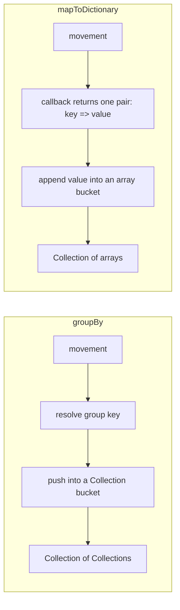

# Chapter 2 - Arr and Collection: the methods nobody imports

Chapter 2 continues Part I (Code Fundamentals) by extending the reader's knowledge of `Arr`
and `Collection` - two classes almost every Laravel application already relies on - with
`Collection::getOrPut()`, `Collection::unshift()`, `Collection::diffUsing()` and
`Collection::diffKeysUsing()`, `Collection::mapToDictionary()`, `Collection::toBase()`, and
`Arr::arrayable()`: methods that solve real, recurring problems but are absent from the
official documentation. Every example in this chapter is verified against `laravel/framework`
`v13.22.0` and the `laravel/docs` `13.x` branch, and is a real, green Pest test drawn from the
book's companion application.

The chapter's examples share a single running scenario: reconciling stock movements into an
inventory report, so each method is seen solving a piece of the same real problem rather than a
disconnected one-off.

| Method | Purpose |
|---|---|
| `Collection::getOrPut($key, $value)` | Get a value by key, or store and return a default if the key is missing. |
| `Collection::unshift(...$values)` | Prepend one or more items to the beginning of the collection, in order. |
| `Collection::diffUsing($items, callable $callback)` | Diff collection values against another set using a custom comparator. |
| `Collection::diffKeysUsing($items, callable $callback)` | Diff collection keys against another set using a custom comparator. |
| `Collection::mapToDictionary(callable $callback)` | Group items into plain-array buckets via a callback returning one key/value pair. |
| `Collection::toBase()` | Downgrade a derived collection (e.g. Eloquent) to a plain base `Collection`. |
| `Arr::arrayable($value)` | Check whether a value can be represented as an array. |

## `Collection::getOrPut()`

**Case type**: undocumented method on the documented `Collection` class. 

**Alias flag**: none -
it has its own existence check and lazily-evaluated default, it does not wrap another public
method. 

**Version note**: introduced in Laravel 8.x (absent before that release).

`Collection::getOrPut()` returns the value stored under a key, or stores and returns a default
if the key is missing yet:

```php
public function getOrPut($key, $value)
{
    if (array_key_exists($key ?? '', $this->items)) {
        return $this->items[$key ?? ''];
    }

    $this->offsetSet($key, $value = value($value));

    return $value;
}
```

### Minimal snippet

```php
collect(['SKU-1' => 7])->getOrPut('SKU-1', 0); // 7, unchanged
collect(['SKU-1' => 7])->getOrPut('SKU-2', 0); // 0, and now stored under 'SKU-2' too
```

### Manual way vs. discovered way

There is no documented Laravel method for this specific job, only the manual
`isset()`-then-initialize pattern developers already write by hand. `getOrPut()` is that same
pattern, already written and named:

```php
$manual = [];

foreach ($movements as $movement) {
    if (! isset($manual[$movement['sku']])) {
        $manual[$movement['sku']] = 0;
    }

    $manual[$movement['sku']] += $movement['quantity'];
}

$discovered = collect();

foreach ($movements as $movement) {
    $discovered[$movement['sku']] = $discovered->getOrPut($movement['sku'], 0) + $movement['quantity'];
}

expect($manual)->toBe($discovered->all());
```

The two loops produce identical totals - the value is not new behavior, it is not having to
re-derive the existence check in every place that needs a running total. The default is also
only ever used once per key: calling `getOrPut('SKU-1', 0)` again once `SKU-1` already holds `7`
returns `7`, not `0` - the default is never re-applied once a value exists.

### Real scenario: a stock-reporting endpoint

The companion app's `StockLedger` uses `getOrPut()` to accumulate a running total per SKU while
walking a list of stock movements:

```php
public function runningTotals(Collection $movements): Collection
{
    $totals = collect();

    foreach ($movements as $movement) {
        $totals[$movement['sku']] = $totals->getOrPut($movement['sku'], 0) + $movement['quantity'];
    }

    return $totals;
}
```

A thin `StockController` exposes it as a reporting endpoint:

```php
public function report(Request $request)
{
    $movements = $request->validate([
        'movements' => ['array'],
        'movements.*.sku' => ['required', 'string'],
        'movements.*.quantity' => ['required', 'integer'],
    ])['movements'];

    $totals = app(StockLedger::class)->runningTotals(collect($movements));

    return response()->json(['totals' => $totals]);
}
```

```php
it('computes running totals for stock movements through the reporting endpoint', function () {
    postJson('/api/stock/report', [
        'movements' => [
            ['sku' => 'SKU-1', 'quantity' => 5],
            ['sku' => 'SKU-2', 'quantity' => 3],
            ['sku' => 'SKU-1', 'quantity' => 2],
        ],
    ])
        ->assertOk()
        ->assertJson(['totals' => ['SKU-1' => 7, 'SKU-2' => 3]]);
});
```

Because `getOrPut()` only writes its default the first time a SKU is seen, `runningTotals()` can
seed and accumulate in the same expression, on the same line, for every movement in the list -
without a separate initialization pass over the SKUs first.

## `Collection::unshift()`

**Case type**: undocumented method on the documented `Collection` class. 

**Alias flag**: none -
it is a one-line wrapper over PHP's native `array_unshift()`, but it is not an alias of the
documented `Collection::prepend()`: `prepend()` accepts only one value per call, `unshift()` is
variadic. 

**Version note**: introduced in Laravel 11.x (absent from the `10.x` branch).

`Collection::unshift()` prepends one or more items to the beginning of the collection, in the
order given:

```php
public function unshift(...$values)
{
    array_unshift($this->items, ...$values);

    return $this;
}
```

### Minimal snippet

```php
collect([['sku' => 'SKU-2', 'quantity' => 3]])
    ->unshift(['sku' => 'SKU-1', 'quantity' => 10]);
// [['sku' => 'SKU-1', 'quantity' => 10], ['sku' => 'SKU-2', 'quantity' => 3]]
```

### Documented way vs. discovered way

For a single value, `Collection::prepend()` and `unshift()` produce the same result. The
difference shows up with more than one value. `prepend($value, $key = null)` only accepts one
value per call, so inserting two items means chaining two calls - and each call jumps its value
ahead of whatever is already there, reversing the order relative to how the calls were written:

```php
$stockTake = ['sku' => 'SKU-1', 'quantity' => 10];
$adjustment = ['sku' => 'SKU-2', 'quantity' => -2];
$movements = [['sku' => 'SKU-3', 'quantity' => 3]];

collect($movements)->prepend($stockTake)->prepend($adjustment);
// [$adjustment, $stockTake, ['sku' => 'SKU-3', 'quantity' => 3]] - reversed

collect($movements)->unshift($stockTake, $adjustment);
// [$stockTake, $adjustment, ['sku' => 'SKU-3', 'quantity' => 3]] - as written
```

`unshift()` takes both values in a single call and keeps them in the order passed - there is no
call-order arithmetic to do.

### Real scenario: opening balances on the stock-reporting endpoint

The companion app's `StockLedger` uses `unshift()` to prepend however many opening-balance
adjustments a report needs, in one call:

```php
public function withOpeningBalances(Collection $movements, array ...$openingBalances): Collection
{
    return $movements->unshift(...$openingBalances);
}
```

`StockController::report()` accepts them as an optional array and applies them before computing
totals:

```php
if (! empty($validated['opening_balances'])) {
    $movements = $ledger->withOpeningBalances($movements, ...$validated['opening_balances']);
}

$totals = $ledger->runningTotals($movements);
```

```php
it('includes opening balances in the running totals through the reporting endpoint', function () {
    postJson('/api/stock/report', [
        'movements' => [
            ['sku' => 'SKU-1', 'quantity' => 5],
        ],
        'opening_balances' => [
            ['sku' => 'SKU-1', 'quantity' => 10],
            ['sku' => 'SKU-2', 'quantity' => 4],
        ],
    ])
        ->assertOk()
        ->assertJson(['totals' => ['SKU-1' => 15, 'SKU-2' => 4]]);
});
```

Because `unshift()` takes the whole list of adjustments in one call, `report()` can pass through
however many a client sends without reasoning about the order they will end up in - a guarantee
chained `prepend()` calls alone could not make.

## `Collection::diffUsing()` and `Collection::diffKeysUsing()`

**Case type**: undocumented methods on the documented `Collection` class. 

**Alias flag**: none
for either - both are thin wrappers over PHP's native `array_udiff()`/`array_diff_ukey()`, but
neither is an alias of the documented `Collection::diffAssocUsing()` sibling, which compares
keys and values together rather than one or the other. 

**Version note**: both introduced in
Laravel 5.6, alongside `diffAssocUsing()`.

```php
public function diffUsing($items, callable $callback)
{
    return $this->newInstance(array_udiff($this->items, $this->getArrayableItems($items), $callback));
}

public function diffKeysUsing($items, callable $callback)
{
    return $this->newInstance(array_diff_ukey($this->items, $this->getArrayableItems($items), $callback));
}
```

### Minimal snippet

```php
collect([['sku' => 'SKU-1'], ['sku' => 'SKU-2']])
    ->diffUsing([['sku' => 'sku-1']], fn ($a, $b) => strcasecmp($a['sku'], $b['sku']));
// [['sku' => 'SKU-2']] - 'SKU-1' matched 'sku-1' case-insensitively, so it is excluded

collect(['SKU-1' => 10, 'SKU-2' => 5])->diffKeysUsing(['sku-1' => 12], fn ($a, $b) => strcasecmp($a, $b));
// ['SKU-2' => 5]
```

### Manual way vs. discovered way

There is no documented Laravel method for a custom-comparator diff, only a manual loop that
checks every candidate by hand. `diffUsing()` is that same loop, already written:

```php
$manual = array_values(array_filter($before->all(), function ($item) use ($after) {
    foreach ($after->all() as $candidate) {
        if (strcasecmp($item['sku'], $candidate['sku']) === 0) {
            return false;
        }
    }

    return true;
}));

$discovered = $before->diffUsing($after, fn ($a, $b) => strcasecmp($a['sku'], $b['sku']))->values()->all();

expect($manual)->toBe($discovered);
```

Both methods type their callback as returning an `int` in their own docblocks - the same
`usort`-style contract PHP's comparison functions expect: negative, zero, or positive, never a
boolean. This is not a formality. Swap the comparator above for one that looks equivalent but
returns a boolean, on the same data:

```php
$before->diffUsing($after, fn ($a, $b) => strcasecmp($a['sku'], $b['sku']))->values()->all();
// [['sku' => 'SKU-2', 'quantity' => 5]] - correct

$before->diffUsing($after, fn ($a, $b) => strcasecmp($a['sku'], $b['sku']) !== 0)->values()->all();
// all three records - wrong, not a partial miss
```

`array_udiff()` sorts internally using the callback to line elements up efficiently; a boolean
comparator can only say "equal" or "not", never "less than" or "greater than", so the sort it
depends on breaks - and it breaks completely, not gracefully.

### Real scenario: reconciling two stock snapshots

The companion app's `StockLedger` uses both methods together to reconcile a before/after pair
of stock snapshots:

```php
public function missingSnapshotRecords(Collection $before, Collection $after): Collection
{
    return $before->diffUsing($after, fn ($a, $b) => strcasecmp($a['sku'], $b['sku']));
}

public function missingSkuKeys(Collection $beforeTotals, Collection $afterTotals): Collection
{
    return $beforeTotals->diffKeysUsing($afterTotals, fn ($a, $b) => strcasecmp($a, $b));
}
```

`missingSkuKeys()` reuses `runningTotals()` from earlier in this chapter, so the two SKU-keyed
totals being compared come from the same aggregation already in place:

```php
it('reconciles two stock snapshots through the endpoint', function () {
    postJson('/api/stock/reconcile', [
        'before' => [
            ['sku' => 'SKU-1', 'quantity' => 10],
            ['sku' => 'SKU-2', 'quantity' => 5],
            ['sku' => 'SKU-3', 'quantity' => 2],
        ],
        'after' => [
            ['sku' => 'sku-1', 'quantity' => 12],
            ['sku' => 'SKU-3', 'quantity' => 2],
        ],
    ])
        ->assertOk()
        ->assertJson([
            'missing_records' => [['sku' => 'SKU-2', 'quantity' => 5]],
            'missing_skus' => ['SKU-2'],
        ]);
});
```

Both answers agree because they describe the same underlying gap - `SKU-2` disappeared between
the two snapshots - one at the level of raw records, the other at the level of aggregated
totals.

## `Collection::mapToDictionary()`

**Case type**: undocumented method on the documented `Collection` class. 

**Alias flag**: none -
it has its own accumulation logic; `groupBy()` is actually built on top of `mapToDictionary()`
internally, not the other way round. 

**Version note**: introduced in Laravel 5.5 (landed under
the working name `buildToDictionary`, renamed before release).

```php
public function mapToDictionary(callable $callback)
{
    $dictionary = [];

    foreach ($this->items as $key => $item) {
        $pair = $callback($item, $key);

        $key = key($pair);

        $value = reset($pair);

        if (! isset($dictionary[$key])) {
            $dictionary[$key] = [];
        }

        $dictionary[$key][] = $value;
    }

    return $this->newInstance($dictionary);
}
```

### Minimal snippet

```php
collect([['sku' => 'SKU-1', 'warehouse' => 'north']])
    ->mapToDictionary(fn ($movement) => [$movement['warehouse'] => $movement]);
// ['north' => [['sku' => 'SKU-1', 'warehouse' => 'north']]]
```

### Documented way vs. discovered way

`groupBy()` solves a similar grouping problem, but wraps each bucket in another `Collection`.
`mapToDictionary()` builds plain arrays instead - the callback returns one `[key => value]` pair
per item, and the method appends the value into that key's array bucket:



```php
$documented = $movements->groupBy('warehouse');
$discovered = $movements->mapToDictionary(fn ($movement) => [$movement['warehouse'] => $movement]);

expect($documented->get('north'))->toBeInstanceOf(Collection::class)
    ->and($discovered->get('north'))->toBeArray()
    ->and($documented->map(fn ($group) => $group->all())->all())->toBe($discovered->all());
```

The grouped content is identical either way - only the bucket type differs: a `Collection` you
can chain further collection methods on, or a plain `array` when you do not need that.

### Real scenario: grouping stock movements by warehouse

```php
public function groupByWarehouse(Collection $movements): Collection
{
    return $movements->mapToDictionary(fn ($movement) => [$movement['warehouse'] => $movement]);
}
```

```php
it('groups movements by warehouse through the reporting endpoint', function () {
    postJson('/api/stock/by-warehouse', [
        'movements' => [
            ['sku' => 'SKU-1', 'quantity' => 10, 'warehouse' => 'north'],
            ['sku' => 'SKU-2', 'quantity' => 5, 'warehouse' => 'south'],
            ['sku' => 'SKU-3', 'quantity' => 2, 'warehouse' => 'north'],
        ],
    ])
        ->assertOk()
        ->assertJson([
            'by_warehouse' => [
                'north' => [
                    ['sku' => 'SKU-1', 'quantity' => 10, 'warehouse' => 'north'],
                    ['sku' => 'SKU-3', 'quantity' => 2, 'warehouse' => 'north'],
                ],
                'south' => [
                    ['sku' => 'SKU-2', 'quantity' => 5, 'warehouse' => 'south'],
                ],
            ],
        ]);
});
```

Because the JSON response only needs to serialize the grouped movements, not call further
collection methods on each group, the plain-array buckets `mapToDictionary()` produces are
exactly what `byWarehouse()` needs - no wrapping `Collection` to strip away first.

## `Collection::toBase()`

**Case type**: undocumented method on the documented `Collection` class. 

**Alias flag**: none -
it has its own logic, not a wrapper around another public method. 

**Version note**: introduced
in Laravel 5.3.

```php
public function toBase()
{
    return new self($this);
}
```

Because this is written as `new self($this)`, not `new static($this)`, `self` resolves at
compile time to `Illuminate\Support\Collection` - the class where the method is textually
defined - regardless of which subclass instance calls it. `Illuminate\Database\Eloquent\
Collection` extends the base `Collection` and never overrides `toBase()`, so calling it on an
Eloquent collection always downgrades to the plain base collection.

### Minimal snippet

```php
$movements = StockMovement::all(); // Illuminate\Database\Eloquent\Collection
get_class($movements->toBase()); // 'Illuminate\Support\Collection'
```

### Documented way vs. discovered way

The "documented way" here is simply continuing to use the Eloquent collection - which works
until a method your code relies on behaves differently there. `unique()` (no key) is exactly
such a method: the Eloquent version dedupes by primary key, the base version compares full
values:

```php
$movements->unique()->pluck('quantity')->all();
// [99] - Eloquent's unique() dedupes by id, keeping only the last one

$movements->toBase()->unique()->pluck('quantity')->all();
// [10, 99] - the base unique() compares full values, both kept
```

### Real scenario: an audit that must not hide a pending edit

`StockLedger::distinctSnapshots()` converts an Eloquent collection of `StockMovement` models -
possibly including an uncommitted in-memory edit sharing the same `id` as a saved row - back to
a base collection before deduplicating, so the pending edit is not silently collapsed into the
saved row:

```php
public function distinctSnapshots(EloquentCollection $movements): Collection
{
    return $movements->toBase()->unique();
}
```

```php
it('confirms toBase() changes unique() semantics for models sharing the same id', function () {
    $saved = StockMovement::factory()->create(['sku' => 'SKU-1', 'quantity' => 10, 'warehouse' => null]);
    $pending = clone $saved;
    $pending->quantity = 99;

    $movements = new EloquentCollection([$saved, $pending]);

    expect($movements->unique()->count())->toBe(1)
        ->and(app(StockLedger::class)->distinctSnapshots($movements)->count())->toBe(2);
});
```

An audit endpoint built on `distinctSnapshots()` shows both the saved quantity and the pending
one, instead of the identity-based `unique()` masking the difference.

## `Arr::arrayable()`

**Case type**: undocumented method on the documented `Arr` class. 

**Alias flag**: none.

**Version note**: introduced in Laravel 12.x, alongside the documented `Arr::from()` - which
never itself mentions `arrayable()`.

```php
public static function arrayable($value)
{
    return is_array($value)
        || $value instanceof Arrayable
        || $value instanceof Traversable
        || $value instanceof Jsonable
        || $value instanceof JsonSerializable;
}
```

### Minimal snippet

```php
Arr::arrayable(['sku' => 'SKU-1']); // true
Arr::arrayable(new StockAdjustment('SKU-1', 5)); // true
```

### Documented way vs. discovered way

A manual `instanceof Arrayable` check is the natural first reach for "can this become an array",
but it only recognizes one of the shapes `arrayable()` accepts. `StockAdjustment` implements
`JsonSerializable`, not `Arrayable` - a manual check would reject it:

```php
$adjustment = new StockAdjustment('SKU-2', 3);

$adjustment instanceof Arrayable; // false
Arr::arrayable($adjustment); // true
```

### Real scenario: merging an adjustment of unknown origin into a report

`StockLedger::withAdjustment()` uses `Arr::arrayable()` to decide whether an incoming value
belongs in the report at all, before the report is built with `Arr::from()`:

```php
public function withAdjustment(Collection $snapshots, mixed $adjustment): Collection
{
    if (! Arr::arrayable($adjustment)) {
        return $snapshots;
    }

    return $snapshots->push($adjustment);
}

public function snapshotReport(Collection $snapshots): array
{
    return $snapshots->map(fn ($item) => Arr::from($item))->all();
}
```

```php
it('merges a valid adjustment into the snapshot report but leaves it untouched for a non-arrayable value', function () {
    $snapshots = collect([['sku' => 'SKU-1', 'quantity' => 7]]);
    $ledger = app(StockLedger::class);

    $merged = $ledger->withAdjustment($snapshots, new StockAdjustment('SKU-2', 3));
    $unchanged = $ledger->withAdjustment($snapshots, 'not-arrayable');

    expect($ledger->snapshotReport($merged))->toBe([
        ['sku' => 'SKU-1', 'quantity' => 7],
        ['sku' => 'SKU-2', 'quantity' => 3],
    ])->and($unchanged->all())->toBe($snapshots->all());
});
```

The check and the conversion are deliberately two different methods: `arrayable()` only answers
"can this become an array", `from()` is the one that actually does it - one rejects unusable
input before the other has to.

## Summary

| Entry | Documented alternative | When to prefer it |
|---|---|---|
| `Collection::getOrPut($key, $value)` | A manual `has()`/`get()` check followed by `put()` | Reading a key that may not exist yet, storing a default in the same call if it's missing |
| `Collection::unshift(...$values)` | `prepend()` called once per value | Prepending more than one item at once, in order, without a loop |
| `Collection::diffUsing($items, callable $callback)` | `diff()`'s default loose comparison | The values need a custom equality rule `diff()`'s default comparison cannot express |
| `Collection::diffKeysUsing($items, callable $callback)` | `diffKeys()`'s default loose comparison | Same, but comparing keys instead of values |
| `Collection::mapToDictionary(callable $callback)` | `groupBy()` plus a second `map()` pass | Building plain-array buckets directly from a single callback returning one key/value pair |
| `Collection::toBase()` | Re-wrapping manually via `collect($derived->all())` | Downgrading a derived collection (e.g. Eloquent) back to a plain base `Collection` in one call |
| `Arr::arrayable($value)` | A manual `is_array($value) || $value instanceof Arrayable || ...` check | Checking whether a value can become an array before calling `Arr::from()` on it |

Chapter 3 turns to standalone support classes usable directly - `Env`, `Inspiring`, `Pipeline`,
`Manager`, `MultipleInstanceManager`, and `ProcessUtils` - rather than further extensions of
`Arr` or `Collection`.
