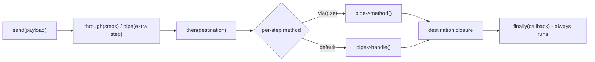
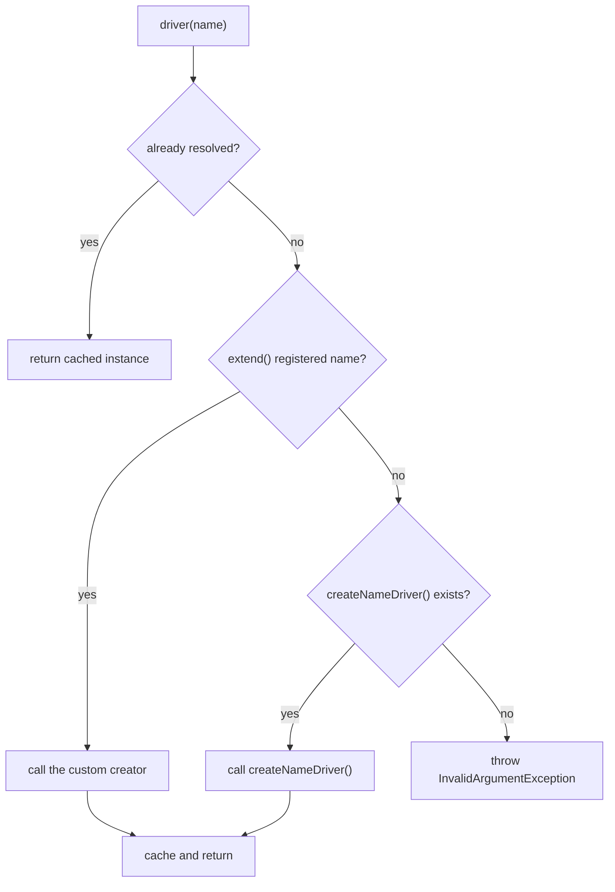

# Chapter 3 - Support classes with no docs page (and one with partial docs)

Chapter 3 closes Part I (Code Fundamentals) by turning away from extensions of `Str`, `Arr`,
and `Collection` and toward standalone support classes usable directly in an application:
`Env`, `Inspiring`, `Pipeline`, `Manager`, `MultipleInstanceManager`, and `ProcessUtils`. Most
have no documentation page at all; `Pipeline` is the exception, with a docs page that covers
only some of its methods. Two entries, `Manager` and `MultipleInstanceManager`, shift the
intended audience toward developers building a package or a reusable subsystem rather than
day-to-day application code - each is flagged explicitly where it occurs. Unlike Chapter 2,
these six classes do not share a single running scenario: each is independent infrastructure,
so each entry gets its own real scenario instead. Every example in this chapter is verified
against `laravel/framework` `v13.22.0` and the `laravel/docs` `13.x` branch, and is a real,
green Pest test drawn from the book's companion application.

## `Env::get()`, `Env::writeVariables()`, and `Env::writeVariable()`

**Case type**: undocumented class with no dedicated docs page. Its read side is surfaced only
indirectly through the documented global `env()` helper; its write side has no documented
counterpart at all. 

**Alias flag**: inverted from the usual case - the documented helper is the
one that is a thin alias, not the undocumented method. `Support/helpers.php` defines `env()` as
`return Env::get($key, $default);`, so every call to the documented helper is already a call to
the undocumented class underneath it. 

**Version note**: `writeVariables()` and `writeVariable()`
are absent from the `v12.0.0` tag but present on the current `12.x` branch and in `13.x` -
readers on an early Laravel 12 point release should confirm the methods exist before relying on
them. No audience shift, no package-stability concern - core framework code.

### Minimal snippet

`Env::get()` reads a value straight from the environment, independently of whether it has been
promoted to a `config/*.php` file:

```php
return (int) Env::get('SHIPPING_REQUEST_TIMEOUT', 5);
```

`Env::writeVariable()` does the opposite: it adds or updates a single key in an environment
file on disk:

```php
Env::writeVariable('SHIPPING_API_KEY', $key, $this->environmentFilePath, overwrite: true);
```

### Documented way vs. discovered way

For reading, `env('SHIPPING_REQUEST_TIMEOUT')` and `Env::get('SHIPPING_REQUEST_TIMEOUT')` return
the same value, confirmed directly in the companion app's test suite:

```php
expect(Env::get('SHIPPING_REQUEST_TIMEOUT'))->toBe(env('SHIPPING_REQUEST_TIMEOUT'))
    ->and(Env::get('SHIPPING_REQUEST_TIMEOUT'))->toBe('30');
```

Reaching for the class form directly still has a place: code that would rather not depend on a
global function - package code, or a class with an explicitly typed, easily mockable call
surface - can call `Env::get()` without losing anything the helper offers.

For writing, there is no documented alternative at all. A hand-rolled script would normally
just append a line to the file:

```php
file_put_contents($manualPath, PHP_EOL.'SHIPPING_API_KEY=sk_test#123', FILE_APPEND);
```

That line parses incorrectly: a `.env` parser treats `#` as the start of a comment, so the key
ends up holding only `sk_test`, silently dropping everything after the hash - exactly what the
companion test demonstrates:

```php
expect(Dotenv::parse(file_get_contents($manualPath))['SHIPPING_API_KEY'])->toBe('sk_test')
    ->and(Dotenv::parse(file_get_contents($discoveredPath))['SHIPPING_API_KEY'])->toBe('sk_test#123');
```

`Env::writeVariable()` and `Env::writeVariables()` avoid this because they decide whether a
value needs quoting before writing it, and where to place it among lines that share the same
key prefix:

```php
protected static function addVariableToEnvContents(string $key, mixed $value, array $envLines, bool $overwrite): array
{
    $prefix = explode('_', $key)[0].'_';
    $lastPrefixIndex = -1;

    $shouldQuote = preg_match('/^[a-zA-Z0-9]+$/', $value) === 0;

    $lineToAddVariations = [
        $key.'='.(is_string($value) ? self::prepareQuotedValue($value) : $value),
        $key.'='.$value,
    ];

    $lineToAdd = $shouldQuote ? $lineToAddVariations[0] : $lineToAddVariations[1];
    // ...
}
```

Any value that is not purely alphanumeric gets quoted; an exact existing line is left untouched
instead of duplicated; and a non-empty existing value survives unless `$overwrite` is `true` -
three small decisions a one-line `file_put_contents()` call does not make on its own.

### Real scenario: configuring a shipping provider integration

The companion app's `ShippingProviderConfigurator` wraps both operations behind two small,
purpose-built methods instead of exposing the raw `Env` calls everywhere they are needed:

```php
class ShippingProviderConfigurator
{
    public function __construct(private readonly string $environmentFilePath) {}

    public function store(array $credentials, bool $overwrite = false): void
    {
        Env::writeVariables($credentials, $this->environmentFilePath, $overwrite);
    }

    public function rotateApiKey(string $key): void
    {
        Env::writeVariable('SHIPPING_API_KEY', $key, $this->environmentFilePath, overwrite: true);
    }

    public function requestTimeout(): int
    {
        return (int) Env::get('SHIPPING_REQUEST_TIMEOUT', 5);
    }
}
```

A dedicated Artisan command exposes it as exactly the kind of configuration script this entry
is about - the same shape as Laravel's own `install:broadcasting` command, which calls
`Env::writeVariable()` and `Env::writeVariables()` internally to save Pusher, Ably, or Reverb
credentials into `.env`, without the `broadcasting.md` docs page that describes its effect ever
naming the mechanism behind it:

```php
class ConfigureShippingProviderCommand extends Command
{
    protected $signature = 'shipping:configure {provider} {api-key} {region} {--rotate-key}';

    protected $description = 'Write shipping provider credentials into the environment file';

    public function handle(ShippingProviderConfigurator $configurator): int
    {
        if ($this->option('rotate-key')) {
            $configurator->rotateApiKey($this->argument('api-key'));

            $this->info('Shipping API key rotated.');

            return self::SUCCESS;
        }

        $configurator->store([
            'SHIPPING_PROVIDER' => $this->argument('provider'),
            'SHIPPING_API_KEY' => $this->argument('api-key'),
            'SHIPPING_REGION' => $this->argument('region'),
        ]);

        $this->info('Shipping provider configured.');

        return self::SUCCESS;
    }
}
```

The feature test drives the command end to end against a throwaway environment file, confirming
the credentials land exactly where expected, and that rotating the key later leaves the other
values untouched:

```php
it('configures a shipping provider end to end through the artisan command', function () {
    $path = makeTemporaryEnvironmentFile();

    $this->app->instance(ShippingProviderConfigurator::class, new ShippingProviderConfigurator($path));

    $this->artisan('shipping:configure', [
        'provider' => 'easypost',
        'api-key' => 'abc123',
        'region' => 'us-east-1',
    ])->assertExitCode(0);

    expect(Dotenv::parse(file_get_contents($path)))->toBe([
        'APP_NAME' => 'Laravel',
        'SHIPPING_PROVIDER' => 'easypost',
        'SHIPPING_API_KEY' => 'abc123',
        'SHIPPING_REGION' => 'us-east-1',
    ]);

    unlink($path);
});
```

Neither `writeVariable()` nor `writeVariables()` checks `app()->environment()` on its own, so
that guarantee has to come from the caller: a setup or deployment script controls when it runs
and against which file, a request handler serving live traffic cannot make the same promise,
and writing to `.env` mid-request risks another process reading a half-written file. Keep both
methods out of controllers, jobs, and anything else that might execute while the application is
already serving requests.

## `Inspiring::quote()` and `Inspiring::quotes()`

**Case type**: undocumented class with no dedicated docs page at all. Only the *name* of the
Artisan command it powers, `inspire`, appears in the documentation, listed once among Tinker's
allowed commands - the `Inspiring` class behind it is never mentioned. 

**Alias flag**: none -
`quotes()` is the sole source of the 41 bundled quotes, and `quote()` is not a bare passthrough
to it: it adds real formatting behavior of its own. No audience shift, no package-stability
concern - this is core framework code.

### Minimal snippet

The companion app's `routes/console.php` already carries Laravel's own default use of `quote()`,
unchanged from the framework skeleton:

```php
Artisan::command('inspire', function () {
    $this->comment(Inspiring::quote());
})->purpose('Display an inspiring quote');
```

The lesser-known sibling, `quotes()`, returns the raw collection instead of one formatted
string:

```php
Inspiring::quotes()->random();
```

### Documented way vs. discovered way

`quote()` looks like the obvious choice for reusing a quote anywhere in an application, but it
is not a plain string - it is console output. Its implementation formats the text for Artisan's
colored terminal rendering before returning it:

```php
protected static function formatForConsole($quote)
{
    [$text, $author] = (new Stringable($quote))->explode('-');

    return sprintf(
        // ...
        trim($text),
        trim($author),
    );
}
```

The elided template wraps the quote in an Artisan `<options=bold>` tag and the author in
`<fg=gray>`, with decorative quotation marks and a dash of its own around the author's name -
markup meant purely for colored console rendering. Called anywhere outside a console command,
those literal tags leak straight into the output:

```php
expect(Inspiring::quote())->toContain('<options=bold>');
```

The discovered way is to skip `quote()` entirely and pull a plain string from `quotes()`
instead:

```php
expect(Inspiring::quotes()->all())->toContain($footer)
    ->and($footer)->not->toContain('<options=bold>')
    ->and($footer)->not->toContain('<fg=gray>');
```

This is exactly what the framework's own scaffolding commands do: `ViewMakeCommand`,
`MailMakeCommand`, and `ComponentMakeCommand` all call `Inspiring::quotes()->random()`, never
`quote()`, to drop a placeholder comment into a freshly generated file - the same console
markup that is harmless in a terminal would otherwise land as broken text in a generated PHP or
Blade file.

### Real scenario: a packing-slip footer for a shipped order

The companion app's `PackingSlipComposer` reuses `quotes()` to add a footer to a shipped order,
a context with nothing in common with the Artisan splash screen:

```php
class PackingSlipComposer
{
    public function footer(): string
    {
        return Inspiring::quotes()->random();
    }
}
```

`OrderController` exposes it next to the existing `refund()` action, following the same
route-model-binding shape:

```php
public function packingSlip(Order $order, PackingSlipComposer $composer)
{
    return response()->json([
        'order_id' => $order->id,
        'footer' => $composer->footer(),
    ]);
}
```

The feature test confirms the footer reaching the client is a real entry from `quotes()`, not a
console-formatted string:

```php
it('returns a packing-slip footer through the order endpoint', function () {
    $order = Order::factory()->create();

    $response = getJson("/api/orders/{$order->id}/packing-slip")
        ->assertOk()
        ->assertJson(['order_id' => $order->id]);

    expect(Inspiring::quotes()->all())->toContain($response->json('footer'));
});
```

Because `quote()` and `quotes()` solve two different problems - one produces console output,
the other hands back raw data - reaching for the wrong one only fails once the string leaves the
terminal it was designed for.

## `Pipeline::pipe()`, `Pipeline::via()`, and `Pipeline::finally()`

`Pipeline` is not entirely undocumented. The official docs already cover `send()`, `through()`,
`then()`, `thenReturn()`, and `withinTransaction()` - the pattern of pushing a value through a
list of steps and collecting a final result. Three methods are missing from that page:
`pipe()`, `via()`, and `finally()`.

**Case type**: a class with a docs page that covers only some of its methods - `send()`,
`through()`, `then()`, `thenReturn()`, and `withinTransaction()` are documented; `pipe()`,
`via()`, and `finally()` are not. 

**Alias flag**: none - `pipe()` behaves differently from
`through()` rather than wrapping it (see below), so it is not presented as a new concept for
something already documented. The `Pipeline` facade's own docblock already lists all three
methods (`@method static pipe(mixed $pipes)`, `via(string $method)`,
`finally(\Closure $callback)`), so an IDE's autocomplete surfaces them even though the docs page
does not. No audience shift, no package-stability concern - this is core framework code.

### Minimal snippet

The documented shape sends a value through a list of steps to a final destination:

```php
Pipeline::send($request)->through($middleware)->then($destination);
```

`pipe()` adds one more step to whatever is already queued, instead of replacing the list:

```php
Pipeline::send($payload)->through($baseSteps)->pipe($extraStep)->then($destination);
```

### Documented way vs. discovered way

`through()` **replaces** `$this->pipes` wholesale:

```php
public function through($pipes)
{
    $this->pipes = is_array($pipes) ? $pipes : func_get_args();

    return $this;
}
```

`pipe()` **appends** instead:

```php
public function pipe($pipes)
{
    array_push($this->pipes, ...(is_array($pipes) ? $pipes : func_get_args()));

    return $this;
}
```

That difference matters whenever a step should only run conditionally: calling `through()` a
second time to add one step would silently discard the first list, while `pipe()` can be called
only when needed, on top of a list already built with `through()`.

Every pipe is normally invoked through a `handle()` method - that convention is what the docs'
own `through()` example relies on. `via()` changes it:

```php
public function via($method)
{
    $this->method = $method;

    return $this;
}
```

```php
$carry = method_exists($pipe, $this->method)
    ? $pipe->{$this->method}(...$parameters)
    : $pipe(...$parameters);
```

No internal framework caller ever changes it - `Illuminate\Routing\Router::runRouteWithinStack()`
and `Illuminate\Foundation\Http\Kernel::sendRequestThroughRouter()` both run the entire HTTP
middleware stack through a `Pipeline` using nothing but the default `'handle'`:

```php
return (new Pipeline($this->container))
    ->send($request)
    ->through($middleware)
    ->then(fn ($request) => $this->prepareResponse(
        $request, $route->run()
    ));
```

Skip `via()` and a pipe class without a `handle()` method is not silently ignored - the
pipeline tries to call the object itself as a callable, and fails outright:

```php
expect(fn () => (new Pipeline(app()))
    ->send(['rows' => []])
    ->through([ValidateStockImportRows::class])
    ->then(fn ($payload) => $payload))
    ->toThrow(Error::class);
```

`finally()` is the one method of the three that does not need the caller to do anything extra
at the call site where the pipeline runs. It only stores a closure:

```php
public function finally(Closure $callback)
{
    $this->finally = $callback;

    return $this;
}
```

but `then()` itself wraps the whole pipeline in a `try`/`finally` block:

```php
try {
    return $this->withinTransaction !== false
        ? $this->getContainer()->make('db')->connection($this->withinTransaction)->transaction(fn () => $pipeline($this->passable))
        : $pipeline($this->passable);
} finally {
    if ($this->finally) {
        ($this->finally)($this->passable);
    }
}
```

so the registered callback always runs - on a normal return and on a thrown exception alike.



### Real scenario: importing a batch of stock movements with a guaranteed lock release

The companion app's `StockImportPipeline` holds a `Cache::lock()` for the duration of a batch
import, guaranteeing its release regardless of outcome, and conditionally appends an
audit-summary step with `pipe()` only when one is requested:

```php
class StockImportPipeline
{
    public function run(array $rows, bool $withAudit = false): array
    {
        $lock = Cache::lock('stock-import', 10);

        if (! $lock->get()) {
            throw new RuntimeException('A stock import is already running.');
        }

        $pipeline = (new Pipeline(app()))
            ->send(['rows' => $rows])
            ->through([
                ValidateStockImportRows::class,
                PersistStockMovements::class,
            ])
            ->via('import')
            ->finally(fn () => $lock->release());

        if ($withAudit) {
            $pipeline->pipe(RecordImportAuditSnapshot::class);
        }

        return $pipeline->then(fn (array $payload) => Arr::except($payload, 'rows'));
    }
}
```

Each step is a small, single-purpose class exposing an `import()` method - the name `via('import')`
routes to - rather than the generic `handle()`:

```php
class ValidateStockImportRows
{
    public function import(array $payload, Closure $next)
    {
        foreach ($payload['rows'] as $row) {
            if (! isset($row['sku'], $row['quantity']) || $row['quantity'] < 0) {
                throw new InvalidArgumentException('Each import row requires a sku and a non-negative quantity.');
            }
        }

        return $next($payload);
    }
}
```

The feature test confirms the lock is released even when a row fails validation partway
through, and that nothing was partially persisted:

```php
it('releases the import lock via finally() even when a row fails validation, with no partial commit', function () {
    $rows = [
        ['sku' => 'SKU-1', 'quantity' => 5],
        ['sku' => 'SKU-2', 'quantity' => -1],
    ];

    postJson('/api/stock/import', ['rows' => $rows])
        ->assertUnprocessable()
        ->assertJson(['message' => 'Each import row requires a sku and a non-negative quantity.']);

    expect(StockMovement::count())->toBe(0);

    $lock = Cache::lock('stock-import', 10);

    expect($lock->get())->toBeTrue();

    $lock->release();
});
```

Because validation runs before persistence in the pipe order, a bad row never reaches
`PersistStockMovements` - and because `finally()` runs inside `then()` itself, the lock comes
back regardless of which step raised the exception, or whether one did at all.

Two limits of this particular example are worth calling out rather than glossing over. The
lock key is a single fixed string, not scoped per batch or warehouse, so two unrelated imports
running at the same time would serialize against each other instead of both proceeding - fine
for a single-tenant example, but worth revisiting before reusing this shape against a busier,
multi-tenant workload. And `finally()` only guarantees the lock is released, not that
persistence itself is atomic: if `PersistStockMovements` failed partway through a large batch
(a database-level error rather than a validation one), rows already created before the failure
would stay committed. Neither gap affects what this entry is demonstrating - `Pipeline`'s
`finally()` behavior - but a reader adapting the pattern for real use should add a database
transaction around the persistence step and scope the lock key to the data being imported.

## `Manager::getDefaultDriver()`, `driver()`, `extend()`, and `forgetDrivers()`

This entry addresses readers building a package or a reusable subsystem, not day-to-day
application code. If that is not the kind of code you write, the rest of this entry is still
worth knowing exists, but you are unlikely to reach for it directly.

**Case type**: undocumented base class. The official docs teach adding one more driver to an
*existing* Laravel manager - `Cache::extend()`, `Session::extend()`, `Storage::extend()` - never
building a brand-new subsystem by extending `Illuminate\Support\Manager` directly, which is
this entry's actual subject. 

**Alias flag**: none. No package-stability concern - this is core
framework code, though the audience it is written for is different from the rest of this
chapter.

### Minimal snippet

Without `Manager`, picking one of several interchangeable implementations means a hand-rolled
switch:

```php
$driver = match ($name) {
    'flat' => new FlatRateDriver(500),
    'weight' => new WeightBasedRateDriver(150),
};
```

Extending `Manager` replaces that switch with a resolve-by-name call, cached after the first
resolution:

```php
$manager->driver('flat');
```

### Documented way vs. discovered way

The documented pattern only ever adds one more driver to a manager Laravel already ships:

```php
Cache::extend('mongo', function (Application $app) {
    return Cache::repository(new MongoStore);
});
```

That teaches `extend()` as a facade method for an existing subsystem, not `Manager` as a base
class to build a new one. The discovered way is extending `Manager` itself:

```php
abstract public function getDefaultDriver();
```

`getDefaultDriver()` is abstract - the base class has no opinion on where the driver name comes
from. Every first-party manager implements it by reading its own config key, exactly the shape
`ShippingRateManager` follows:

```php
public function getDefaultDriver()
{
    return $this->config->get('shipping.default');
}
```

Resolution itself is handled once, in the base class, for every subclass:

```php
public function driver($driver = null)
{
    $driver = enum_value($driver) ?: $this->getDefaultDriver();

    if (is_null($driver)) {
        throw new InvalidArgumentException(sprintf(
            'Unable to resolve NULL driver for [%s].', static::class
        ));
    }

    return $this->drivers[$driver] ??= $this->createDriver($driver);
}
```

and `createDriver()` decides, per call, whether a custom creator registered via `extend()`
should win over the naming convention:

```php
protected function createDriver($driver)
{
    if (isset($this->customCreators[$driver])) {
        return $this->callCustomCreator($driver);
    }

    $method = 'create'.Str::studly($driver).'Driver';

    if (method_exists($this, $method)) {
        return $this->$method();
    }

    throw new InvalidArgumentException("Driver [$driver] not supported.");
}
```



### Real scenario: a package-style shipping-rate calculator with interchangeable drivers

`ShippingRateManager` extends `Manager` directly to offer two interchangeable rate
calculations, configured in `config/shipping.php`:

```php
class ShippingRateManager extends Manager
{
    public function getDefaultDriver()
    {
        return $this->config->get('shipping.default');
    }

    protected function createFlatDriver(): FlatRateDriver
    {
        return new FlatRateDriver($this->config->get('shipping.flat.cost_cents'));
    }

    protected function createWeightDriver(): WeightBasedRateDriver
    {
        return new WeightBasedRateDriver($this->config->get('shipping.weight.cost_per_kg_cents'));
    }
}
```

A third-party package extending this subsystem never has to touch `ShippingRateManager` itself
- `extend()` registers a driver from the outside:

```php
$manager->extend('express', fn () => new FlatRateDriver(2000));

expect($manager->driver('express')->calculate(1))->toBe(2000);
```

and `forgetDrivers()` clears every cached instance, forcing the next `driver()` call to build a
fresh one - useful once a driver's own configuration changes at runtime:

```php
$first = $manager->driver('flat');
$firstId = spl_object_id($first);

$manager->forgetDrivers();

$second = $manager->driver('flat');

expect(spl_object_id($second))->not->toBe($firstId);
```

A thin controller exposes the manager to the rest of the application without knowing which
driver will actually run:

```php
class ShippingRateController extends Controller
{
    public function __invoke(Request $request, ShippingRateManager $manager)
    {
        $validated = $request->validate([
            'weight_grams' => ['required', 'integer', 'min:0'],
            'driver' => ['sometimes', 'string'],
        ]);

        $driver = $validated['driver'] ?? $manager->getDefaultDriver();

        return response()->json([
            'driver' => $driver,
            'cost_cents' => $manager->driver($driver)->calculate($validated['weight_grams']),
        ]);
    }
}
```

Nothing in this controller changes when a new driver is added, whether it arrives via a new
`create{Driver}Driver()` method or via a package calling `extend()` - the exact guarantee a
driver-based subsystem is meant to provide.

## `MultipleInstanceManager::instance()`, `extend()`, `forgetInstance()`, and `purge()`

Same audience as `Manager` above: this entry addresses package and subsystem authors.

**Case type**: undocumented class, structurally parallel to `Manager` but solving a different
problem, and never named on the docs pages that describe the config-array surface it would sit
under (`database.md`, `mail.md`). 

**Alias flag**: none - and, worth stating precisely because
it looks like an obvious assumption, `MultipleInstanceManager` is not literally the base class
of `Illuminate\Mail\MailManager` in this version. `MailManager` hand-rolls a nearly identical
`instance()`/`resolve()`/`extend()` shape on its own; the only first-party class that actually
extends `MultipleInstanceManager` is `Illuminate\Concurrency\ConcurrencyManager`. No
package-stability concern - core framework code.

### Minimal snippet

Two named instances, resolved back to back, both usable at once:

```php
$manager->instance('ups');
$manager->instance('fedex');
```

### Documented way vs. discovered way

A hand-rolled registry keyed by name gets you most of the way there:

```php
$accounts['ups'] ??= new ShippingCarrierAccount(/* ... */);
$accounts['fedex'] ??= new ShippingCarrierAccount(/* ... */);
```

`instance()` is that same idea, generalized by the framework, with one structural difference
from `Manager::driver()` covered earlier in this chapter: `Manager` resolves *one active driver
at a time* (`$this->drivers[$driver] ??= $this->createDriver($driver)`); `MultipleInstanceManager`
resolves *several named instances, all cached and usable together*:

```php
public function instance($name = null)
{
    $name = $name ?: $this->getDefaultInstance();

    return $this->instances[$name] = $this->get($name);
}
```

Resolution also goes through an extra level of indirection `Manager` does not have. A subclass
supplies per-name configuration via `getInstanceConfig($name)`, and only *then* does a `driver`
key inside that config array pick the creation method:

```php
public function getInstanceConfig($name)
{
    return $this->config->get("shipping.accounts.instances.{$name}", ['driver' => $name]);
}
```

The `['driver' => $name]` fallback mirrors the framework's own
`Illuminate\Concurrency\ConcurrencyManager` - the one first-party class that actually extends
`MultipleInstanceManager`:

```php
public function getInstanceConfig($name)
{
    return $this->app['config']->get(
        'concurrency.driver.'.$name, ['driver' => $name],
    );
}
```

`forgetInstance()` and `purge()` look interchangeable but are not quite. `forgetInstance()`
accepts one name, several at once, or none (falling back to the default), guards each removal
with `isset()`, and returns `$this` so it can be chained:

```php
public function forgetInstance($name = null)
{
    $name ??= $this->getDefaultInstance();

    foreach ((array) $name as $instanceName) {
        if (isset($this->instances[$instanceName])) {
            unset($this->instances[$instanceName]);
        }
    }

    return $this;
}
```

`purge()` only ever takes one name, skips the `isset()` guard, and returns `void`:

```php
public function purge($name = null)
{
    $name ??= $this->getDefaultInstance();

    unset($this->instances[$name]);
}
```

Its docblock promises to "disconnect the given instance," but the base implementation does no
such thing - it only drops the cache entry, exactly like `forgetInstance()` does for a single
name. Any actual teardown (closing a connection, flushing a client) is left entirely to a
subclass that overrides `purge()`.

### Real scenario: multiple shipping-carrier accounts active at once

`ShippingCarrierAccountManager` configures two carrier accounts that stay independently cached
and simultaneously usable, unlike the single active driver `ShippingRateManager` picks in the
previous entry:

```php
class ShippingCarrierAccountManager extends MultipleInstanceManager
{
    public function getDefaultInstance()
    {
        return $this->config->get('shipping.accounts.default');
    }

    public function setDefaultInstance($name)
    {
        $this->config->set('shipping.accounts.default', $name);
    }

    public function getInstanceConfig($name)
    {
        return $this->config->get("shipping.accounts.instances.{$name}", ['driver' => $name]);
    }

    protected function createUpsDriver(array $config): ShippingCarrierAccount
    {
        return new ShippingCarrierAccount($config['base_url'], $config['api_key']);
    }

    protected function createFedexDriver(array $config): ShippingCarrierAccount
    {
        return new ShippingCarrierAccount($config['base_url'], $config['api_key']);
    }
}
```

A third account can be registered at runtime, with no change to the class above:

```php
$manager->extend('dhl', fn ($app, $config) => new ShippingCarrierAccount('https://api.dhl.com', 'test-dhl-key'));

$dhl = $manager->instance('dhl');
```

The controller resolves both configured accounts in the same response - the concrete
illustration of "simultaneously active," where `ShippingRateController` (previous entry) only
ever resolves one driver per request:

```php
class ShippingCarrierController extends Controller
{
    public function __invoke(ShippingCarrierAccountManager $manager)
    {
        return response()->json([
            'ups' => ['base_url' => $manager->instance('ups')->baseUrl],
            'fedex' => ['base_url' => $manager->instance('fedex')->baseUrl],
        ]);
    }
}
```

The feature test confirms resolving one account never disturbs the other's cached instance:

```php
it('resolves distinct named instances simultaneously, without evicting one another', function () {
    $manager = app(ShippingCarrierAccountManager::class);

    $ups = $manager->instance('ups');
    $fedex = $manager->instance('fedex');

    expect($ups)->toBeInstanceOf(ShippingCarrierAccount::class)
        ->and($ups->baseUrl)->toBe('https://onlinetools.ups.com')
        ->and($fedex)->toBeInstanceOf(ShippingCarrierAccount::class)
        ->and($fedex->baseUrl)->toBe('https://apis.fedex.com');

    $upsAgain = $manager->instance('ups');

    expect(spl_object_id($upsAgain))->toBe(spl_object_id($ups));
});
```

Chapter 8 ("The binding lifecycle") picks up this same thread from the other side - not how a
subsystem caches its own named instances, but how the container resolves and caches bindings
more generally.

## `ProcessUtils::escapeArgument()`

Back to application-developer territory after the two package-author entries above.

**Case type**: undocumented class with no dedicated docs page - a single-method utility class.
Its own docblock says plainly: "This class was originally copied from Symfony 3." 

**Alias flag**: none. No package-stability concern - core framework code.

### Minimal snippet

```php
ProcessUtils::escapeArgument("O'Malley Freight");
```

produces a single, safely-quoted shell argument:

```php
expect(ProcessUtils::escapeArgument("O'Malley Freight"))->toBe("'O'\\''Malley Freight'");
```

### Documented way vs. discovered way

The documented way to run a process, from the `Process` facade's own docs, passes an **array**:

```php
Process::run(['ls', '-la', $path]);
```

Laravel builds this on Symfony's `new Process(array $command, ...)`, which escapes each element
itself - there is nothing to do, and nothing `escapeArgument()` could improve here. The
discovered case is narrower and only shows up once a **string** is unavoidable - passing a
string to `Process::run()` routes to `Process::fromShellCommandline((string) $command, ...)`,
which hands that string to a real shell verbatim. The framework's own scheduler needs exactly
this: `Illuminate\Console\Scheduling\CommandBuilder` builds a whole cron line as one string, and
reaches for `escapeArgument()` every time a dynamic value joins it:

```php
protected function ensureCorrectUser(Event $event, $command)
{
    return $event->user && ! windows_os()
        ? 'sudo -u '.$event->user.' -- sh -c '.ProcessUtils::escapeArgument($command)
        : $command;
}
```

Skipping it is not a dramatic failure. A shipping-label line built with a naive
`'echo '.$line` and a note containing an apostrophe does not run at all - the shell's parser
breaks on the unmatched quote and `Process::run()` simply reports the command as unsuccessful:

```php
$naive = Process::run('echo '.$line);

expect($naive->successful())->toBeFalse();
```

A note with irregular internal spacing is the quieter version of the same problem: nothing
crashes, the shell just splits the unquoted argument into extra words and `echo` rejoins them
with single spaces, silently losing the original spacing:

```php
$naive = Process::run('echo '.$line);

expect($naive->successful())->toBeTrue()
    ->and(trim($naive->output()))->not->toBe($line);
```

`escapeArgument()` wraps the whole line as one argument, so the shell never gets a chance to
reinterpret it - a note with an apostrophe runs cleanly, and irregular spacing survives exactly
as written.

### Real scenario: printing a shipping label through an external process

`ShippingLabelPrinter` builds one line of label text and runs it through `echo` - standing in
for a real label-printing CLI tool - as a single escaped argument:

```php
class ShippingLabelPrinter
{
    public function printLabel(string $carrier, string $trackingCode, string $note = ''): ProcessResult
    {
        $line = "Carrier: {$carrier} - Tracking: {$trackingCode} - Note: {$note}";

        return Process::run('echo '.ProcessUtils::escapeArgument($line));
    }
}
```

A thin Artisan command exposes it, following the same shape as `ConfigureShippingProviderCommand`
from earlier in this chapter:

```php
class PrintShippingLabelCommand extends Command
{
    protected $signature = 'label:print {carrier} {tracking-code} {--note=}';

    protected $description = 'Print a shipping label line for an order through an external process';

    public function handle(ShippingLabelPrinter $printer): int
    {
        $result = $printer->printLabel(
            $this->argument('carrier'),
            $this->argument('tracking-code'),
            $this->option('note') ?? '',
        );

        if (! $result->successful()) {
            $this->error('Failed to print shipping label.');

            return self::FAILURE;
        }

        $this->line(trim($result->output()));

        return self::SUCCESS;
    }
}
```

The feature test drives the command end to end with a note that would break a naive
concatenation, confirming the full text survives intact:

```php
it('prints a shipping label end to end through the artisan command', function () {
    $note = "O'Malley Freight requested overnight delivery";

    $this->artisan('label:print', [
        'carrier' => 'ups',
        'tracking-code' => 'TRACK1',
        '--note' => $note,
    ])
        ->assertExitCode(0)
        ->expectsOutputToContain($note);
});
```

A free-text field like a warehouse note will eventually contain an apostrophe or irregular
spacing whether or not anyone intended it to - `escapeArgument()` is what keeps that ordinary
data from ever becoming a shell-parsing problem.

## Quick reference

| Entry | Documented alternative or manual approach | When to prefer the undocumented one |
|---|---|---|
| `Env::get()` / `writeVariables()` / `writeVariable()` | The `env()` helper (read-only); a hand-rolled file append (write) | Package code avoiding a global helper; safely adding or updating `.env` keys from a setup or deployment script, with correct quoting |
| `Inspiring::quote()` / `quotes()` | Hardcoding a static list of quotes | Reusing a quote as plain data outside Artisan's console output |
| `Pipeline::pipe()` / `via()` / `finally()` | `through()` redeclaring the whole pipe list; the `handle()` convention; a manual `try`/`finally` | Appending a step conditionally; naming pipe methods after the domain; guaranteeing cleanup regardless of outcome |
| `Manager::getDefaultDriver()` / `driver()` / `extend()` / `forgetDrivers()` | A hand-rolled `if`/`match` driver switch | Building your own driver-based subsystem, extensible by third parties via `extend()` |
| `MultipleInstanceManager::instance()` / `extend()` / `forgetInstance()` / `purge()` | A hand-rolled array keyed by name | Managing several named, simultaneously-active configured instances |
| `ProcessUtils::escapeArgument()` | `Process::run()`'s array form (already auto-escaped) | Only when a raw shell command string is unavoidable |

Chapter 4 turns to Part II (Eloquent Beyond Basic Relationships), starting with more concise
negation syntax for filtering records based on conditions on related data -
`whereDoesntHaveRelation()` and its siblings, contrasted against `whereDoesntHave()` on the same
query.
