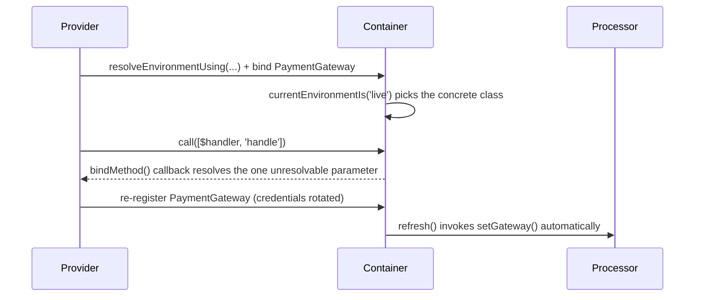

# Chapter 8 - The binding lifecycle

Chapter 7 closed Part III (HTTP, APIs, and Testing) by asserting on what a test actually got
back. Chapter 8 turns to an earlier and different concern: not what happens after a response
leaves the application, but how the application's own dependencies come to exist in the first
place. This opens Part IV (Container and Routing), which spans this chapter and Chapter 9.

Every Laravel application already relies on the container's basics: `bind()` registers how to
build something, `singleton()` does the same but keeps the first result, and resolving a class
from the container, whether through type-hinting or `app()`, triggers that registered logic the
first time it is needed. Less visible is everything that can happen around that moment. A
binding can depend on more than a fixed rule. A single method call can be intercepted
independently of how its owner was built. An object that already holds a resolved dependency can
be kept in sync when that dependency changes underneath it later on. This chapter walks through
one undocumented mechanism for each of those three points: conditional registration, a single
method invocation, and synchronization over time. The running example throughout is a small
payment gateway abstraction: `PaymentGateway`, an interface with a `SandboxPaymentGateway` and a
`LivePaymentGateway` implementation (plus a `FakePaymentGateway` for tests), registered once in
`AppServiceProvider` and extended incrementally across the chapter's three entries. Every example
is verified against `laravel/framework` v13.22.0 and the `laravel/docs` `13.x` branch, and is a
real, green Pest test drawn from this book's companion application.



## `currentEnvironmentIs()` and `resolveEnvironmentUsing()`

**Case type**: two undocumented methods on `Illuminate\Container\Container` (inherited by
`Application`) that sit beneath a documented feature rather than beside one.
`resolveConcreteFromAttributes()` calls `currentEnvironmentIs()` internally to evaluate the
`#[Bind]` PHP attribute, which `laravel/docs`'s `container.md` does document, including its
environment-scoped form. Neither `currentEnvironmentIs()` nor `resolveEnvironmentUsing()` is
named anywhere on that page. 

**Alias flag**: not trivial, but close. Every Laravel application
already wires a default resolver at boot (`LoadConfiguration` calls
`resolveEnvironmentUsing($app->environment(...))`), so out of the box `currentEnvironmentIs($env)`
returns exactly what the documented `app()->environment($env)` would. The pair only earns its
place in this chapter through `resolveEnvironmentUsing()`'s ability to replace that default
resolver, decoupling what "environment" means for a given resolution from the fixed,
process-wide `APP_ENV`. 

**Audience**: application developers configuring their own service
provider, not package authors. 

**Stability**: core container code, unrelated to any third-party
driver; no minor-version churn found while verifying against v13.22.0.

### Minimal snippet

```php
app()->resolveEnvironmentUsing(fn ($environments) => in_array('live', (array) $environments, true));

app()->currentEnvironmentIs('live'); // true, using the resolver just installed
```

### Documented way vs. discovered way

The documented way to make a binding depend on the environment is a conditional built directly
on `app()->environment()`:

```php
$this->app->singleton(PaymentGateway::class, function ($app) {
    return $app->environment('production')
        ? new LivePaymentGateway(config('services.payment_gateway.key'))
        : new SandboxPaymentGateway(config('services.payment_gateway.key'));
});
```

This works as long as "which gateway to use" and "which `APP_ENV` this process is running under"
are the same question. They stop being the same question the moment a single production
deployment needs to serve both real customers and an internal QA area at once, still against
`APP_ENV=production` throughout: `app()->environment()` cannot express that, since it only ever
answers with the one, fixed value the process booted with.

`resolveEnvironmentUsing()` replaces the resolver `currentEnvironmentIs()` reads from, so
"environment" (for this one decision) can be redefined from anything the application already
knows, here a plain configuration value:

```php
$this->app->resolveEnvironmentUsing(
    fn ($environments) => in_array(config('services.payment_gateway.mode'), (array) $environments, true),
);

$this->app->singleton(PaymentGateway::class, fn ($app) => $app->currentEnvironmentIs('live')
    ? new LivePaymentGateway(config('services.payment_gateway.key'))
    : new SandboxPaymentGateway(config('services.payment_gateway.key')));
```

Now the same `APP_ENV=production` process can resolve a `LivePaymentGateway` for one request and
a `SandboxPaymentGateway` for another, purely based on `services.payment_gateway.mode` (config,
or ultimately `PAYMENT_GATEWAY_MODE`), something the documented conditional could never express
on its own.

### Real scenario: one process, two gateway modes

The full binding, exactly as registered in `AppServiceProvider::register()`:

```php
$this->app->resolveEnvironmentUsing(
    fn ($environments) => in_array(config('services.payment_gateway.mode'), (array) $environments, true),
);

$this->app->singleton(
    PaymentGateway::class,
    fn ($app) => $app->currentEnvironmentIs('live')
        ? new LivePaymentGateway(config('services.payment_gateway.key'))
        : new SandboxPaymentGateway(config('services.payment_gateway.key')),
);
```

And the test that proves it resolves differently without ever changing `APP_ENV`:

```php
it('resolves differently within the same process and the same APP_ENV, based on configuration alone', function () {
    expect(app()->environment())->toBe('testing');

    config(['services.payment_gateway.mode' => 'live']);
    $live = app(PaymentGateway::class);

    app()->forgetInstance(PaymentGateway::class);
    config(['services.payment_gateway.mode' => 'sandbox']);
    $sandbox = app(PaymentGateway::class);

    expect($live)->toBeInstanceOf(LivePaymentGateway::class)
        ->and($sandbox)->toBeInstanceOf(SandboxPaymentGateway::class);
});
```

`PaymentGateway` is bound as a singleton, so the test calls the already-documented
`forgetInstance()` between the two resolutions, otherwise the second call would just return the
first, already-cached gateway regardless of the new configuration.

This is not the same problem Chapter 3's `Manager` and `MultipleInstanceManager` solve. Those
build a subsystem around multiple concrete drivers, or multiple named instances, that all exist
and stay usable at the same time, such as comparing two shipping carriers within the same
request. Here there is exactly one `PaymentGateway` binding; what changes is which single
concrete class it resolves to for a given resolution, not a set of simultaneously available
instances to pick from.

None of this needs a real HTTP call to either gateway mode to test: `SandboxPaymentGateway` and
`LivePaymentGateway` each just return a deterministic reference string, so a test only needs to
resolve `PaymentGateway::class` and assert on its concrete class, exactly as the tests above do.

## `bindMethod()`

**Case type**: undocumented method on `Illuminate\Container\Container`, with no attribute or
higher-level feature built on top of it the way the previous entry's pair powers `#[Bind]`.
`laravel/docs`'s `container.md` never names it. 

**Alias flag**: not trivial. Contextual binding
(`when()->needs()->give()`), the closest documented tool, only ever applies while the container
is constructing an object; `bindMethod()` is the only container-level mechanism that reaches into
a method call made on an object the container did not just build, and its callback replaces the
parameter resolution for that one call entirely. 

**Audience**: application developers.

**Stability**: core container code, no minor-version churn found while verifying against
v13.22.0.

### Minimal snippet

```php
app()->bindMethod([SomeClass::class, 'someMethod'], function ($instance, $app) {
    return $instance->someMethod('a value the container could never infer from a type-hint');
});

app()->call([app(SomeClass::class), 'someMethod']); // uses the bound callback above
```

### Documented way vs. discovered way

Without `bindMethod()`, a method that needs a value the container cannot infer from a type-hint
has only one option: derive that value inside the method itself, every time it runs:

```php
class PaymentGatewayWebhookHandler
{
    public function handle(): string
    {
        $request = request();

        $signature = hash_hmac('sha256', $request->getContent(), config('services.payment_gateway.key'));

        abort_unless(hash_equals($signature, (string) $request->header('X-Gateway-Signature')), 401);

        return "processed:{$request->string('event_id')->toString()}";
    }
}
```

This is not a hypothetical inconvenience: without it, the same verification would have to be
duplicated in every place that invokes `handle()` through the container. `bindMethod()` moves
that logic to one place instead, registered once against the exact `Class@method` pair, and this
is a genuine framework mechanism, not a one-off trick: every Artisan command's `handle()` is
itself invoked through this same door, `$this->laravel->call([$this, $method])`
(`Illuminate\Console\Command::execute()`), so registering a method binding for a command's
`handle()` would intercept it identically. A future console command that replays a stored webhook
for debugging is one plausible second caller here, though it would first need to bind its own
`Request::class` instance into the container, since the callback above always reads whichever
request is currently bound, not one passed to it directly.

```php
$this->app->bindMethod([PaymentGatewayWebhookHandler::class, 'handle'], function ($handler, $app) {
    $request = $app->make(Request::class);

    $signature = hash_hmac('sha256', $request->getContent(), config('services.payment_gateway.key'));

    abort_unless(hash_equals($signature, (string) $request->header('X-Gateway-Signature')), 401);

    return $handler->handle($request->string('event_id')->toString());
});
```

`PaymentGatewayWebhookHandler::handle()` itself now only takes the one thing it actually needs to
do its job:

```php
class PaymentGatewayWebhookHandler
{
    public function handle(string $verifiedEventId): string
    {
        return "processed:{$verifiedEventId}";
    }
}
```

### Real scenario: verifying a payment gateway webhook once, not on every call

`PaymentGatewayWebhookController::__invoke()` never verifies anything itself; it just asks the
container to call the handler:

```php
class PaymentGatewayWebhookController extends Controller
{
    public function __invoke(PaymentGatewayWebhookHandler $handler)
    {
        return response()->json(['result' => app()->call([$handler, 'handle'])]);
    }
}
```

This works because the route (`POST /webhooks/payment-gateway`) reaches the controller the
ordinary way, through `ControllerDispatcher`, which does not go through `Container::call()` and
so never triggers the method binding on its own; it is the controller's own explicit
`app()->call(...)` that does. A test confirms an edge case worth knowing before relying on this:
once a method binding exists for a `Class@method` pair, any parameter passed explicitly to that
same `call()` is ignored entirely, since the bound callback only ever receives `($instance,
$container)`, never the caller's own `$parameters`:

```php
app()->instance(Request::class, Request::create(
    uri: '/api/webhooks/payment-gateway',
    method: 'POST',
    server: ['HTTP_X_GATEWAY_SIGNATURE' => $signature, 'CONTENT_TYPE' => 'application/json'],
    content: json_encode($payload),
));

$handler = app(PaymentGatewayWebhookHandler::class);

$result = app()->call([$handler, 'handle'], ['verifiedEventId' => 'should-be-ignored']);

expect($result)->toBe('processed:evt_123'); // the explicit parameter above never reaches handle()
```

A security note before reusing this pattern as-is: `config('services.payment_gateway.key')`
falls back to a fixed default (`'test-sandbox-key'`) when `PAYMENT_GATEWAY_API_KEY` is not set in
the environment. That default is fine for the companion app's own test suite, but it is also
sitting in this book's public source history; a real deployment that forgets to set its own
`PAYMENT_GATEWAY_API_KEY` would be signing and verifying webhooks against a secret anyone can
read, defeating the signature check entirely. Treat the fallback as a teaching convenience, not
something to carry into production unchanged.

## `refresh()`

**Case type**: undocumented method on `Illuminate\Container\Container`, with no attribute or
higher-level feature built on it, unlike the first entry's pair. `laravel/docs`'s `container.md`
never names it. 

**Alias flag**: not trivial. Manually re-registering a binding
(`bind()`/`instance()`) only changes what a *future* `make()` call returns; it does nothing for
an object that already holds a reference to the previous instance, and `refresh()` is the only
container-level tool that keeps such an object in sync automatically. 

**Audience**: application
developers. 

**Stability**: core container code, no minor-version churn found while verifying
against v13.22.0.

### Minimal snippet

```php
class Holder
{
    public function __construct(private Dependency $dependency) {}

    public function setDependency(Dependency $dependency): void
    {
        $this->dependency = $dependency;
    }
}

$holder = new Holder(app(Dependency::class));
app()->refresh(Dependency::class, $holder, 'setDependency');

app()->instance(Dependency::class, new Dependency); // $holder is updated automatically
```

### Documented way vs. discovered way

Without `refresh()`, keeping a dependent object in sync after a binding changes means tracking
down and rebuilding every object that holds a reference to the old instance, by hand, every time
the binding is rebound:

```php
app()->instance(PaymentGateway::class, new FakePaymentGateway);

// nothing else updates on its own - any object built earlier still holds the old gateway
// unless it is located and rebuilt explicitly, one by one, after every rebind
```

`refresh()` registers that synchronization once, at the point where the dependent object is
built, and the framework relies on exactly this to keep its own internals consistent:
`Illuminate\Auth\AuthManager` calls `$guard->setRequest($this->app->refresh('request', $guard,
'setRequest'))` so every guard stays pointed at the current request, even across the sub-requests
a single test can simulate.

### Real scenario: keeping a long-running worker's refund processor in sync

`OrderRefundProcessor` wraps a `PaymentGateway` to process order refunds:

```php
class OrderRefundProcessor
{
    public function __construct(private PaymentGateway $gateway) {}

    public function setGateway(PaymentGateway $gateway): void
    {
        $this->gateway = $gateway;
    }

    public function refund(Order $order, int $amountCents): string
    {
        return $this->gateway->refund($order, $amountCents);
    }
}
```

`AppServiceProvider` registers it as a singleton and wires the synchronization in the same breath
it builds it:

```php
$this->app->singleton(OrderRefundProcessor::class, function ($app) {
    $processor = new OrderRefundProcessor($app->make(PaymentGateway::class));

    $app->refresh(PaymentGateway::class, $processor, 'setGateway');

    return $processor;
});
```

A queue worker resolves `OrderRefundProcessor` once and keeps it for its entire lifetime, well
past the point where `OrderRefunded::handle()` uses it for any given job:

```php
class OrderRefunded implements ShouldQueue
{
    use Queueable;

    public ?string $reference = null;

    public function __construct(public array $payload = []) {}

    public function handle(OrderRefundProcessor $processor): void
    {
        $order = Order::findOrFail($this->payload['order_id']);

        $this->reference = $processor->refund($order, $this->payload['refund_cents'] ?? 0);
    }
}
```

If the gateway's credentials rotate, or the deployment switches from sandbox to live, while that
worker is still running, `OrderRefundProcessor` does not need to be rebuilt, and neither does
anything holding a reference to it: rebinding `PaymentGateway::class` is enough, because the
synchronization was already registered when the processor was first built.

```php
$processor = app(OrderRefundProcessor::class); // resolved once, at worker boot

app()->instance(PaymentGateway::class, new FakePaymentGateway); // credentials rotated mid-run

$job = new OrderRefunded(['order_id' => $order->id, 'refund_cents' => 500]);
app()->call([$job, 'handle']);

// $job->reference now reflects the new gateway, and so does $processor->refund(...) directly -
// neither needed to be resolved again
```

One edge case is worth knowing before relying on `refresh()`: it only synchronizes from the point
a binding is actually re-registered onward, and only counts a registration as a rebind if the
abstract was already `bound()` beforehand. Calling `refresh()` on an abstract with no binding at
all returns `null` immediately and does not update the target; even the very next registration of
that same abstract does not count as a rebind either, since it is the first one - only the
registration after that one fires the synchronization:

```php
$result = app()->refresh('a-truly-unbound-abstract', $target, 'setValue');
// $result is null, $target is untouched

app()->instance('a-truly-unbound-abstract', 'first-value'); // establishes the binding, no sync yet
app()->instance('a-truly-unbound-abstract', 'second-value'); // a genuine rebind - $target updates now
```

For all three entries, the documented approach is still the right choice in the simpler case it
was built for: a single `app()->environment(...)` conditional is all a binding needs when there is
no reason for more than one logical mode to share the same process, and skipping `refresh()`'s
synchronization is fine when the dependent object is resolved fresh per request rather than held
across a long-running worker, since there is nothing stale left to keep in sync.

## Summary

| Entry | Documented alternative | When to prefer it |
|---|---|---|
| `currentEnvironmentIs()` / `resolveEnvironmentUsing()` | `app()->environment(...)` conditional | When a binding's "environment" needs to come from something other than the fixed, process-wide `APP_ENV` (e.g. a single deployment serving more than one logical mode at once) |
| `bindMethod()` | Deriving the value manually inside the method itself | When the same derivation would otherwise be duplicated across every place that invokes that method through the container |
| `refresh()` | Manually re-registering the binding and rebuilding every dependent object by hand | When an object built earlier must keep working with whatever a binding currently resolves to, without being rebuilt itself |

Part IV - Container and Routing continues in Chapter 9, which stays inside the container's
neighborhood but moves from binding resolution to the `Router` facade: inspecting the route
currently executing and adjusting middleware groups at runtime.
