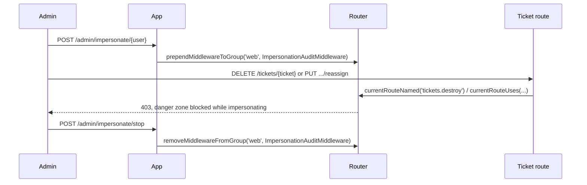

# Chapter 9 - The Router facade under the hood

Chapter 8 closed the first half of Part IV by keeping an already-resolved binding in sync with
itself. Chapter 9 closes the Part's second half, moving from how a dependency comes to exist to
how a request, once routed, keeps behaving consistently with the rest of the application around
it. Two undocumented pairs on the `Router` facade cover this: recognizing which route is
currently executing, and reshaping a middleware group's composition after it has already been
defined. The running example is a support admin who can impersonate a customer to help with a
ticket: certain ticket actions must stay off-limits while impersonating, and every request made
under impersonation must leave an audit trail behind, two needs that map directly onto this
chapter's four entries. Every example is verified against `laravel/framework` v13.22.0 and the
`laravel/docs` `13.x` branch, and is a real, green Pest test drawn from this book's companion
application.



## `currentRouteNamed()` and `currentRouteUses()`

**Case type**: two undocumented methods on `Illuminate\Routing\Router` (proxied by the `Route`
facade), sitting right beside methods the same facade's own "Accessing the Current Route"
documentation section already covers (`Route::current()`, `Route::currentRouteName()`,
`Route::currentRouteAction()`) - the difference being that those three return the route's actual
name/action as a string, while this chapter's pair takes a pattern and returns a boolean directly.

**Alias flag**: `currentRouteNamed()` is not a trivial alias, but a close one - it ends up calling
the exact same `Route::named()` the documented `$request->route()->named(...)` also calls. Its
real value is reachability: it works from anywhere in the application (a view composer, a policy,
a queued listener) without a `Request` instance in scope, unlike `$request->route()->named(...)`.
`currentRouteUses()` is not an alias of anything documented, but it is also not the full-strength,
wildcard-matching sibling its name suggests - that role belongs to the separate, still-undocumented
`Router::uses()`, out of this chapter's scope (see `docs/chapters-overview.md`'s Appendix B
outline). 

**Audience**: ordinary application developers guarding routes, not package authors.

**Stability**: core routing, no minor-version churn found while verifying against v13.22.0.

### Minimal snippet

```php
use Illuminate\Support\Facades\Route;

Route::currentRouteNamed('tickets.destroy'); // true only while that named route is executing

Route::currentRouteUses(TicketController::class.'@reassign'); // strict match on the controller action
```

### Documented way vs. discovered way

The documented way to recognize the current route by name is to call `named()` directly on the
`Route` instance, and to read the current action back as a string from the facade for a manual
comparison:

```php
if ($request->route()->named('tickets.destroy')) {
    abort(403);
}

if (Route::currentRouteAction() === TicketController::class.'@reassign') {
    abort(403);
}
```

Both work, but the first needs a `Request` instance in scope, and the second turns every check
into a string comparison written out by hand. `currentRouteNamed()`/`currentRouteUses()` collapse
both into a direct boolean call on the same facade already used to define the route in the first
place:

```php
if (Route::currentRouteNamed('tickets.destroy') || Route::currentRouteUses(TicketController::class.'@reassign')) {
    abort(403);
}
```

One further mix-up worth naming explicitly: `Route::has('tickets.destroy')` asks a completely
different question, whether a route with that name exists anywhere in the application's route
collection, regardless of whether it is the one currently executing. `currentRouteNamed()` only
ever looks at the route already being handled; confusing the two would make a guard like the one
above trivially always true, since a named route practically always "exists".

### Real scenario: blocking the ticket "danger zone" while impersonating

The middleware guards both a named and a deliberately unnamed route with a single check:

```php
class BlockDangerZoneWhileImpersonating
{
    public function handle(Request $request, Closure $next): Response
    {
        if (ImpersonationSession::isActive()
            && (Route::currentRouteNamed('tickets.destroy')
                || Route::currentRouteUses(TicketController::class.'@reassign'))) {
            abort(403);
        }

        return $next($request);
    }
}
```

It is attached to one route left named for the `currentRouteNamed()` check, and one deliberately
left unnamed to exercise `currentRouteUses()` instead:

```php
Route::delete('/tickets/{ticket}', [TicketController::class, 'destroy'])
    ->name('tickets.destroy')
    ->middleware(BlockDangerZoneWhileImpersonating::class);

Route::put('/tickets/{ticket}/reassign', [TicketController::class, 'reassign'])
    ->middleware(BlockDangerZoneWhileImpersonating::class);
```

And the test proving both routes are blocked only while an impersonation session is active, and
behave normally otherwise:

```php
it('blocks the destroy and reassign routes while an impersonation session is active', function () {
    $admin = User::factory()->admin()->create();
    $target = User::factory()->create();
    ImpersonationSession::start($admin, $target);

    $ticket = Ticket::factory()->create();
    $assignee = User::factory()->create();

    $this->put("/tickets/{$ticket->id}/reassign", ['assigned_to_id' => $assignee->id])
        ->assertForbidden();

    expect($ticket->fresh()->assigned_to_id)->not->toBe($assignee->id);

    $this->delete("/tickets/{$ticket->id}")->assertForbidden();

    expect(Ticket::find($ticket->id))->not->toBeNull();
});

it('allows the destroy and reassign routes when no impersonation session is active', function () {
    expect(ImpersonationSession::isActive())->toBeFalse();

    $ticket = Ticket::factory()->create();
    $assignee = User::factory()->create();

    $this->put("/tickets/{$ticket->id}/reassign", ['assigned_to_id' => $assignee->id])
        ->assertOk();

    expect($ticket->fresh()->assigned_to_id)->toBe($assignee->id);

    $this->delete("/tickets/{$ticket->id}")->assertNoContent();

    expect(Ticket::find($ticket->id))->toBeNull();
});
```

## `prependMiddlewareToGroup()` and `removeMiddlewareFromGroup()`

**Case type**: two undocumented methods on `Illuminate\Routing\Router` (proxied by the `Route`
facade), for a mechanism `laravel/docs`'s `middleware.md` otherwise documents thoroughly, just
under different names. 

**Alias flag**: neither is an alias, but both have documented siblings
that solve a different half of the same problem: `prependToGroup()`/`appendToGroup()` (on the
`Middleware` configuration object passed to `bootstrap/app.php`'s `withMiddleware()`) build a
group's composition once, at boot; `prependMiddlewareToGroup()`/`removeMiddlewareFromGroup()`
change it afterwards, at runtime, from anywhere the `Route` facade is reachable. 

**Audience**:
ordinary application developers, not package authors. 

**Stability**: core routing, no
minor-version churn found while verifying against v13.22.0.

### Minimal snippet

```php
use Illuminate\Support\Facades\Route;

Route::prependMiddlewareToGroup('web', ImpersonationAuditMiddleware::class);

Route::removeMiddlewareFromGroup('web', ImpersonationAuditMiddleware::class);
```

### Documented way vs. discovered way

The documented way to shape a middleware group is entirely static, written once in
`bootstrap/app.php`:

```php
->withMiddleware(function (Middleware $middleware): void {
    $middleware->appendToGroup('web', [
        ImpersonationAuditMiddleware::class,
    ]);
})
```

This is the right tool when a group's composition is fixed for the lifetime of the application.
It cannot express a group that needs to change based on something that is only known at runtime,
such as whether a particular admin currently has an impersonation session open.
`prependMiddlewareToGroup()`/`removeMiddlewareFromGroup()` mutate the very same array the
`Middleware` configuration object populated at boot, from ordinary application code:

```php
Route::prependMiddlewareToGroup('web', ImpersonationAuditMiddleware::class);
// ... later ...
Route::removeMiddlewareFromGroup('web', ImpersonationAuditMiddleware::class);
```

Both methods are also more forgiving than they might look. Calling `prependMiddlewareToGroup()`
twice with the same middleware is a safe no-op the second time, verified directly in
`Router.php`: it only inserts when `! in_array($middleware, $this->middlewareGroups[$group])`.
`removeMiddlewareFromGroup()` is equally defensive: it returns immediately, without an exception,
if the group does not exist or the middleware is not currently in it.

### Real scenario: toggling the impersonation audit trail, and its sharp edge

The controller that starts and stops an impersonation session is also where the `web` group gets
mutated:

```php
class ImpersonationController extends Controller
{
    public function start(User $user)
    {
        abort_unless(Auth::check() && Auth::user()->is_admin, 403);

        ImpersonationSession::start(Auth::user(), $user);

        Route::prependMiddlewareToGroup('web', ImpersonationAuditMiddleware::class);

        return back();
    }

    public function stop()
    {
        ImpersonationSession::stop();

        Route::removeMiddlewareFromGroup('web', ImpersonationAuditMiddleware::class);

        return back();
    }
}
```

`ImpersonationAuditMiddleware` itself just records who is impersonating whom, and which route was
visited, before letting the request continue:

```php
class ImpersonationAuditMiddleware
{
    public function handle(Request $request, Closure $next): Response
    {
        ImpersonationAuditLog::create([
            'admin_id' => ImpersonationSession::adminUser()->getKey(),
            'target_user_id' => ImpersonationSession::targetUser()->getKey(),
            'route_name' => optional($request->route())->getName(),
        ]);

        return $next($request);
    }
}
```

This looks like it should audit every request from the moment impersonation starts until it
stops. Tracing `Router::dispatch()` shows otherwise: a route's middleware group is expanded from
`$this->middlewareGroups` at dispatch time, once the route has been matched but before its
controller action actually runs. A mutation made *inside* that controller action can therefore
never affect the pipeline of the very request that triggered it - only a later, separate request.
The test proves this precisely, including the sharp edge it creates:

```php
it('audits requests once impersonation starts, including the stop request itself', function () {
    $admin = User::factory()->admin()->create();
    $target = User::factory()->create();
    $ticket = Ticket::factory()->create();

    // The start request's own middleware pipeline was already built before this action runs
    // (prependMiddlewareToGroup only affects later requests), so it is not audited itself.
    $this->actingAs($admin)->post("/admin/impersonate/{$target->id}")->assertRedirect();
    expect(ImpersonationAuditLog::count())->toBe(0);

    $this->get("/tickets/{$ticket->id}")->assertOk();

    $log = ImpersonationAuditLog::sole();
    expect($log->admin_id)->toBe($admin->id)
        ->and($log->target_user_id)->toBe($target->id);

    // The stop request's own pipeline was built while the audit middleware was still in the
    // group, so it gets one last entry before removeMiddlewareFromGroup() takes effect for
    // later requests.
    $this->post('/admin/impersonate/stop')->assertRedirect();
    expect(ImpersonationAuditLog::count())->toBe(2);

    // Only a genuinely later request is served by a pipeline built after the removal.
    $this->get("/tickets/{$ticket->id}")->assertOk();
    expect(ImpersonationAuditLog::count())->toBe(2);
});
```

The `stop` request itself ends up audited, one request later than a first glance at the code
would suggest, simply because its own pipeline had already been built while the middleware was
still registered.

This sits on top of a sharper limitation that the test cannot show on its own, because a single
Pest test runs its `$this->get()`/`$this->post()` calls against the very same booted application:
`Router` is registered as a singleton on the `Application` container
(`RoutingServiceProvider::registerRouter()`), so there is exactly one `$middlewareGroups` array
for that instance's entire lifetime. Under a normal stateless deployment (PHP-FPM, CLI), a fresh
`Application` (and `Router`) is built for every incoming HTTP request, so a
`prependMiddlewareToGroup()` call made inside a controller is discarded the moment that request
ends and has no effect whatsoever on any later, genuinely separate request - the audit trail this
scenario wants would simply never appear in production. The only environment where the mutation
would actually carry over to later requests is a long-running worker model such as Laravel
Octane, and there it introduces a different problem: the mutation is process-wide, so it would
apply to every request any user sends to that same worker for as long as it stays registered, not
just to the impersonating admin's own requests. Reaching for these two methods to make a group's
composition depend on per-session state, the way this scenario does, is only safe on a
long-running server that is also built to isolate or reset such runtime changes between requests;
on a standard deployment, the same result calls for the documented, boot-time
`appendToGroup()`/`prependToGroup()` instead, paired with a condition the middleware itself
checks on every request (as `ImpersonationAuditMiddleware` already does by reading
`ImpersonationSession`), rather than a group whose membership changes underneath it.

## Summary

| Entry | Documented alternative | When to prefer the undocumented one |
|---|---|---|
| `currentRouteNamed()` | `$request->route()->named(...)` | No `Request` instance in scope (a view composer, a policy, a queued listener) |
| `currentRouteUses()` | `Route::currentRouteAction()` compared by hand | A direct boolean check reads more clearly than a manual string comparison |
| `prependMiddlewareToGroup()` / `removeMiddlewareFromGroup()` | Static `appendToGroup()`/`prependToGroup()` in `bootstrap/app.php` | Only on a long-running server (e.g. Octane) built to isolate/reset such runtime changes between requests - never as a way to make a group depend on per-request/session state under a standard deployment |

For the first pair, the documented approach already suffices whenever a `Request` instance is
already in scope and only the route's name matters: `$request->route()->named(...)` reads just as
clearly there. For the second pair, it suffices whenever a middleware group's composition never
needs to depend on anything only known at runtime: a static `appendToGroup()`/`prependToGroup()`
in `bootstrap/app.php` is simpler and carries none of this chapter's process-scope caveat. Reach
for `prependMiddlewareToGroup()`/`removeMiddlewareFromGroup()` only outside that case, and even
then only on infrastructure built to isolate or reset runtime middleware changes between requests
safely - not as a way to make a group's membership track per-session state on a standard
deployment.

Part IV - Container and Routing ends here. Part V - Authorization, Validation, and Asynchrony
opens next with Chapter 10, moving from how a request is routed and processed to how it is
authorized and validated once it arrives.
